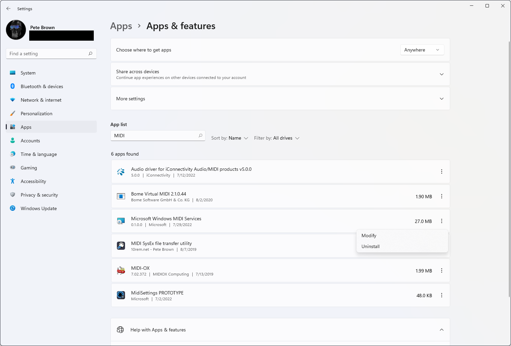
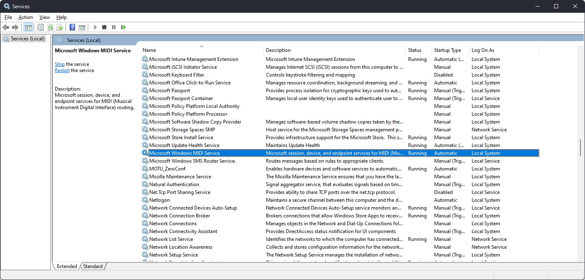
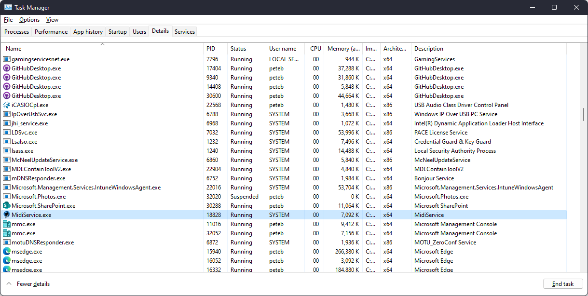

# Installation During Development

## Services

Install the latest version of the .NET 7 Preview runtime on the target machine. We don't package this in the installer during development because .NET 7 is in preview. If this is the development machine, install the SDK instead.

[.NET SDK and Desktop Runtime](https://dotnet.microsoft.com/download/dotnet/7.0)

### Building the main service

Open the main solution from the src folder, and build the project.

Right-click the MIDI Service project, and select "Publish". Click the publish button. This copies files required by the installer.

### Building the installer

TODO: There are hard-coded paths in the installer which are machine-dependent.

Right-click the installer and build it. The output will be in a bin folder in the project.

Go into Settings -> Apps and uninstall any previous version of MIDI Services.

Ensure that the service was removed from the installed services.

Also ensure there's no MIDI Service process stuck running (see Task Manager). This is not a normal condition, but during development, it can happen.

Run the installer. It will install the service, and importantly, create the required data folders and set permissions on them.

## USB MIDI 2.0 Driver

TODO

## Tools

TODO
