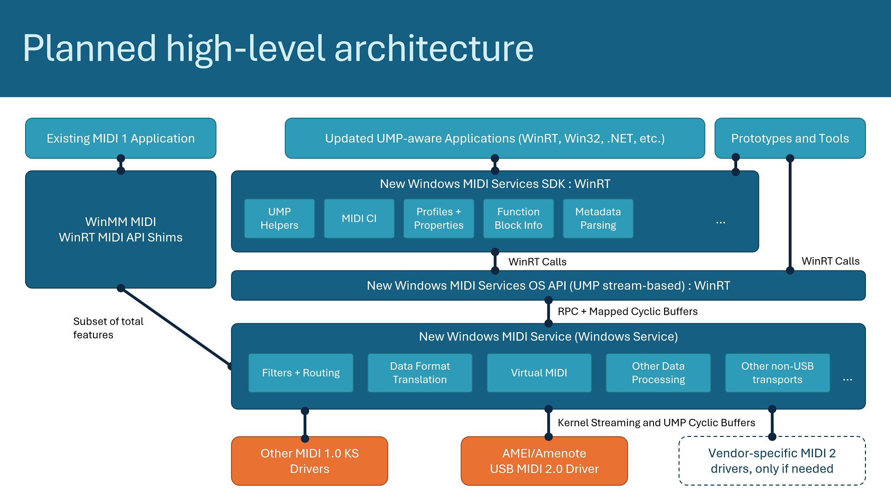

# Windows MIDI Services

**While this project is closed to the public, everything in this repo is confidential under MIDI Association / AMEI NDA. You have been invited to provide early feedback or contributions to what will eventually be a fully open source project. Please do not share or discuss outside of this repo and the associated Discord server.**

This project is the next-generation MIDI API for Windows, including MIDI 1.0, MIDI CI, and MIDI 2.0. It includes enhancements, a new USB class driver, new transports, and a suite of essential tools. The project adds many enhancements and bug fixes to our MIDI 1.0 support, and importantly adds support for the latest revisions to MIDI CI and MIDI 2.0.

> The open source USB MIDI 2.0 driver has been generously donated by [AMEI](https://www.amei.or.jp/),
> the **Association of Musical Electronics Industry**, and developed by [AmeNoteTM](https://www.AmeNote.com/) in partnership with
> Microsoft. Please see the file headers for any additional copyright notices. A huge thank you to
> AMEI and its member companies for making this happen!

**This is an official Microsoft project**. Although Microsoft is an active member of the MIDI Association, and Pete is the chair of the MIDI Association Excutive Board and other contributors are on standards boards, this project is not affiliated with the MIDI Association other than as a consumer of and contributor to the standards. Affiliation with AMEI is disclosed above.

Here's a high-level view of the prototype. Details subject to change.

> **Join the Discussion!**
>
> Our official community server for this project is on Discord here:
> https://aka.ms/MidiDiscord
>
> Please keep bug and feature requests in the issues here, but other discussion, live streams,
> Q&A, and more can happen on Discord. Additionally, we know that not everyone who uses MIDI
> has access to GitHub, so we welcome additional suggestions, reports, etc. there for those
> members of the community.

## Feature Set

This is a living and growing API. The first phase is to release a complete and working MIDI 1.0 and MIDI 2.0 system that includes all the necessary infrastructure for us to continue to build upon.

> Some big features are called out in the [API specs readme](https://github.com/microsoft/MIDI/tree/main/specs/api/README.md). Beyond that, specific detailed features may be found in the issues list by using the following labels:
>
> Proposed Features
> https://github.com/microsoft/MIDI/labels/feature%20proposal
> 
> Approved Features
> https://github.com/microsoft/MIDI/labels/feature
> 
> Known Tracked Bugs
> https://github.com/microsoft/MIDI/labels/bug

The majority of this infrastructure development will be done by the core team. We
certainly encourage you to participate in testing and in contributing pull requests as you have suggestions. See [CONTRIBUTING.md](CONTRIBUTING.md) for how to contribute.

## Releases

To keep the project agile, we are currently planning to distibute all of the released and signed end-user components, as much as possible, through the Microsoft Store on Windows. This may evolve over time as the project stabilizes or as the developer and musician community provide feedback. Additionally, some components may need to be distributed through Windows Update or other common mechanisms.

**There are no end-user releases yet. We expect to start seeing those as we head into 2023.**

[Developer Installation Instructions](./README-Installing.md)

## Philosophy - why is this Open Source?

We believe in the musician and music technology communities. We also know that the music creation tech community is a highly motivated and interested community, including those who are both musicians and developers who are working to move music technology forward.

We recognize that standards like MIDI 2.0 are living standards, with new transports, messages, and add-on capabilities added over time, and that in the past, we haven't been quick to adopt those in released of Windows. We want to change that.

We proposed that the best way to maintain an API which keeps up with the evolving standards and offers early adopters in this community an opportunity to try them out, test, and contribute, is to open source everything that we can, and invite both internal teams and the community to contribute to MIDI as implemented on Windows. We also love the idea of others learning from this source code to implement MIDI 2.0 on embedded devices and other operating systems as they need.

In short, we believe this project is the best way to continue to develop MIDI on Windows in the long-term, and to give back to the whole MIDI developer community, regardless of which operating system they
prefer.

For other core tenets, see the [API spec readme](https://github.com/microsoft/MIDI/tree/main/specs/api/README.md).

## Yet another API?

Wait, is this just yet another "API to rule them all", so we end up with n+1 APIs to deal with?

Yes and no. Part of the reason this is open source is to make everything as visible as possible, and to allow much-needed input from app developers. The long-term intention is to discourage use of the older APIs through eventual deprecation, and to encourage use of this new API by adding in all the features and capabilities that users and app authors want. We simply couldn't do that with any of the older APIs, which were tied heavily to an older driver model, and so we've ended up with a new one that we can grow to support the features and the evolution of the standards.

## What else does this provide for developers?

MIDI 2.0 is a standard that allows for many different types of physical transport layers. Developers often want to experienment with new or novel approaches for getting MIDI information from one device to another. In the past, that has required either creating a MIDI stack from scratch (which was not difficult with the simpler MIDI 1.0), or writing a Windows driver.

We want to encourage experimentation. By adopting a pluggable transport model for the Windows MIDI Services, it's possible for a developer to much more quickly prototype an idea, or an evolving standard, and see how it performs in action, all without climbing the driver development hill.

## Repo Structure

The repo contains many different projects and stand-alone files which make up Windows MIDI Services.

| Location             | Description |
| ---------------------|----------------------------------------------------------|
| /                    | Project root, including main README |
| /get-started         | Root for all samples and documentation |
| /get-started/docs    | Developer and user documentation |
| /get-started/samples | Developer samples for using the API |
| /specs               | Specifications, when needed |
| /src                 | Main source (non-documentation/sample) root. See folder for more details |

Note that any internal changes made to Windows to support the driver or MIDI API are not contained in this repo.

## Contributing

See [CONTRIBUTING.md](CONTRIBUTING.md)

## Security

See [SECURITY.md](SECURITY.md)

## Trademarks

This project may contain trademarks or logos for projects, products, or services. Authorized use of Microsoft trademarks or logos is subject to and must follow
[Microsoft's Trademark & Brand Guidelines](https://www.microsoft.com/en-us/legal/intellectualproperty/trademarks/usage/general). Use of Microsoft trademarks or logos in modified versions of this project must not cause confusion or imply Microsoft sponsorship. Any use of third-party trademarks or logos are subject to those third-party's policies.

## Relevant specifications

These are the specifications which apply to this project today. (TODO: Update with latest specs at time of publishing)

* [MIDI 2.0](https://www.midi.org/specifications/midi-2-0-specifications)
* [USB MIDI 2.0](https://www.midi.org/specifications/midi-transports-specifications/usb/usb-midi-2-0-2)
* [MIDI 1.0](https://www.midi.org/specifications/midi1-specifications)
* [USB MIDI 1.0](https://www.midi.org/specifications/midi-transports-specifications/usb/usb-midi-1-0-2)

## Learn more about MIDI 2.0

* [MIDI @ 40 and the new Windows MIDI Services](https://devblogs.microsoft.com/windows-music-dev/midi-40-and-the-new-windows-midi-services/)
