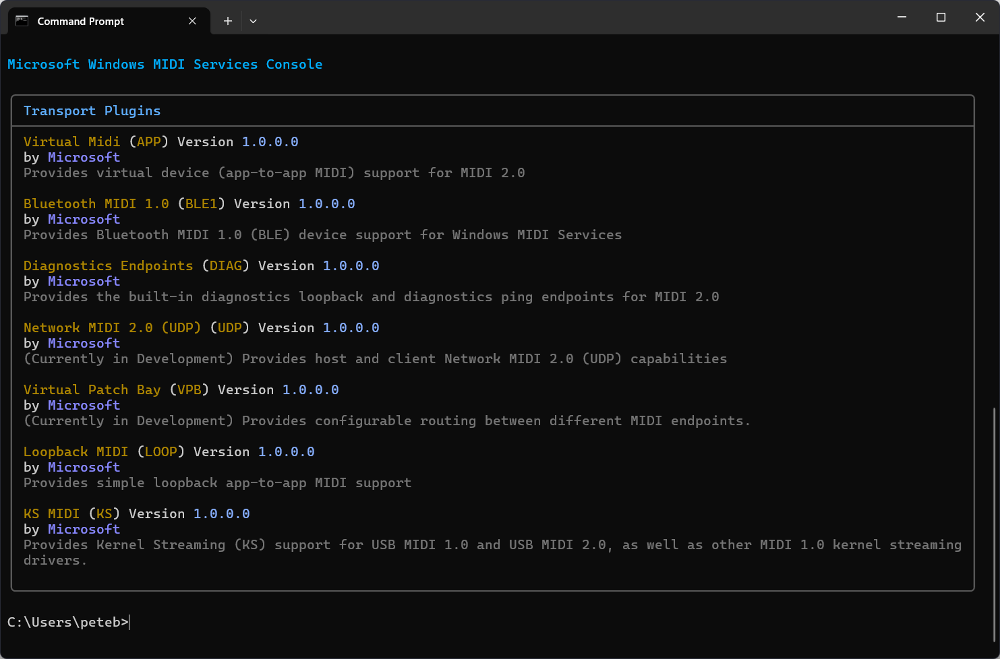

# Enumerate (List) MIDI Service Plugins

The enumerate command has the aliases `enum` and `list` which may be used instead of the full `enumerate` command.

## Enumerate Transport Plugins

This command makes it easy to see which transports are currently enabled in Windows MIDI Services. 

```
midi enumerate transport-plugins
```




## Enumerate Message Processing Plugins

TODO: This feature is actively in development.

