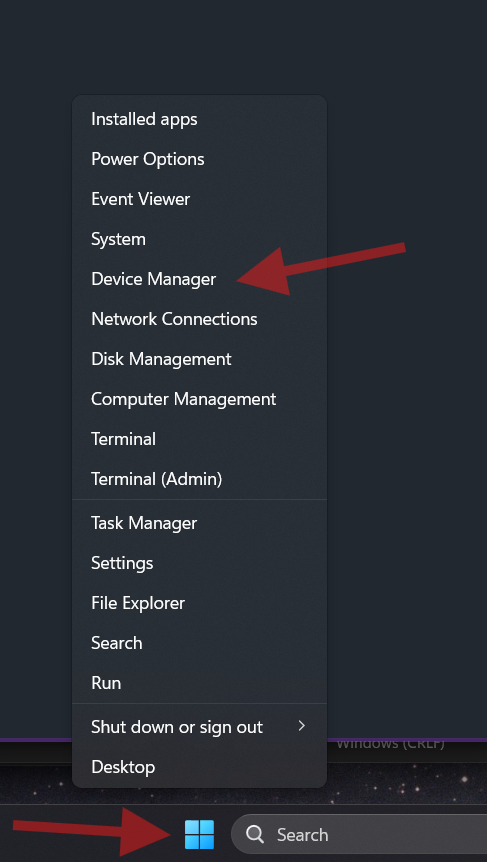
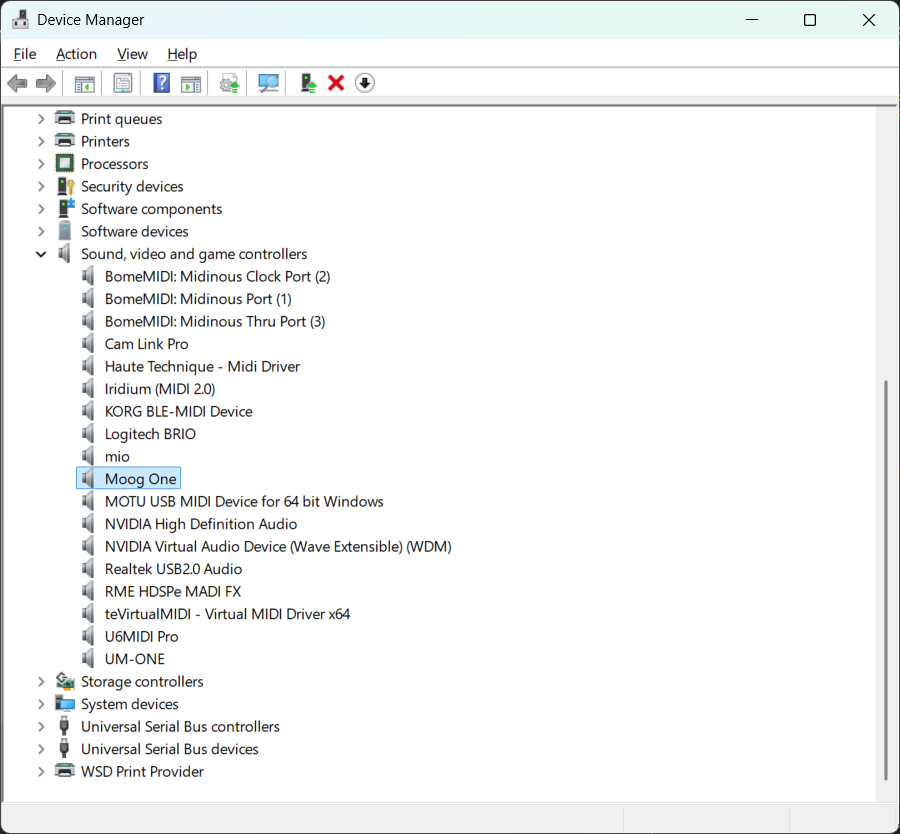
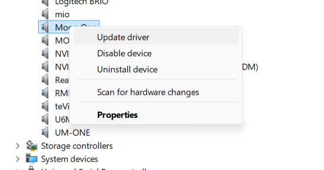
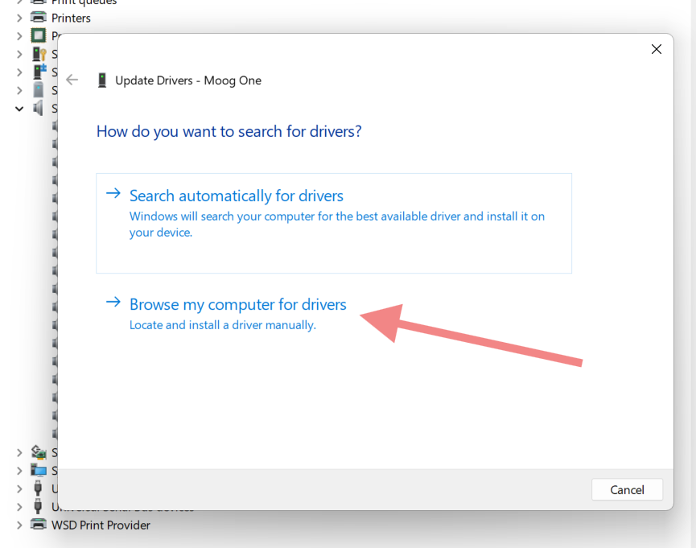
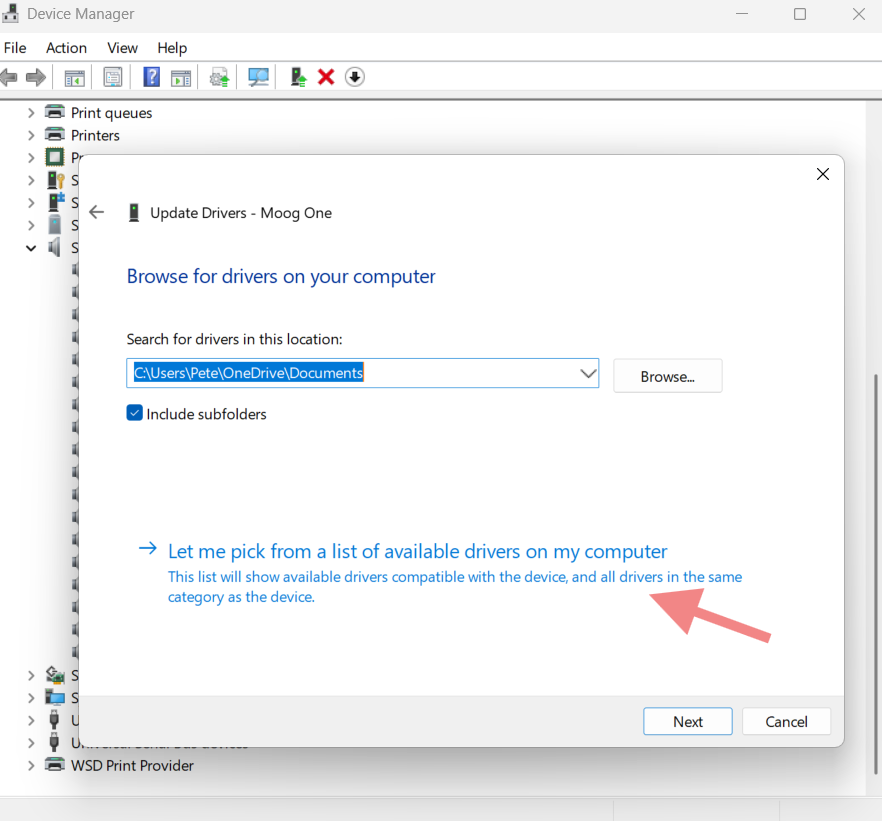
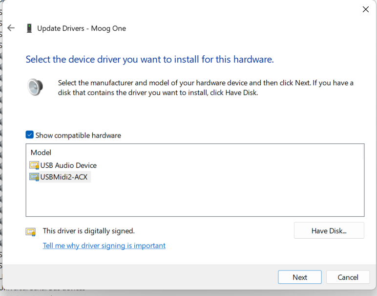

With the Windows MIDI Services release, we introduced a new class driver USBMidi2-ACX. That new driver supports MIDI 1.0 and MIDI 2.0 devices, but it's not always going to be compatible with every device. For that reason, we kept the existing USB MIDI 1.0 class driver: usbaudio.sys. 

# Switch Between Drivers

If you need to switch from one driver to the other, the instructions follow this post. Note that this only works for moving between class drivers for a class-compliant device. If you try to force a driver on a non-compliant device, either the driver won't start and you'll see a <!> for the device, or you will BSOD the PC. It will recover on reboot if that happens.

## Step 1. Close your MIDI Apps and Open Device Manager

Close your DAW or other apps using MIDI. Save your work. If you do not do this, the driver may have an open connection and cannot reliably be changed. Additionally, the action taken here will cause a device disconnection from those apps anyway, which some apps don't handle well.

Right-click the Windows logo on the taskbar and then choose "Device Manager". This is one of many ways to open Device Manager in Windows. You can also search for "Device Manager" using the search box.

## Step 2. Find the device under "Sound, video and game controllers"

The actual text of this section of device manager will depend on your language settings, but you want the section which contains the hardware devices, not the "MIDI Endpoints" or "Software Devices" sections.

## Step 3: Right-click the device and choose "Update Driver"

> Right-click the device in device manager, but choose "Properties". On the "General" tab, the manufacturer will show "Microsoft" if the new combined MIDI 1.0/MIDI 2.0 class driver is in use. If the old driver is in use, it will show "(Generic USB Audio)" for the manufacturer. You can open device manager 

## Step 4: Choose "Browse my computer for drivers"

Please pay extra attention to these steps. If you choose the wrong option, Windows may tell you that you are already using the "best driver" for your device. We're specifically overriding that choice.

## Step 5: Choose "Let me pick from a list of available drivers on my computer"

## Step 6: Choose the driver

- If you want to use the old MIDI 1.0 class driver, choose "USB Audio Device"
- If you want to use the new MIDI 1.0 and MIDI 2.0 class driver, choose "USBMidi2-ACX"

If you do not see these two options, one of these is likely to be true

- The device requires a vendor driver and is not class-compliant
- You picked an audio or other non-MIDI endpoint in Device Manager

## Step 7: Finish up

Click "Next" and when complete, unplug the device, **reboot your PC**, and then plug the device back in. Not all devices need to be unplugged/replugged, but many do.

# Important Note on Windows Updates

There's a Plug & Play bug in Windows right now which **may cause your choice to be reverted after any sort of update.** the PNP team is looking into it. 

This does mean you will likely have to repeat these steps in the future.

It that becomes a problem, and you don't need the new MIDI features, you can switch to the old API mode by [following the instructions here](how-to-change-api-mode.md). In that case, the device will only be allowed to use the older driver.

# Important Note on Hubs and unplugging/replugging devices without iSerialNumber

When connected through a hub that does not have a USB serial number, or when the device itself does not have a USB serial number, the device metadata will get rebuilt if you plug into a different USB port on the PC. This will cause the driver assignment (and also custom names and other metadata) to be lost. You will need to repeat the above steps for the device.