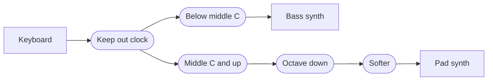

Windows MIDI Patchbay is the Windows MIDI Services app that connects MIDI devices to each other. You put devices on a canvas and draw connections from one device's **Out** to another device's **In**. In between, you can add **steps**. A step lets only some messages through, or changes them on the way, such as moving them to another channel or transposing them. A design is called a **patch**, and each patch is one `.midipatch` file.

This article is written for AI agents and online AI chats that plan patches for people. It's also for anyone who wants to write or check a patch file by hand. If you're asking an AI to build a patch for you, give it the link to this article and ask it to read the whole page before it starts.

> **Windows MIDI Patchbay is a preview app.** The patch file described here is version 2, which the app writes from Windows MIDI Services Preview 11 on. It still opens version 1 files and converts them. Later versions can add settings.

> **For AI agents:** Read this article from start to finish before you write anything. Follow [Building a patch for someone](#building-a-patch-for-someone) as your process, and use [The patch file](#the-patch-file) as your reference. You usually can't see Windows MIDI Patchbay yourself, so the notes marked **For agents** point out mistakes that load without an error and give the customer the wrong patch.

The rules that matter most:

1. **Ask before you build.** Get the device names, what plays what, and on which channels.
2. **Write `"fileVersion": 2`.** Without it, Windows MIDI Patchbay reads the file as the older format and leaves out every step and connection.
3. **Hand the file over to be imported,** and write `"activateAtStartup": false`. The customer turns routing on in Windows MIDI Patchbay after they've looked at it.
4. **Count channels and groups from 0 in the file.** People, manuals, and Windows MIDI Patchbay's own screens count them from 1.
5. **Name each device the way Windows shows it, and match it by name.** You can't know a device's ID.
6. **Use only the keys and values in this article.** Windows MIDI Patchbay ignores a key it doesn't know without an error, so a made-up key looks fine and does nothing.
7. **Write strict JSON.** No comments, no comma after the last item, and no hexadecimal numbers.
8. **Say what Windows MIDI Patchbay can't do,** and show the plan in plain words before you hand it over.
9. **Say who made it.** Write a `provenance` block that says an AI made the patch, and ask the customer whose name and which license go on it. See [Who made it](#who-made-it).

On this page:

- [What a patch is](#what-a-patch-is)
- [Building a patch for someone](#building-a-patch-for-someone)
- [Where patch files go, and how to bring one in](#where-patch-files-go-and-how-to-bring-one-in)
- [What Windows MIDI Patchbay can't do](#what-patchbay-cant-do)
- [The patch file](#the-patch-file)
- [Step settings](#step-settings)
- [The MIDI-CI file](#the-midi-ci-file)
- [Mistakes that are easy to miss](#mistakes-that-are-easy-to-miss)

## What a patch is

- A patch has **endpoints**: the devices on its canvas. A keyboard, a synth, a drum machine, or a loopback that leads to an app.
- A patch has **steps**. Each step does one job, such as keeping out clock, letting only some notes through, or transposing. A step has one **In** and one **Out**. MIDI clock and MIDI Time Code have only an **Out**, and an LFO's **In** takes the clock it follows. A **branch** and a **switch** have one **Out** for each way a message can go.
- A patch has **connections**. Each one takes what comes out of an endpoint's or a step's **Out** and sends it to another endpoint's or step's **In**.
- Messages go through the steps in the order the connections lead them. A chain of steps between a keyboard and a synth works like a cable with each step plugged in along the way.
- When an **Out** has more than one connection, each connection gets its own copy of every message. What a step does to one copy doesn't change the others. When more than one connection goes into the same **In**, their messages are merged.
- There are seven kinds of steps. **Filters** keep messages out. **Transforms** change messages. The **message throttler** slows messages down for a device that loses data when a lot arrives at once. **Distribution** steps decide which connection out each message takes: the **note distributor** plays several one-note synths as one. **Logic** steps look at what's in a message and decide what happens to it, and remember things from one message to the next: the **branch** and the **switch** send a message one way or another, **set tag** gives a message a value to carry, **set memory** remembers a value for later messages, **put value** writes a value into a message, and the **gate** lets messages through between one message and another. **MIDI-CI** steps answer MIDI-CI for a MIDI 1.0 device that can't, or keep MIDI-CI away from a device. **Generators** make messages of their own, such as MIDI clock, for as long as the patch is routing.
- A patch can have **annotations**: notes on the canvas, such as which keyboard is which. Nothing goes into or comes out of an annotation, and it doesn't change what routes. The file keeps annotations in the same list as the steps.
- A patch can **wait for send complete**. Then each message waits until the device's driver has taken the one before it. It covers every connection in the patch.
- **Routing only happens while Windows MIDI Patchbay is running.** The app receives the messages and sends them on itself.
- Several patches can route at the same time. Each patch opens in a window of its own, and it keeps routing after its window is closed.

**Groups.** Every MIDI 1.0 device uses group 1. A MIDI 2.0 device can have up to sixteen groups, each with sixteen channels. An endpoint has a connection point for all of its groups, and one for each group:

- From all groups to any group passes everything through with its group untouched. That's the usual choice.
- From one group passes only that group.
- To one group moves everything onto that group. That's how four groups of one device fold onto one group of another.
- A step's **In** and **Out** carry every group. The group filter and group mapper steps pick out and move groups along the way.

## Building a patch for someone

### 1. Ask first

Ask these before you write anything. Put them in one message, in plain words, and offer a sensible answer for each so the customer can just say yes.

If the customer pasted a prompt from **Ask an AI assistant…** in Windows MIDI Patchbay, it already lists the MIDI devices on their PC and the groups each one uses. Use those names exactly. You still need to ask what each device does.

| Ask | Why it matters |
| --- | --- |
| Which devices are involved? Get each one's name exactly as Windows shows it, for example in MIDI Settings, or on the **Endpoints** tab of a patch in Windows MIDI Patchbay. | The file finds devices by name. A name that's only close doesn't match. |
| What should play what? For example, the keyboard plays both synths. | Each pair is a path of connections, with any steps along the way. |
| Are any of them apps on the same PC, such as a DAW? | Windows MIDI Patchbay reaches an app through a loopback. See [What Windows MIDI Patchbay can't do](#what-patchbay-cant-do). |
| Which channels does each device send and listen on? | Most synths listen on one channel. A channel mapper step fixes a mismatch. |
| Should the keyboard be split? At which note? | A split is a note filter step on each side. Ask for the note by name, such as middle C. |
| Should anything be transposed, by how much, and on which side of the split? | That's a transpose step. |
| How should playing feel? Too hard to play loudly, too easy, or every note the same? | That's a velocity rescaler step. |
| Should soft and hard playing go to different sounds? Where's the line between them? | That's a velocity filter step on each side. |
| Does a pedal or a wheel work backwards, or not reach its ends? | That's a control change values step. |
| Should anything be kept out, such as clock, active sensing, program changes, or one controller? | That's a filter step. |
| Does any device lose messages when a lot arrives at once, such as during a SysEx dump? | That's a message throttler step in front of it. Keeping out what it doesn't use, with a filter step, helps too. |
| Should Windows MIDI Patchbay send MIDI clock to some of the devices? At what tempo? Should it send Start and Stop? | That's a `clockGenerator` step, connected to each device that follows it. A device that should run at half speed gets the clock through a `clockDivider` step. |
| Does a device need MIDI Time Code? At what frame rate, and from what time? | That's a `timeCodeGenerator` step. |
| Should something move up and down by itself, such as a filter sweep or a wobble? Which controller, how fast, and over how much of its range? Should it keep in step with a clock? | That's an `lfoGenerator` step. To keep it in step, connect the clock to its **In**. |
| Would notes on the canvas help, such as which keyboard is which, or what a split is for? | That's an `annotation`: text on the canvas, one or more lines. It doesn't change what routes. |
| Should an RPN or NRPN, such as pitch bend range, be kept out or sent as a different one? | That's an `rpnFilter` or an `rpnTransform` step. Ask for the bank and index, such as RPN 0/0. |
| Should several one-note synths play together as one bigger synth? How should notes be shared out, and should knobs and pitch bend reach all of them? | That's a `noteDistributor` step, with one connection out to each synth, in the order they should be used. |
| Should messages only get through at some times, such as while the sequencer plays, or while a pedal is down? | That's a `gate` step. Ask which message opens it and which closes it. |
| Should messages go one way or another by what's in them, such as hard notes to one synth and soft notes to another, or each channel to its own synth? | That's a `branch` step for two ways, or a `switch` step for more. Ask what decides the way, and where each way goes. |
| Should one control decide what another does, such as a footswitch or a program change that picks which synth the keyboard plays? | That's a `setMemory` step on the control's path, and a `switch` or `branch` on the keyboard's path that tests the memory. Ask which control, and what each of its settings should pick. |
| Should a value from one message end up in later messages, such as moving the keyboard to the channel the last program change picked? | That's a `setMemory` step, and a `putValue` step that writes the memory into the messages. |
| Should an app, such as a DAW, see a MIDI 1.0 device as a MIDI-CI device? Ask for the device's manufacturer ID, family, model, and software version from its manual, which profiles it follows, and what an app should be able to read, such as its programs. | That's a `ciResponder` step on the path from the app to the device, with a MIDI-CI file beside the patch. See [The MIDI-CI file](#the-midi-ci-file). |
| Does a device get confused by system exclusive it doesn't know, or should MIDI-CI be kept away from it? | That's a `ciFilter` step in front of it. |
| Should the patch start by itself whenever Windows MIDI Patchbay starts? | The customer turns that on in the app. Tell them where. |
| Whose name should go on the patch, and may others share or change it? Offer to leave the name off. | It goes in the `provenance` block, so anyone the customer shares the patch with can see who made it. See [Who made it](#who-made-it). |

### 2. Plan the steps and connections

Write the plan down as a list of paths before you write the file, such as "Keyboard, then Keep out clock, then Below middle C, then Bass synth". Then check it:

- **Loops.** A device's output that finds its way back to its own input, directly or the long way around, floods everything within a second.
- **Steps in a circle.** Steps can't be connected in a circle. A patch with steps in a circle doesn't route at all.
- **Order.** A step only sees what the steps before it let through, and a filter after a transform sees the changed message. Put filters first. To split a keyboard and transpose one side, put the note filter before the transpose, so the split is at the keys the player actually presses.
- **Dead ends.** A step with nothing connected to its **Out** sends what it gets nowhere.

| The customer wants | What to write |
| --- | --- |
| One device plays another | A connection from the first device to the second. No steps. |
| One device plays two | Two connections from the same **Out**. |
| Two devices play one | Two connections into the same **In**. |
| A keyboard split at middle C | Two `noteFilter` steps, both fed by the keyboard. One has `"lowest": 0, "highest": 59` and leads to the first synth. The other has `"lowest": 60, "highest": 127` and leads to the second. |
| A layer: both synths play every note | Two connections from the keyboard, with no note filter. |
| Move channel 1 to channel 2 | A `channelMap` step with `"channelMap": [ { "from": 0, "to": 1 } ]`. |
| Transpose down an octave | A `transpose` step with `"transposeSemitones": -12`. |
| Only notes get through | A `messageTypeFilter` step with `"messageTypes": 20, "channelVoiceStatuses": 768`. |
| Keep out clock and active sensing | A `messageTypeFilter` step with `"systemMessages": 751`. |
| Only channel 10 | A `channelFilter` step with `"channels": 512`. |
| Keep out one controller, such as volume | A `controlChangeFilter` step with `"mode": "one", "controller": 7, "action": "keepOut"`. |
| Of all the controllers, only the mod wheel and the sustain pedal | A `controlChangeFilter` step with `"mode": "list", "controllers": [1, 64], "action": "letThrough"`. Messages that aren't control changes still get through. |
| Soft notes to one synth and hard notes to another, split at velocity 64 | Two `velocityFilter` steps. One has `"lowestPercent": 0, "highestPercent": 49.99`, and the other has `"lowestPercent": 50, "highestPercent": 100`. |
| A sustain pedal that works backwards | A `controlChangeValue` step with `"valueScale": "percent", "controlValueShapes": [ { "controller": 64, "invert": true } ]`. |
| The mod wheel moves expression instead | A `controlChangeMap` step with `"controlMap": [ { "from": 1, "to": 11 } ]`. |
| Harder to play loud | A `velocity` step with `"valueScale": "percent", "velocityCurve": 1`. |
| Every note at velocity 100 | A `velocity` step with `"valueScale": "percent", "velocityCurve": 3, "fixedVelocityPercent": 78.74`. |
| Program 1 on the keyboard picks program 41 on the synth | A `programMap` step with `"programMap": [ { "from": 0, "to": 40 } ]`. |
| Only group 2 of a MIDI 2.0 device | A connection from that device with `"sourceGroup": 1`. |
| Everything onto group 3 of a MIDI 2.0 device | A connection into that device with `"destinationGroup": 2`. |
| Group 1 moves to group 3, and the other groups stay where they are | A `groupMap` step with `"groupMap": [ { "from": 0, "to": 2 } ]`. |
| A device loses messages when a lot arrives at once | A `throttle` step with `"speed": 1`, which is MIDI 1.0 wire speed. Connect everything that goes to that device through it. |
| Each message reaches the device's driver before the next one goes | `"waitForSendComplete": true` at the top level. It covers every connection in the patch. |
| One clock for several devices, at 96 BPM | A `clockGenerator` step with `"beatsPerMinute": 96`, connected to each device. |
| One device at half the tempo of the others | A `clockDivider` step with `"divideBy": 2`, between the clock and that device. |
| Time code at 25 frames per second, from one hour in | A `timeCodeGenerator` step with `"frameRate": 25, "startTime": "01:00:00:00"`. |
| A slow filter sweep on controller 74, two bars long | An `lfoGenerator` step with `"wave": "triangle", "beatsPerCycle": 8, "message": "controlChange", "number": 74`. |
| An LFO in step with a clock | A connection from the clock into the `lfoGenerator` step. The clock can be a `clockGenerator`, a `clockDivider`, or a device that sends MIDI clock. |
| A note on the canvas, such as "Bass below middle C" | An `annotation` with `"text": "Bass below middle C"`, placed near what it describes. Nothing connects to it. |
| Keep pitch bend range changes away from a synth | An `rpnFilter` step with `"action": "keepOut", "parameters": [ { "type": "rpn", "bank": 0, "index": 0 } ]`. |
| Send NRPN 1/8 as NRPN 3/16, at half its range | An `rpnTransform` step with `"rows": [ { "from": { "type": "nrpn", "bank": 1, "index": 8 }, "to": { "bank": 3, "index": 16 }, "shape": { "outputMaximumPercent": 50 } } ]`. |
| Four one-note synths played as one four-note synth | A `noteDistributor` step fed by the keyboard, with one connection out to each synth. |
| Notes only get through while the sequencer plays | A `gate` step with its defaults: it opens on Start and closes on Stop. Connect the sequencer's clock and the keyboard to its **In**. |
| Notes only get through while a pedal is down | A `gate` step with `"open": { "message": "controlChange", "number": 64, "test": "atLeast", "value": 64 }, "close": { "message": "controlChange", "number": 64, "test": "below", "value": 64 }, "startsOpen": false`. |
| Hard notes to one synth and soft notes to another, with one step | A `branch` step with `"subject": { "kind": "part", "part": "velocity" }, "test": "atLeast", "value": 50`. Connect its Yes way to one synth with `"sourceOutput": "yes"`, and its No way to the other with `"sourceOutput": "no"`. |
| Channel 1 to one synth, channel 2 to another, and the rest to a third | A `switch` step with `"subject": { "kind": "part", "part": "channel" }, "cases": [ { "id": 1, "test": "is", "value": 0 }, { "id": 2, "test": "is", "value": 1 } ]`. Connect each way with `"sourceOutput": 1`, `"sourceOutput": 2`, and `"sourceOutput": "otherwise"`. |
| A footswitch on controller 80 switches the keyboard between two synths | A `setMemory` step fed by the footswitch, with `"memory": "Synth", "everyMessage": false, "trigger": { "message": "controlChange", "number": 80, "test": "atLeast", "value": 64 }, "action": "toggle", "first": 0, "second": 1, "passTriggers": false`, with nothing connected to its Out. Then a `switch` step fed by the keyboard, with `"subject": { "kind": "memory", "name": "Synth" }, "unit": "number"` and a case for 0 and for 1. |
| The keyboard plays on the channel the last program change picked | A `setMemory` step with `"memory": "Channel", "everyMessage": false, "trigger": { "message": "programChange" }, "source": { "kind": "part", "part": "program" }`. Then a `putValue` step with `"part": "channel", "source": { "kind": "memory", "name": "Channel" }`. Programs 0 to 15 pick channels 1 to 16, and a higher program picks channel 16. |
| A DAW finds an older synth as a MIDI-CI device, with its program list | The DAW sends to the synth through a loopback. A `ciResponder` step goes between the loopback and the synth, with the synth's numbers and `"file": "Synth.midici"`. The file lists the programs as a `ProgramList` resource. |
| Keep MIDI-CI away from a device | A `ciFilter` step with its defaults, in front of the device. |

The numbers are explained in [Step settings](#step-settings).

### 3. Write the file

- **JSON, saved as UTF-8.** A byte order mark is allowed, but not needed.
- **Strict JSON.** No comments, no comma after the last item in a list or an object, and no hexadecimal numbers. JSON has no `0x`.
- **`"fileVersion": 2`,** every time.
- **Names for choices,** spelled exactly as this article shows them, capital letters included.
- **Ids are text,** unique within the patch across endpoints and steps together. Windows MIDI Patchbay writes GUIDs, but any unique text works, such as `keyboard` or `below-middle-c`.
- **Lay it out from left to right,** as [Where things go on the canvas](#where-things-go-on-the-canvas) shows. Windows MIDI Patchbay puts everything exactly where the file says.
- **Leave out what you don't need.** Anything you leave out takes the default in [The patch file](#the-patch-file) and [Step settings](#step-settings).
- **Say who made it.** Write a `provenance` block with a new GUID for `id`, `trainedAlgorithmicMedia` for `digitalSourceType`, and the names and license the customer gave you. See [Who made it](#who-made-it).

Don't save the file into Windows MIDI Patchbay's own folder. Save it somewhere else, such as Downloads, and have the customer import it, as [Where patch files go](#where-patch-files-go-and-how-to-bring-one-in) explains. Importing is what makes sure a patch from somewhere else doesn't start routing on its own.

If you can run commands on the customer's PC, write the file with PowerShell 7:

```powershell
$path = Join-Path ([Environment]::GetFolderPath('UserProfile')) 'Downloads\Keyboard split.midipatch'
[IO.File]::WriteAllText($path, $json, [Text.UTF8Encoding]::new($false))
```

Then `midipatchbay "<patch file>"` imports it, exactly as a double-click does.

If you're an online chat, give the customer the file as a download named after the patch, ending in `.midipatch`. If you can only show text, put the whole file in one code block and tell them how to save it: paste it into Notepad, select **File** > **Save as**, set **Save as type** to **All files**, type a name that ends in `.midipatch`, and leave **Encoding** at **UTF-8**.

### 4. Check it

Go through [Mistakes that are easy to miss](#mistakes-that-are-easy-to-miss) for every file. If you can run PowerShell 7, save this as `Test-MidiPatch.ps1` and run `pwsh -File Test-MidiPatch.ps1 -Path "<patch file>"`. It reads the file as strictly as Windows MIDI Patchbay does, and lists the mistakes that load without an error. It also checks each [MIDI-CI file](#the-midi-ci-file) the patch names, when it's in the same folder. To check a MIDI-CI file on its own, give its path instead.

```powershell
param([Parameter(Mandatory)][string]$Path)
$ErrorActionPreference = 'Stop'

$problems = [Collections.Generic.List[string]]::new()

function Test-Number($Value) { $Value -is [long] -or $Value -is [int] -or $Value -is [double] -or $Value -is [decimal] }
function Test-Range($Value, [double]$Lowest, [double]$Highest) { $null -eq $Value -or ((Test-Number $Value) -and $Value -ge $Lowest -and $Value -le $Highest) }
function Get-List($Value) { if ($null -eq $Value) { @() } else { @($Value) } }
function Test-Keys($Object, [string[]]$Known, [string]$Where) {
    if ($Object -isnot [Management.Automation.PSCustomObject]) { return }
    $in = $Where.Substring(0, 1).ToLowerInvariant() + $Where.Substring(1)
    foreach ($name in $Object.PSObject.Properties.Name) { if ($name -cnotin $Known) { $problems.Add("Windows MIDI Patchbay doesn't know the key '$name' in $in, so it's ignored.") } }
}
function Test-Choice($Value, [string[]]$Choices, [string]$Where, [string]$Key) {
    if ($null -ne $Value -and $Value -cnotin $Choices) { $problems.Add("$Where has the $Key '$Value'. Use one of: $($Choices -join ', ').") }
}
function Test-Map($Settings, [string]$Key, [int]$Highest, [string]$Where) {
    $list = Get-List $Settings.$Key
    if ($list.Count -gt 128) { $problems.Add("$Where has more than 128 entries in $Key. Windows MIDI Patchbay keeps the first 128.") }
    foreach ($entry in $list) {
        if (-not (Test-Number $entry.from) -or -not (Test-Number $entry.to) -or -not (Test-Range $entry.from 0 $Highest) -or -not (Test-Range $entry.to 0 $Highest)) { $problems.Add("$Where has a $Key entry without a from and a to from 0 to $Highest. The file counts from 0.") }
    }
}
function Test-Shape($Shape, [bool]$ForController, [string]$Where) {
    $known = @('curve', 'inputMinimumPercent', 'inputMaximumPercent', 'outputMinimumPercent', 'outputMaximumPercent') + $(if ($ForController) { 'controller', 'invert' } else { @() })
    Test-Keys $Shape $known $Where
    if ($ForController -and (-not (Test-Number $Shape.controller) -or -not (Test-Range $Shape.controller 0 127))) { $problems.Add("$Where shapes a controller that isn't 0 to 127, so that entry is left out.") }
    Test-Choice $Shape.curve @('linear', 'slowRise', 'fastRise') $Where 'curve'
    foreach ($key in 'inputMinimumPercent', 'inputMaximumPercent', 'outputMinimumPercent', 'outputMaximumPercent') { if (-not (Test-Range $Shape.$key 0 100)) { $problems.Add("$Where has $key outside 0 to 100.") } }
}
function Test-ValueSet($Settings, [string]$One, [string]$Many, [string]$Where) {
    Test-Choice $Settings.mode @('range', 'one', 'list') $Where 'mode'
    Test-Choice $Settings.action @('letThrough', 'keepOut') $Where 'action'
    foreach ($key in 'lowest', 'highest', $One) { if (-not (Test-Range $Settings.$key 0 127)) { $problems.Add("$Where has $key outside 0 to 127.") } }
    foreach ($value in (Get-List $Settings.$Many)) { if (-not (Test-Number $value) -or -not (Test-Range $value 0 127)) { $problems.Add("$Where has '$value' in $Many, which isn't a number from 0 to 127.") } }
    $mode = $Settings.mode ?? 'range'
    if ($mode -ceq 'range' -and ($null -ne $Settings.$One -or (Get-List $Settings.$Many).Count -gt 0) -and $null -eq $Settings.lowest -and $null -eq $Settings.highest) { $problems.Add("$Where sets $One or $Many, but mode isn't one or list, so it uses the range and picks out everything.") }
    if ($mode -ceq 'list' -and (Get-List $Settings.$Many).Count -eq 0) { $problems.Add("$Where has an empty $Many list. With letThrough nothing it looks at gets through, and with keepOut it does nothing.") }
}

function Test-Parameter($Item, [string[]]$Types, [string]$Where) {
    Test-Keys $Item @('type', 'bank', 'index') $Where
    Test-Choice $Item.type $Types $Where 'type'
    foreach ($key in 'bank', 'index') { if (-not (Test-Range $Item.$key 0 127)) { $problems.Add("$Where has a $key outside 0 to 127. Leave it out for any.") } }
}
function Test-Trigger($Trigger, [string]$Where) {
    if ($null -eq $Trigger) { return }
    Test-Keys $Trigger @('message', 'group', 'channel', 'number', 'test', 'value', 'messageWords') $Where
    Test-Choice $Trigger.message @('noteOn', 'noteOff', 'controlChange', 'programChange', 'start', 'continue', 'stop', 'words') $Where 'message'
    if (-not (Test-Range $Trigger.group 0 15) -or -not (Test-Range $Trigger.channel 0 15)) { $problems.Add("$Where has a group or channel outside 0 to 15. The file counts from 0, and leaving it out means any.") }
    if (-not (Test-Range $Trigger.number 0 127) -or -not (Test-Range $Trigger.value 0 127)) { $problems.Add("$Where has a number or value outside 0 to 127.") }
    Test-Choice $Trigger.test @('any', 'atLeast', 'below') $Where 'test'
    if ($Trigger.message -ceq 'words') {
        $words = Get-List $Trigger.messageWords
        if ($words.Count -lt 1 -or $words.Count -gt 4 -or ($words | Where-Object { -not (Test-Number $_) -or -not (Test-Range $_ 0 4294967295) })) { $problems.Add("$Where matches words, but messageWords isn't a list of 1 to 4 numbers from 0 to 4294967295. JSON has no hex, so write each word as an ordinary number.") }
    }
}

# Logic steps: the tags and memories they set and read, by name, and each switch's case ids.
$tagSets = [Collections.Generic.HashSet[string]]::new([StringComparer]::OrdinalIgnoreCase)
$memorySets = [Collections.Generic.HashSet[string]]::new([StringComparer]::OrdinalIgnoreCase)
$tagReads = [Collections.Generic.List[object]]::new()
$memoryReads = [Collections.Generic.List[object]]::new()
$caseIds = [Collections.Generic.Dictionary[string, Collections.Generic.HashSet[int]]]::new([StringComparer]::Ordinal)
$partNames = @('group', 'channel', 'note', 'velocity', 'controller', 'controllerValue', 'program', 'bankMsb', 'bankLsb', 'pressure', 'pitchBend', 'bits')
$unitNames = @('number', 'channel', 'group', 'note', 'value')
function Get-PartUnit([string]$Part) {
    if ($Part -cin 'group', 'channel', 'note') { return $Part }
    if ($Part -cin 'velocity', 'controllerValue', 'pressure', 'pitchBend') { return 'value' }
    return 'number'
}
function Test-Place($Object, [string]$Where, [string]$DefaultPart) {
    Test-Choice $Object.part $partNames $Where 'part'
    if (($Object.part ?? $DefaultPart) -cne 'bits') { return }
    if (-not (Test-Range $Object.word 0 3)) { $problems.Add("$Where has a word outside 0 to 3. The file counts words from 0.") }
    if (-not (Test-Range $Object.highBit 0 31) -or -not (Test-Range $Object.lowBit 0 31)) { $problems.Add("$Where has a highBit or lowBit outside 0 to 31.") }
    elseif ((Test-Number $Object.highBit) -and (Test-Number $Object.lowBit) -and $Object.lowBit -gt $Object.highBit) { $problems.Add("$Where has a lowBit above its highBit. Windows MIDI Patchbay swaps them.") }
}
function Test-UnitNumber($Value, [string]$Unit, [string]$Where, [string]$Key) {
    if ($null -eq $Value) { return }
    $top = switch -CaseSensitive ($Unit) { 'channel' { 15 } 'group' { 15 } 'note' { 127 } 'value' { 100 } default { 4294967295 } }
    if (-not (Test-Number $Value) -or $Value -lt 0 -or $Value -gt $top -or ($Unit -cne 'value' -and $Value -ne [Math]::Floor($Value))) {
        $hint = switch -CaseSensitive ($Unit) { 'channel' { ' The file counts channels from 0.' } 'group' { ' The file counts groups from 0.' } 'value' { ' A value is a percent.' } default { '' } }
        $problems.Add("$Where has a $Key that isn't a $Unit from 0 to $top, so Windows MIDI Patchbay ignores it.$hint")
    }
}
function Test-Name($Name, [string]$Kind, [string]$Where, [string]$Consequence) {
    $text = "$Name".Trim()
    if ($text.Length -eq 0) { $problems.Add("$Where has no $Kind name, so $Consequence."); return $null }
    if ($text.Length -gt 32) { $problems.Add("$Where has a $Kind name longer than 32 characters. Windows MIDI Patchbay cuts it off."); $text = $text.Substring(0, 32) }
    return $text
}
# Where a value comes from. Returns the kind of source, or 'none' when there isn't one.
function Test-Source($Source, [bool]$AllowsNumber, [string]$Where, [string]$DefaultKind, [string]$DefaultPart) {
    if ($null -eq $Source) { return 'none' }
    Test-Keys $Source @('kind', 'unit', 'number', 'part', 'word', 'highBit', 'lowBit', 'name') $Where
    Test-Choice $Source.kind $(if ($AllowsNumber) { @('number', 'part', 'tag', 'memory') } else { @('part', 'tag', 'memory') }) $Where 'kind'
    $kind = $Source.kind ?? $DefaultKind
    if ($kind -ceq 'number') {
        Test-Choice $Source.unit $unitNames $Where 'unit'
        Test-UnitNumber $Source.number ($Source.unit ?? 'number') $Where 'number'
    }
    elseif ($kind -ceq 'part') { Test-Place $Source $Where $DefaultPart }
    elseif ($kind -cin 'tag', 'memory') {
        $name = Test-Name $Source.name $kind $Where "it's always empty"
        $read = [pscustomobject]@{ Name = $name; Where = $Where }
        if ($null -eq $name) { }
        elseif ($kind -ceq 'tag') { $tagReads.Add($read) }
        else { $memoryReads.Add($read) }
    }
    return $kind
}
function Test-Condition($Object, [string]$Unit, [bool]$AllowsAnything, [string]$Where) {
    $tests = @('is', 'isNot', 'atLeast', 'below', 'between', 'oneOf', 'hasValue', 'isEmpty')
    if ($AllowsAnything -or $Object.test -cne 'anything') { Test-Choice $Object.test $(if ($AllowsAnything) { @('anything') + $tests } else { $tests }) $Where 'test' }
    foreach ($key in 'value', 'lowest', 'highest') { Test-UnitNumber $Object.$key $Unit $Where $key }
    $values = Get-List $Object.values
    if ($values.Count -gt 128) { $problems.Add("$Where has more than 128 values. Windows MIDI Patchbay keeps the first 128.") }
    foreach ($value in $values) { Test-UnitNumber $value $Unit $Where 'value in values' }
    if ($Object.test -ceq 'oneOf' -and $values.Count -eq 0) { $problems.Add("$Where tests oneOf with no values, so nothing matches.") }
}
# What a branch or a switch tests, and the unit its numbers are in.
function Test-Subject($Settings, [string]$DefaultPart, [string]$Where) {
    $kind = Test-Source $Settings.subject $false ('The subject of ' + $Where.Substring(0, 1).ToLowerInvariant() + $Where.Substring(1)) 'part' $DefaultPart
    if ($kind -cin 'tag', 'memory') {
        Test-Choice $Settings.unit $unitNames $Where 'unit'
        if ($null -eq $Settings.unit) { $problems.Add("$Where tests a $kind but has no unit. Write the unit the $kind holds, such as channel, note or value.") }
        return $Settings.unit ?? 'number'
    }
    return Get-PartUnit ($Settings.subject.part ?? $DefaultPart)
}

# A MIDI-CI responder's file: its profiles, device info, and properties.
function Test-CiFile([string]$File) {
    $label = "The MIDI-CI file '$([IO.Path]::GetFileName($File))'"
    $inLabel = "the MIDI-CI file '$([IO.Path]::GetFileName($File))'"
    if ((Get-Item -LiteralPath $File).Length -gt 1MB) { $problems.Add("$label is larger than 1 MB, so Windows MIDI Patchbay doesn't read it."); return }
    $ciText = [IO.File]::ReadAllText($File)
    try { $null = [Text.Json.JsonDocument]::Parse($ciText) } catch { $problems.Add("$label isn't strict JSON, so Windows MIDI Patchbay can't read it."); return }
    $ci = $ciText | ConvertFrom-Json
    if ($ci -isnot [Management.Automation.PSCustomObject]) { $problems.Add("$label isn't a JSON object, so Windows MIDI Patchbay can't read it."); return }
    Test-Keys $ci @('profiles', 'deviceInfo', 'resources') $label
    $profiles = Get-List $ci.profiles
    $resources = Get-List $ci.resources
    if ($profiles.Count -eq 0 -and $null -eq $ci.deviceInfo -and $resources.Count -eq 0) { $problems.Add("$label has no profiles, deviceInfo, or resources, so it adds nothing.") }
    if ($profiles.Count -gt 64) { $problems.Add("$label has more than 64 profiles. Windows MIDI Patchbay keeps the first 64.") }
    if ($resources.Count -gt 64) { $problems.Add("$label has more than 64 resources. Windows MIDI Patchbay keeps the first 64.") }

    $places = [Collections.Generic.HashSet[string]]::new([StringComparer]::Ordinal)
    $number = 0
    foreach ($p in $profiles) {
        $number++
        $in = "Profile $number in $inLabel"
        Test-Keys $p @('id', 'name', 'target', 'channel', 'channels', 'enabled', 'details') $in
        $id = $null
        if ($p.id -is [string]) {
            $hex = $p.id -replace ' ', ''
            if ($hex -match '^[0-9A-Fa-f]{10}$') { $id = @(0..4 | ForEach-Object { [Convert]::ToInt32($hex.Substring($_ * 2, 2), 16) }) }
        }
        elseif ($null -ne $p.id) { $id = Get-List $p.id }
        if ($null -eq $id -or $id.Count -ne 5 -or ($id | Where-Object { -not (Test-Number $_) -or -not (Test-Range $_ 0 127) -or $_ -ne [Math]::Floor($_) })) { $problems.Add("$in has no id of five numbers from 0 to 127, such as [126, 33, 0, 1, 1] or the same as hex text, so it's left out."); continue }
        $target = $p.target ?? $(if ($null -ne $p.channel) { 'channel' } else { 'functionBlock' })
        if ($target -cnotin 'channel', 'group', 'functionBlock') { $problems.Add("$in has the target '$target', so it's left out. Use one of: channel, group, functionBlock."); continue }
        if ($target -ceq 'channel' -and -not ((Test-Number $p.channel) -and (Test-Range $p.channel 0 15))) { $problems.Add("$in is for a channel but has no channel from 0 to 15, so it's left out. The file counts channels from 0."); continue }
        if ($target -cne 'channel' -and ($null -ne $p.channel -or $null -ne $p.channels)) { $problems.Add("$in is for a $target but has a channel, so it's left out."); continue }
        if (-not (Test-Range $p.channels 1 16)) { $problems.Add("$in has channels outside 1 to 16, so it's left out."); continue }
        if ($null -ne $p.enabled -and $p.enabled -isnot [bool]) { $problems.Add("$in has enabled that isn't true or false, so it's left out."); continue }
        if ($null -ne $p.name -and $p.name -isnot [string]) { $problems.Add("$in has a name that isn't text, so it's left out."); continue }
        $details = Get-List $p.details
        $badDetail = $details.Count -gt 16
        $targets = [Collections.Generic.HashSet[long]]::new()
        foreach ($d in $details) {
            if ($d -isnot [Management.Automation.PSCustomObject] -or @($d.PSObject.Properties.Name | Where-Object { $_ -cnotin 'target', 'data' }).Count -gt 0 -or -not (Test-Number $d.target) -or -not (Test-Range $d.target 0 127) -or -not $targets.Add([long]$d.target)) { $badDetail = $true; continue }
            $data = Get-List $d.data
            if ($null -eq $d.data -or $data.Count -gt 512 -or ($data | Where-Object { -not (Test-Number $_) -or -not (Test-Range $_ 0 127) })) { $badDetail = $true }
        }
        if ($badDetail) { $problems.Add("$in has details that aren't up to 16 entries of a target from 0 to 127 and data of up to 512 numbers from 0 to 127, each with a different target, so it's left out."); continue }
        if (-not $places.Add("$($id -join ',')|$target|$($p.channel)")) { $problems.Add("$in is the same profile in the same place as one before it, so it's left out.") }
    }

    if ($null -ne $ci.deviceInfo) {
        if ($ci.deviceInfo -isnot [Management.Automation.PSCustomObject]) { $problems.Add("deviceInfo in $inLabel isn't an object, so it's left out.") }
        else {
            Test-Keys $ci.deviceInfo @('manufacturer', 'family', 'model', 'version') "deviceInfo in $inLabel"
            foreach ($key in 'manufacturer', 'family', 'model', 'version') {
                $value = $ci.deviceInfo.$key
                if ($null -ne $value -and ($value -isnot [string] -or $value.Length -gt 128)) { $problems.Add("deviceInfo's $key in $inLabel isn't text of 128 characters or fewer, so it's left out.") }
            }
        }
    }

    $names = [Collections.Generic.HashSet[string]]::new([StringComparer]::Ordinal)
    $number = 0
    foreach ($r in $resources) {
        $number++
        $in = "Resource $number in $inLabel"
        Test-Keys $r @('resource', 'resId', 'data') $in
        if ($r.resource -isnot [string] -or $r.resource -cnotmatch '^[ -~]{1,64}$' -or $r.resource -cin 'ResourceList', 'DeviceInfo') { $problems.Add("$in needs a resource name of up to 64 plain ASCII characters, and Windows MIDI Patchbay makes ResourceList and DeviceInfo itself, so it's left out."); continue }
        if ($null -ne $r.resId -and ($r.resId -isnot [string] -or $r.resId -cnotmatch '^[ -~]{0,64}$')) { $problems.Add("$in has a resId that isn't up to 64 plain ASCII characters, so it's left out."); continue }
        if ($null -eq $r.PSObject.Properties['data']) { $problems.Add("$in has no data, so it's left out."); continue }
        if (-not $names.Add("$($r.resource)|$($r.resId)")) { $problems.Add("$in has the same resource and resId as one before it, so it's left out.") }
    }
}

# A MIDI-CI file on its own.
if ([IO.Path]::GetExtension($Path) -ieq '.midici') {
    Test-CiFile $Path
    if ($problems.Count -gt 0) { $problems | Select-Object -Unique; exit 1 }
    'No problems found.'
    exit 0
}

$text = [IO.File]::ReadAllText($Path)
$null = [Text.Json.JsonDocument]::Parse($text)   # throws on a comment, a trailing comma, or a hexadecimal number
$patch = $text | ConvertFrom-Json
$ciFiles = [Collections.Generic.List[string]]::new()

$stepKeys = @{
    messageTypeFilter   = @('messageTypes', 'channelVoiceStatuses', 'systemMessages')
    groupFilter         = @('groups')
    channelFilter       = @('channels')
    noteFilter          = @('mode', 'action', 'lowest', 'highest', 'note', 'notes')
    controlChangeFilter = @('mode', 'action', 'lowest', 'highest', 'controller', 'controllers')
    velocityFilter      = @('action', 'valueScale', 'lowestPercent', 'highestPercent')
    messageMaskFilter   = @('words', 'action', 'hex', 'conditions')
    channelMap          = @('channelMap')
    groupMap            = @('groupMap')
    noteMap             = @('noteMap', 'ignoreExactPitchNotes')
    transpose           = @('transposeSemitones', 'ignoreExactPitchNotes')
    velocity            = @('valueScale', 'velocityCurve', 'fixedVelocityPercent', 'rescaleVelocity', 'minimumVelocityPercent', 'maximumVelocityPercent')
    aftertouch          = @('valueScale', 'aftertouchShape')
    controlChangeMap    = @('controlMap')
    controlChangeValue  = @('valueScale', 'controlValueShapes')
    programMap          = @('programMap', 'bankMsbMap', 'bankLsbMap')
    throttle            = @('speed')
    clockDivider        = @('divideBy')
    clockGenerator      = @('beatsPerMinute', 'sendStartStop', 'swingPercent', 'swingSubdivision', 'group')
    timeCodeGenerator   = @('frameRate', 'startTime', 'sendFullFrame', 'group')
    lfoGenerator        = @('wave', 'beatsPerCycle', 'beatsPerMinute', 'lowestPercent', 'highestPercent', 'intervalMilliseconds', 'message', 'channel', 'number', 'group', 'midi1', 'returnToMiddle', 'startStopWithClock')
    annotation          = @('text', 'fontFamily', 'fontSize', 'bold', 'italic', 'underline', 'color')
    rpnFilter           = @('action', 'parameters')
    rpnTransform        = @('rows')
    noteDistributor     = @('mode', 'controlChangesToAll', 'channelPressureToAll', 'pitchBendToAll')
    gate                = @('open', 'close', 'startsOpen', 'passTriggers')
    branch              = @('subject', 'unit', 'test', 'value', 'lowest', 'highest', 'values', 'unreadable', 'bypass', 'valueScale')
    switch              = @('subject', 'unit', 'cases', 'unreadable', 'bypass', 'valueScale')
    setTag              = @('tag', 'source', 'valueScale')
    setMemory           = @('memory', 'everyMessage', 'trigger', 'action', 'source', 'unit', 'first', 'second', 'lowest', 'highest', 'wraps', 'passTriggers', 'valueScale')
    putValue            = @('part', 'word', 'highBit', 'lowBit', 'source', 'keepOutWhenEmpty', 'valueScale')
    ciResponder         = @('manufacturer', 'family', 'model', 'version', 'productInstanceId', 'processInquiry', 'passMidiCi', 'file')
    ciFilter            = @('action', 'categories')
}
$generators = @('clockGenerator', 'timeCodeGenerator', 'lfoGenerator')
$noInput = @('clockGenerator', 'timeCodeGenerator', 'annotation')

Test-Keys $patch @('_comment', 'fileVersion', 'name', 'description', 'provenance', 'activateAtStartup', 'waitForSendComplete', 'created', 'modified', 'endpoints', 'blocks', 'connections') 'The patch'
if ($patch.fileVersion -ne 2) { $problems.Add('fileVersion isn''t 2, so Windows MIDI Patchbay reads this as an older patch and leaves out every step and connection.') }
if ($patch.activateAtStartup -ne $false) { $problems.Add('activateAtStartup isn''t false. If this file is put in the patches folder without being imported, it can start routing when Windows MIDI Patchbay starts.') }
if ($null -ne $patch.waitForSendComplete -and $patch.waitForSendComplete -isnot [bool]) { $problems.Add('waitForSendComplete isn''t true or false, so Windows MIDI Patchbay ignores it.') }

$kinds = [Collections.Generic.Dictionary[string, string]]::new([StringComparer]::Ordinal)   # id -> endpoint or step type
foreach ($e in (Get-List $patch.endpoints)) {
    $where = "The endpoint '$($e.displayName ?? $e.id)'"
    Test-Keys $e @('id', 'displayName', 'transportCode', 'match', 'matchMode', 'x', 'y', 'showAllGroups') $where
    $mode = $e.matchMode ?? 'endpointDeviceId'
    if (-not $e.id) { $problems.Add("$where has no id, so Windows MIDI Patchbay leaves it out."); continue }
    if (-not $kinds.TryAdd($e.id, 'endpoint')) { $problems.Add("Two endpoints have the id '$($e.id)'. Windows MIDI Patchbay keeps only the first.") }
    if (-not $e.displayName) { $problems.Add("The endpoint '$($e.id)' has no displayName.") }
    if ($mode -cnotin @('endpointDeviceId', 'usbVendorAndProduct', 'endpointName')) { $problems.Add("$where has the matchMode '$mode'.") }
    elseif ($mode -ceq 'endpointDeviceId' -and -not $e.match.endpointDeviceId) { $problems.Add("$where matches by device ID but has none, so the customer has to pick the device. Use endpointName.") }
}

foreach ($b in (Get-List $patch.blocks)) {
    $where = "$(if ($b.type -ceq 'annotation') { 'The annotation' } else { 'The step' }) '$($b.name ?? $b.id)'"
    Test-Keys $b @('id', 'type', 'name', 'x', 'y', 'bypassed', 'settings') $where
    if (-not $b.id) { $problems.Add("$where has no id, so Windows MIDI Patchbay leaves it out."); continue }
    if ($b.type -cnotin $stepKeys.Keys) { $problems.Add("$where has the type '$($b.type)', which Windows MIDI Patchbay doesn't know, so it leaves the step out with its connections."); continue }
    if (-not $kinds.TryAdd($b.id, $b.type)) { $problems.Add("The step '$($b.id)' has an id that another endpoint or step already has, so Windows MIDI Patchbay leaves it out."); continue }
    if ($b.bypassed -eq $true) { $problems.Add($(if ($b.type -ceq 'annotation') { "$where is bypassed, which does nothing for an annotation." } elseif ($b.type -cin $generators) { "$where is bypassed, so it sends nothing." } else { "$where is bypassed, so it lets everything through unchanged." })) }
    $s = $b.settings
    if ($null -eq $s) { $problems.Add("$where has no settings, so it uses the defaults for its type."); continue }
    Test-Keys $s $stepKeys[$b.type] ("The settings of " + $where.Substring(0, 1).ToLowerInvariant() + $where.Substring(1))

    switch -CaseSensitive ($b.type) {
        'messageTypeFilter' {
            foreach ($key in 'messageTypes', 'channelVoiceStatuses') { if (-not (Test-Range $s.$key 0 65535)) { $problems.Add("$where has $key outside 0 to 65535.") } }
            if (-not (Test-Range $s.systemMessages 0 1023)) { $problems.Add("$where has systemMessages outside 0 to 1023.") }
        }
        'channelFilter' { if (-not (Test-Range $s.channels 0 65535)) { $problems.Add("$where has channels outside 0 to 65535.") } }
        'groupFilter' { if (-not (Test-Range $s.groups 0 65535)) { $problems.Add("$where has groups outside 0 to 65535.") } }
        'noteFilter' { Test-ValueSet $s 'note' 'notes' $where }
        'controlChangeFilter' { Test-ValueSet $s 'controller' 'controllers' $where }
        'velocityFilter' {
            Test-Choice $s.action @('letThrough', 'keepOut') $where 'action'
            Test-Choice $s.valueScale @('percent', 'sevenBit') $where 'valueScale'
            foreach ($key in 'lowestPercent', 'highestPercent') { if (-not (Test-Range $s.$key 0 100)) { $problems.Add("$where has $key outside 0 to 100.") } }
        }
        'messageMaskFilter' {
            $words = $s.words ?? 2
            if (-not (Test-Number $words) -or $words -notin 1, 2, 3, 4) { $problems.Add("$where has words that isn't 1, 2, 3, or 4."); $words = 2 }
            Test-Choice $s.action @('letThrough', 'keepOut') $where 'action'
            $conditions = Get-List $s.conditions
            if ($conditions.Count -eq 0) { $problems.Add("$where has no conditions, so it does nothing.") }
            if ($conditions.Count -gt 4) { $problems.Add("$where has more than 4 conditions. Windows MIDI Patchbay keeps the first 4.") }
            foreach ($c in $conditions) {
                Test-Keys $c @('word', 'highBit', 'lowBit', 'match', 'value', 'values', 'lowest', 'highest') "A condition in the step '$($b.name ?? $b.id)'"
                if (-not (Test-Number $c.word) -or -not (Test-Number $c.highBit) -or -not (Test-Number $c.lowBit) -or $c.word -lt 0 -or $c.word -ge $words -or -not (Test-Range $c.highBit 0 31) -or -not (Test-Range $c.lowBit 0 $c.highBit)) {
                    $problems.Add("$where has a condition whose word, highBit or lowBit is missing or doesn't fit a message of $words words, so it's left out."); continue
                }
                $largest = [Math]::Pow(2, $c.highBit - $c.lowBit + 1) - 1
                Test-Choice $c.match @('exactly', 'anyOf', 'between') $where 'match'
                foreach ($key in 'value', 'lowest', 'highest') { if (-not (Test-Range $c.$key 0 $largest)) { $problems.Add("$where has a condition $key that doesn't fit in bits $($c.highBit) to $($c.lowBit), which hold 0 to $largest.") } }
                foreach ($value in (Get-List $c.values)) { if (-not (Test-Number $value) -or -not (Test-Range $value 0 $largest)) { $problems.Add("$where has a condition value '$value' that doesn't fit in bits $($c.highBit) to $($c.lowBit).") } }
            }
        }
        'channelMap' { Test-Map $s 'channelMap' 15 $where }
        'groupMap' { Test-Map $s 'groupMap' 15 $where }
        'noteMap' { Test-Map $s 'noteMap' 127 $where }
        'transpose' { if (-not (Test-Range $s.transposeSemitones -48 48)) { $problems.Add("$where transposes outside -48 to 48.") } }
        'velocity' {
            if ($s.valueScale -cnotin @('percent', 'sevenBit')) { $problems.Add("$where has no `"valueScale`": `"percent`", so its velocity percentages are ignored.") }
            if (-not (Test-Range $s.velocityCurve 0 3)) { $problems.Add("$where has a velocityCurve outside 0 to 3.") }
            foreach ($key in 'fixedVelocityPercent', 'minimumVelocityPercent', 'maximumVelocityPercent') { if (-not (Test-Range $s.$key 0 100)) { $problems.Add("$where has $key outside 0 to 100.") } }
        }
        'aftertouch' {
            Test-Choice $s.valueScale @('percent', 'sevenBit') $where 'valueScale'
            if ($null -ne $s.aftertouchShape) { Test-Shape $s.aftertouchShape $false "The aftertouchShape in the step '$($b.name ?? $b.id)'" }
        }
        'controlChangeMap' { Test-Map $s 'controlMap' 127 $where }
        'controlChangeValue' {
            Test-Choice $s.valueScale @('percent', 'sevenBit') $where 'valueScale'
            foreach ($shape in (Get-List $s.controlValueShapes)) { Test-Shape $shape $true "A controlValueShapes entry in the step '$($b.name ?? $b.id)'" }
        }
        'programMap' { foreach ($key in 'programMap', 'bankMsbMap', 'bankLsbMap') { Test-Map $s $key 127 $where } }
        'throttle' { if ($null -ne $s.speed -and -not ((Test-Number $s.speed) -and $s.speed -in 0, 1, 2, 4, 8, 16, 32)) { $problems.Add("$where has a speed that isn't 0, 1, 2, 4, 8, 16, or 32.") } }
        'clockDivider' { if (-not (Test-Range $s.divideBy 1 96)) { $problems.Add("$where has divideBy outside 1 to 96.") } }
        'rpnFilter' {
            Test-Choice $s.action @('letThrough', 'keepOut') $where 'action'
            $parameters = Get-List $s.parameters
            if ($parameters.Count -eq 0) { $problems.Add("$where has no parameters, so it does nothing.") }
            if ($parameters.Count -gt 32) { $problems.Add("$where has more than 32 parameters. Windows MIDI Patchbay keeps the first 32.") }
            foreach ($p in $parameters) { Test-Parameter $p @('rpn', 'nrpn', 'either') "A parameter in the step '$($b.name ?? $b.id)'" }
        }
        'rpnTransform' {
            $rows = Get-List $s.rows
            if ($rows.Count -eq 0) { $problems.Add("$where has no rows, so it does nothing.") }
            if ($rows.Count -gt 32) { $problems.Add("$where has more than 32 rows. Windows MIDI Patchbay keeps the first 32.") }
            foreach ($r in $rows) {
                $in = "A row in the step '$($b.name ?? $b.id)'"
                Test-Keys $r @('from', 'to', 'shape') $in
                if ($null -eq $r.from) { $problems.Add("$in has no from, so it matches every RPN.") }
                else { Test-Parameter $r.from @('rpn', 'nrpn', 'either') "$in's from" }
                if ($null -ne $r.to) { Test-Parameter $r.to @('rpn', 'nrpn', 'either') "$in's to" }
                if ($null -ne $r.shape) {
                    Test-Keys $r.shape @('invert', 'curve', 'inputMinimumPercent', 'inputMaximumPercent', 'outputMinimumPercent', 'outputMaximumPercent') "$in's shape"
                    Test-Choice $r.shape.curve @('linear', 'slowRise', 'fastRise') "$in's shape" 'curve'
                    foreach ($key in 'inputMinimumPercent', 'inputMaximumPercent', 'outputMinimumPercent', 'outputMaximumPercent') { if (-not (Test-Range $r.shape.$key 0 100)) { $problems.Add("$in's shape has $key outside 0 to 100.") } }
                }
            }
        }
        'noteDistributor' {
            Test-Choice $s.mode @('takeTurns', 'firstFree', 'highestNotes', 'lowestNotes') $where 'mode'
            foreach ($key in 'controlChangesToAll', 'channelPressureToAll', 'pitchBendToAll') { if ($null -ne $s.$key -and $s.$key -isnot [bool]) { $problems.Add("$where has $key that isn't true or false.") } }
        }
        'gate' {
            Test-Trigger $s.open "The open trigger of the step '$($b.name ?? $b.id)'"
            Test-Trigger $s.close "The close trigger of the step '$($b.name ?? $b.id)'"
        }
        'branch' {
            $unit = Test-Subject $s 'note' $where
            Test-Condition $s $unit $true $where
            if (($s.test ?? 'anything') -ceq 'anything') { $problems.Add("$where has no test, so it sends everything Yes.") }
            Test-Choice $s.unreadable @('everyWay', 'keepOut', 'yes', 'no') $where 'unreadable'
            Test-Choice $s.bypass @('everyWay', 'firstWay') $where 'bypass'
            Test-Choice $s.valueScale @('percent', 'sevenBit') $where 'valueScale'
        }
        'switch' {
            $unit = Test-Subject $s 'channel' $where
            $cases = Get-List $s.cases
            $ids = [Collections.Generic.HashSet[int]]::new()
            if ($cases.Count -eq 0) { $problems.Add("$where has no cases, so everything goes out otherwise.") }
            if ($cases.Count -gt 64) { $problems.Add("$where has more than 64 cases. Windows MIDI Patchbay keeps the first 64.") }
            foreach ($case in $cases) {
                $in = "A case in the step '$($b.name ?? $b.id)'"
                Test-Keys $case @('id', 'test', 'value', 'lowest', 'highest', 'values') $in
                if (-not (Test-Number $case.id) -or $case.id -lt 1 -or $case.id -gt 64 -or $case.id -ne [Math]::Floor($case.id) -or -not $ids.Add([int]$case.id)) { $problems.Add("$in has an id that isn't a whole number from 1 to 64, or that another case has. Windows MIDI Patchbay gives it a new id, so connections that name the old one are left out.") }
                if ($case.test -ceq 'anything') { $problems.Add("$in tests anything. A case can't, so Windows MIDI Patchbay reads it as is.") }
                Test-Condition $case $unit $false $in
            }
            $caseIds[$b.id] = $ids
            Test-Choice $s.unreadable @('everyWay', 'keepOut', 'firstCase', 'otherwise') $where 'unreadable'
            Test-Choice $s.bypass @('everyWay', 'firstWay') $where 'bypass'
            Test-Choice $s.valueScale @('percent', 'sevenBit') $where 'valueScale'
        }
        'setTag' {
            $name = Test-Name $s.tag 'tag' $where 'it does nothing'
            if ($null -ne $name) { $null = $tagSets.Add($name) }
            $null = Test-Source $s.source $true "The source of the step '$($b.name ?? $b.id)'" 'part' 'channel'
            Test-Choice $s.valueScale @('percent', 'sevenBit') $where 'valueScale'
        }
        'setMemory' {
            $name = Test-Name $s.memory 'memory' $where 'it remembers nothing'
            if ($null -ne $name) { $null = $memorySets.Add($name) }
            foreach ($key in 'everyMessage', 'wraps', 'passTriggers') { if ($null -ne $s.$key -and $s.$key -isnot [bool]) { $problems.Add("$where has $key that isn't true or false.") } }
            if ($s.everyMessage -eq $false) { Test-Trigger $s.trigger "The trigger of the step '$($b.name ?? $b.id)'" }
            elseif ($null -ne $s.trigger) { $problems.Add("$where has a trigger, but everyMessage isn't false, so every message that reaches it changes the memory.") }
            Test-Choice $s.action @('set', 'toggle', 'stepUp', 'stepDown', 'clear') $where 'action'
            if (($s.action ?? 'set') -ceq 'set') { $null = Test-Source $s.source $true "The source of the step '$($b.name ?? $b.id)'" 'part' 'program' }
            Test-Choice $s.unit $unitNames $where 'unit'
            foreach ($key in 'first', 'second') { Test-UnitNumber $s.$key ($s.unit ?? 'number') $where $key }
            foreach ($key in 'lowest', 'highest') { if (-not (Test-Range $s.$key 0 4294967295)) { $problems.Add("$where has $key outside 0 to 4294967295.") } }
            if ($s.everyMessage -ne $false -and $s.passTriggers -eq $false) { $problems.Add("$where changes on every message and keeps out what changes it, so nothing gets past it.") }
            Test-Choice $s.valueScale @('percent', 'sevenBit') $where 'valueScale'
        }
        'putValue' {
            Test-Place $s $where 'channel'
            if ($null -eq $s.source) { $problems.Add("$where has no source, so it puts an empty memory, and changes nothing.") }
            else { $null = Test-Source $s.source $true "The source of the step '$($b.name ?? $b.id)'" 'memory' 'channel' }
            if ($null -ne $s.keepOutWhenEmpty -and $s.keepOutWhenEmpty -isnot [bool]) { $problems.Add("$where has keepOutWhenEmpty that isn't true or false.") }
            Test-Choice $s.valueScale @('percent', 'sevenBit') $where 'valueScale'
        }
        'ciResponder' {
            foreach ($check in @(@{ Key = 'manufacturer'; Count = 3; Hint = ' JSON has no hex: 0x7D is 125.' }, @{ Key = 'version'; Count = 4; Hint = '' })) {
                $value = $s.($check.Key)
                if ($null -eq $value) { continue }
                $list = Get-List $value
                if ($value -isnot [array] -or $list.Count -ne $check.Count -or ($list | Where-Object { -not (Test-Number $_) -or -not (Test-Range $_ 0 127) -or $_ -ne [Math]::Floor($_) })) { $problems.Add("$where has a $($check.Key) that isn't a list of $($check.Count) whole numbers from 0 to 127, so Windows MIDI Patchbay uses the default.$($check.Hint)") }
            }
            foreach ($key in 'family', 'model') { if (-not (Test-Range $s.$key 0 16383)) { $problems.Add("$where has $key outside 0 to 16383.") } }
            if ($null -ne $s.productInstanceId -and ($s.productInstanceId -isnot [string] -or $s.productInstanceId.Length -gt 42 -or $s.productInstanceId -cnotmatch '^[ -~]*$')) { $problems.Add("$where has a productInstanceId that isn't up to 42 plain ASCII characters. Windows MIDI Patchbay drops what doesn't fit.") }
            foreach ($key in 'processInquiry', 'passMidiCi') { if ($null -ne $s.$key -and $s.$key -isnot [bool]) { $problems.Add("$where has $key that isn't true or false.") } }
            if ($null -ne $s.file) {
                $file = "$($s.file)"
                if ($s.file -isnot [string] -or $file.Length -eq 0 -or $file.Length -gt 200 -or $file.IndexOfAny([char[]]'\/:*?"<>|') -ge 0 -or $file -cin '.', '..' -or $file -match '^ | $|\.$') { $problems.Add("$where has a file that isn't a plain file name, so Windows MIDI Patchbay never opens it. Write only the name, such as Organ.midici, and put the file beside the patch.") }
                else { $ciFiles.Add($file) }
            }
        }
        'ciFilter' {
            Test-Choice $s.action @('letThrough', 'keepOut') $where 'action'
            foreach ($category in (Get-List $s.categories)) { Test-Choice $category @('management', 'profiles', 'propertyExchange', 'processInquiry') $where 'category' }
            if ($null -ne $s.categories -and (Get-List $s.categories).Count -eq 0 -and ($s.action ?? 'keepOut') -ceq 'keepOut') { $problems.Add("$where keeps out no MIDI-CI, so it does nothing.") }
        }
        'clockGenerator' {
            if (-not (Test-Range $s.beatsPerMinute 20 300)) { $problems.Add("$where has beatsPerMinute outside 20 to 300.") }
            if (-not (Test-Range $s.swingPercent 50 75)) { $problems.Add("$where has swingPercent outside 50 to 75.") }
            if ($null -ne $s.swingSubdivision -and $s.swingSubdivision -notin 2, 4) { $problems.Add("$where has a swingSubdivision that isn't 2 or 4.") }
        }
        'timeCodeGenerator' {
            $rate = $s.frameRate ?? 30
            if (-not (Test-Number $rate) -or $rate -notin 24, 25, 29.97, 30) { $problems.Add("$where has a frameRate that isn't 24, 25, 29.97, or 30."); $rate = 30 }
            if ($null -ne $s.startTime) {
                $parts = @("$($s.startTime)" -split '[:;.]')
                $fit = $s.startTime -is [string] -and $parts.Count -le 4 -and -not ($parts | Where-Object { $_ -notmatch '^\d{1,3}$' })
                if ($fit) {
                    $parts = @(@('0') * (4 - $parts.Count)) + $parts
                    $fit = [int]$parts[0] -le 23 -and [int]$parts[1] -le 59 -and [int]$parts[2] -le 59 -and [int]$parts[3] -lt [Math]::Round($rate)
                }
                if (-not $fit) { $problems.Add("$where has a startTime that isn't hours:minutes:seconds:frames at its frame rate, so it starts from 00:00:00:00.") }
            }
        }
        'lfoGenerator' {
            Test-Choice $s.wave @('sine', 'triangle', 'square', 'rampUp', 'rampDown', 'whiteNoise', 'pinkNoise', 'brownNoise', 'blueNoise') $where 'wave'
            if (-not (Test-Range $s.beatsPerCycle 0.0625 64)) { $problems.Add("$where has beatsPerCycle outside 0.0625 to 64.") }
            if (-not (Test-Range $s.beatsPerMinute 20 300)) { $problems.Add("$where has beatsPerMinute outside 20 to 300.") }
            foreach ($key in 'lowestPercent', 'highestPercent') { if (-not (Test-Range $s.$key 0 100)) { $problems.Add("$where has $key outside 0 to 100.") } }
            if (-not (Test-Range $s.intervalMilliseconds 5 1000)) { $problems.Add("$where has intervalMilliseconds outside 5 to 1000.") }
            Test-Choice $s.message @('controlChange', 'pitchBend', 'channelPressure', 'polyPressure', 'rpn', 'nrpn') $where 'message'
            if (-not (Test-Range $s.channel 0 15)) { $problems.Add("$where has a channel outside 0 to 15. The file counts channels from 0.") }
            $message = $s.message ?? 'controlChange'
            if ($message -cin 'pitchBend', 'channelPressure') { if ($null -ne $s.number) { $problems.Add("$where has a number, but $message doesn't use one, so it's ignored.") } }
            else {
                $largest = if ($message -cin 'rpn', 'nrpn') { 16383 } else { 127 }
                if (-not (Test-Range $s.number 0 $largest)) { $problems.Add("$where has a number outside 0 to $largest for $message.") }
            }
        }
        'annotation' {
            if ($null -eq $s.text -or "$($s.text)".Trim().Length -eq 0) { $problems.Add("$where has no text, so the canvas shows only a hint.") }
            elseif ("$($s.text)".Length -gt 1000) { $problems.Add("$where has more than 1,000 characters of text. Windows MIDI Patchbay cuts it off.") }
            elseif ("$($s.text)" -match '[\x00-\x09\x0B\x0C\x0E-\x1F\x7F-\x9F]') { $problems.Add("$where has a tab or another control character in its text. Windows MIDI Patchbay turns it into a space. Use \n for a new line.") }
            if (-not (Test-Range $s.fontSize 8 96)) { $problems.Add("$where has a fontSize outside 8 to 96.") }
            if ($null -ne $s.color -and "$($s.color)" -notmatch '^#[0-9A-Fa-f]{6}$') { $problems.Add("$where has a color that isn't #RRGGBB, so Windows MIDI Patchbay uses the theme's text color.") }
            if ($null -ne $s.fontFamily -and ("$($s.fontFamily)".Length -gt 128 -or "$($s.fontFamily)" -match '[\\/:#,%?*"<>|]')) { $problems.Add("$where has a fontFamily that isn't the name of one font, so Windows MIDI Patchbay uses its default font.") }
        }
    }
    if ($b.type -cin $generators -and -not (Test-Range $s.group 0 15)) { $problems.Add("$where has a group outside 0 to 15. The file counts groups from 0.") }
}

$next = [Collections.Generic.Dictionary[string, Collections.Generic.List[string]]]::new([StringComparer]::Ordinal)
$hasIn = [Collections.Generic.HashSet[string]]::new([StringComparer]::Ordinal)
$hasOut = [Collections.Generic.HashSet[string]]::new([StringComparer]::Ordinal)
$pairs = [Collections.Generic.HashSet[string]]::new([StringComparer]::Ordinal)
foreach ($c in (Get-List $patch.connections)) {
    $where = if ($c.source -and $c.destination) { "The connection from '$($c.source)' to '$($c.destination)'" } else { "The connection '$($c.id)'" }
    Test-Keys $c @('id', 'source', 'sourceGroup', 'sourceOutput', 'destination', 'destinationGroup', 'muted') $where
    if (-not $c.source -or -not $c.destination -or -not $kinds.ContainsKey($c.source) -or -not $kinds.ContainsKey($c.destination)) { $problems.Add("$where names an endpoint or step that isn't in the patch, so Windows MIDI Patchbay leaves it out."); continue }
    if ($c.source -ceq $c.destination) { $problems.Add("$where goes from something to itself, so Windows MIDI Patchbay leaves it out."); continue }
    if ($kinds[$c.source] -ceq 'annotation') { $problems.Add("$where comes out of an annotation, which has no Out, so Windows MIDI Patchbay leaves it out."); continue }
    if ($kinds[$c.destination] -ceq 'annotation') { $problems.Add("$where goes into an annotation, which has no In, so Windows MIDI Patchbay leaves it out."); continue }
    if ($kinds[$c.destination] -cin $noInput) { $problems.Add("$where goes into a $($kinds[$c.destination]) step, which has no In, so Windows MIDI Patchbay leaves it out."); continue }
    if ($kinds[$c.source] -cne 'endpoint' -and $null -ne $c.sourceGroup) { $problems.Add("$where has a sourceGroup, but a step has one Out, so it's ignored.") }
    if ($kinds[$c.destination] -cne 'endpoint' -and $null -ne $c.destinationGroup) { $problems.Add("$where has a destinationGroup, but a step has one In, so it's ignored.") }
    if (-not (Test-Range $c.sourceGroup -1 15) -or -not (Test-Range $c.destinationGroup -1 15)) { $problems.Add("$where has a group outside -1 to 15. The file counts groups from 0, and -1 is all groups.") }
    # The way out of a branch or a switch the connection leaves by.
    $way = $null
    if ($kinds[$c.source] -ceq 'branch') {
        $way = $c.sourceOutput ?? 'yes'
        if ($way -cnotin 'yes', 'no') { $problems.Add("$where leaves a branch by '$way'. A branch's ways are yes and no, so Windows MIDI Patchbay leaves the connection out."); continue }
    }
    elseif ($kinds[$c.source] -ceq 'switch') {
        $way = $c.sourceOutput ?? 'otherwise'
        if (-not ($way -ceq 'otherwise' -or ((Test-Number $way) -and $way -eq [Math]::Floor($way) -and $caseIds.ContainsKey($c.source) -and $caseIds[$c.source].Contains([int]$way)))) { $problems.Add("$where leaves a switch by '$way', which isn't otherwise or the id of one of its cases, so Windows MIDI Patchbay leaves the connection out."); continue }
    }
    elseif ($null -ne $c.sourceOutput) { $problems.Add("$where has a sourceOutput, but only a branch or a switch has more than one way out, so it's ignored.") }
    $from = if ($kinds[$c.source] -ceq 'endpoint') { $c.sourceGroup ?? -1 } elseif ($null -ne $way) { "way $way" } else { -1 }
    $to = if ($kinds[$c.destination] -ceq 'endpoint') { $c.destinationGroup ?? -1 } else { -1 }
    if (-not $pairs.Add("$($c.source)|$from|$($c.destination)|$to")) { $problems.Add("$where repeats another connection between the same points, so Windows MIDI Patchbay keeps only the first."); continue }
    if ($c.muted -eq $true) { $problems.Add("$where is muted, so it passes nothing."); continue }
    if (-not $next.ContainsKey($c.source)) { $next[$c.source] = [Collections.Generic.List[string]]::new() }
    $next[$c.source].Add($c.destination)
    $null = $hasOut.Add($c.source); $null = $hasIn.Add($c.destination)
}

foreach ($id in $kinds.Keys) {
    if ($kinds[$id] -cin 'endpoint', 'annotation') { continue }
    if ($kinds[$id] -cin $generators) {
        if (-not $hasOut.Contains($id)) { $problems.Add("Nothing is connected to the Out of the generator '$id', so it doesn't run.") }
        continue
    }
    if (-not $hasIn.Contains($id)) { $problems.Add("Nothing is connected to the In of the step '$id', so it does nothing.") }
    if (-not $hasOut.Contains($id)) { if ($kinds[$id] -cne 'setMemory') { $problems.Add("Nothing is connected to the Out of the step '$id', so what goes into it goes nowhere.") } }
    elseif ($kinds[$id] -ceq 'noteDistributor' -and $next[$id].Count -lt 2) { $problems.Add("The note distributor '$id' has one connection out, so it has one voice and plays one note at a time. Connect one synth for each voice.") }
}

# A tag or a memory that's read has to be set somewhere, or it's always empty.
foreach ($read in $tagReads) { if (-not $tagSets.Contains($read.Name)) { $problems.Add("$($read.Where) reads the tag '$($read.Name)', but no setTag step sets it, so it's always empty.") } }
foreach ($read in $memoryReads) { if (-not $memorySets.Contains($read.Name)) { $problems.Add("$($read.Where) reads the memory '$($read.Name)', but no setMemory step sets it, so it's always empty.") } }
if ($tagSets.Count -gt 64) { $problems.Add('The patch sets more than 64 tags. Past 64, a tag reads as empty.') }
if ($memorySets.Count -gt 64) { $problems.Add('The patch sets more than 64 memories. Past 64, a memory reads as empty.') }

# A MIDI-CI responder answers back the way a question came. That needs a device before it, with no throttler or generator on the way.
$previous = [Collections.Generic.Dictionary[string, Collections.Generic.List[string]]]::new([StringComparer]::Ordinal)
foreach ($from in $next.Keys) {
    foreach ($to in $next[$from]) {
        if (-not $previous.ContainsKey($to)) { $previous[$to] = [Collections.Generic.List[string]]::new() }
        $previous[$to].Add($from)
    }
}
foreach ($id in @($kinds.Keys)) {
    if ($kinds[$id] -cne 'ciResponder' -or -not $hasIn.Contains($id)) { continue }
    $reached = $false
    $seen = [Collections.Generic.HashSet[string]]::new([StringComparer]::Ordinal)
    $pending = [Collections.Generic.Stack[string]]::new(); $pending.Push($id)
    while ($pending.Count -gt 0 -and -not $reached) {
        $current = $pending.Pop()
        if (-not $previous.ContainsKey($current)) { continue }
        foreach ($from in $previous[$current]) {
            if ($kinds[$from] -ceq 'endpoint') { $reached = $true; break }
            if ($kinds[$from] -ceq 'throttle' -or $kinds[$from] -cin $generators) { continue }
            if ($seen.Add($from)) { $pending.Push($from) }
        }
    }
    if (-not $reached) { $problems.Add("The MIDI-CI responder '$id' only gets messages through a message throttler or from a generator, so it has nowhere to send its answers.") }
}

# Each MIDI-CI file the patch names, from beside the patch, where importing looks for it.
foreach ($file in $ciFiles) {
    $beside = Join-Path ([IO.Path]::GetDirectoryName([IO.Path]::GetFullPath($Path))) $file
    if (Test-Path -LiteralPath $beside -PathType Leaf) { Test-CiFile $beside }
    else { $problems.Add("The MIDI-CI file '$file' isn't in the same folder as the patch. Hand them over together, so importing the patch brings the file along.") }
}

# Steps connected in a circle stop the whole patch from routing.
$state = [Collections.Generic.Dictionary[string, int]]::new([StringComparer]::Ordinal)
function Find-StepCircle([string]$Id) {
    $state[$Id] = 1
    if ($next.ContainsKey($Id)) {
        foreach ($to in $next[$Id]) {
            if ($kinds[$to] -ceq 'endpoint' -or $kinds[$to] -cin $generators) { continue }   # what goes into an LFO goes no further
            if ($state.ContainsKey($to) -and $state[$to] -eq 1) { return $true }
            if (-not $state.ContainsKey($to) -and (Find-StepCircle $to)) { return $true }
        }
    }
    $state[$Id] = 2
    return $false
}
foreach ($id in @($kinds.Keys)) { if ($kinds[$id] -cne 'endpoint' -and -not $state.ContainsKey($id) -and (Find-StepCircle $id)) { $problems.Add('Some steps are connected in a circle, so the whole patch doesn''t route.'); break } }

# An endpoint whose Out leads back to its own In, straight or through steps, floods it.
foreach ($id in @($kinds.Keys)) {
    if ($kinds[$id] -cne 'endpoint') { continue }
    $seen = [Collections.Generic.HashSet[string]]::new([StringComparer]::Ordinal)
    $pending = [Collections.Generic.Stack[string]]::new(); $pending.Push($id)
    while ($pending.Count -gt 0) {
        $current = $pending.Pop()
        if (-not $next.ContainsKey($current)) { continue }
        foreach ($to in $next[$current]) {
            if ($to -ceq $id) { $problems.Add("The endpoint '$id' sends its output back into its own input. Unless that only moves messages to another group, it floods the device."); $pending.Clear(); break }
            if ($kinds[$to] -cne 'endpoint' -and $kinds[$to] -cnotin $generators -and $seen.Add($to)) { $pending.Push($to) }
        }
    }
}

# Who made it. Optional to Windows MIDI Patchbay, but an AI should always say so.
$sourceTypes = 'digitalCreation', 'trainedAlgorithmicMedia', 'compositeWithTrainedAlgorithmicMedia', 'compositeSynthetic', 'algorithmicMedia'
$oversight = 'fully_autonomous', 'prompt_guided', 'human_validated'
$p = $patch.provenance
if ($null -eq $p) { $problems.Add('There is no provenance block, so nothing says an AI made this patch.') }
else {
    Test-Keys $p @('id', 'version', 'author', 'organization', 'url', 'license', 'created', 'tool', 'digitalSourceType', 'aiDisclosure', 'basedOn') 'The provenance block'
    Test-Keys $p.aiDisclosure @('humanOversightLevel', 'modelName') 'The aiDisclosure block'
    Test-Keys $p.basedOn @('name', 'author', 'id', 'version', 'builtIn') 'The basedOn block'
    if ($p.id -cnotmatch '^[0-9a-f]{8}-[0-9a-f]{4}-[0-9a-f]{4}-[0-9a-f]{4}-[0-9a-f]{12}$') { $problems.Add('provenance.id needs a lowercase GUID with no braces.') }
    if ($p.digitalSourceType -cnotin $sourceTypes) { $problems.Add("provenance.digitalSourceType '$($p.digitalSourceType)' isn't a type Windows MIDI Patchbay knows. A patch you made is trainedAlgorithmicMedia.") }
    if ($p.aiDisclosure -and $p.aiDisclosure.humanOversightLevel -cnotin $oversight) { $problems.Add("provenance.aiDisclosure.humanOversightLevel '$($p.aiDisclosure.humanOversightLevel)' isn't a level Windows MIDI Patchbay knows.") }
    if ($p.url -and $p.url -notmatch '^https://[^/@\s]+(/\S*)?$') { $problems.Add('provenance.url has to start with https:// and have no user name.') }
    if ($p.created -and $p.created -isnot [datetime] -and $p.created -notmatch '^\d{4}-\d{2}-\d{2}') { $problems.Add('provenance.created needs a date and time like 2026-10-08T21:14:00Z.') }
}

if ($problems.Count -gt 0) { $problems | Select-Object -Unique; exit 1 }
'No problems found.'
```

A file that passes can still route the wrong thing. Only the customer can tell you that.

### 5. Show the customer the plan

Show the customer what the patch does before you hand it over, and ask them to confirm it.

- **In plain words.** One line for each path, such as "Keyboard to Bass synth: notes below middle C only" and "Keyboard to Pad synth: middle C and up, one octave lower, played softer". Say what each step does, not just its name.
- **As a picture,** if you can draw one. Boxes for the devices on the left and the right, rounded boxes for the steps between them, and arrows for the connections. If you can show Mermaid diagrams, this is enough:



The best picture is Windows MIDI Patchbay itself. An imported patch doesn't route until the customer turns it on, so they can import it, open it, and select each step to see what it does, before anything is connected.

### 6. Hand it over

Tell the customer how to get the file into Windows MIDI Patchbay, using [Where patch files go, and how to bring one in](#where-patch-files-go-and-how-to-bring-one-in). Then tell them:

- How to start it: in the main Windows MIDI Patchbay window, turn on the switch on the patch's tile. Or open the patch and select **Start routing** on the bar across the top. To have it start every time the app starts, open the patch and turn on **Start automatically** next to the **Routing** switch.
- That routing only runs while Windows MIDI Patchbay is running, and that its settings include **Start with Windows** and **Run in notification area**, which keep it going.
- Which device each endpoint stands for. If one shows as missing, the name didn't match. When a connected device looks like a match, Windows MIDI Patchbay offers it: select the endpoint, then select **Use this device**. Otherwise, remove the endpoint, drag the right device onto the canvas from the **Endpoints** tab on the left, and draw its connections again.
- That **Auto arrange**, on the toolbar of the patch window, lays the patch out again if it looks crowded.
- What the patch can't do that they asked for, and what you did instead.

## Where patch files go, and how to bring one in

Windows MIDI Patchbay keeps its patches in **Documents › MIDI Patches**, one `.midipatch` file per patch.

- **To bring a patch in,** select **Import patch…** in the main Windows MIDI Patchbay window and pick the file, or double-click the file in File Explorer. The first time you double-click one, Windows asks which app to open it with: pick Windows MIDI Patchbay. From a command line, `midipatchbay "<patch file>"` does the same.
- **Importing copies the file into the patches folder** under a name of its own, so the original can stay where it is. The imported patch doesn't route, and doesn't start automatically, until the customer turns those on.
- **A MIDI-CI responder's file goes in the patches folder too,** and the patch names it without a path. Importing a patch copies each file it names from the folder the patch came from, unless the patches folder already has a file with that name. So hand the `.midici` file over in the same folder as the patch.
- **The Documents folder isn't always `C:\Users\<name>\Documents`.** On many PCs it has been moved into OneDrive. In File Explorer, select **Documents** and look for **MIDI Patches** there.
- **A file put straight into the folder** shows up the next time Windows MIDI Patchbay starts, and skips the import. If it says `"activateAtStartup": true`, or doesn't say, it can start routing as soon as the app starts. That's why you should hand files over to be imported.
- **A version 1 patch is converted when Windows MIDI Patchbay opens it.** Its filters, transforms, and sending speeds become steps, and it routes the same way it did. The app keeps the original file in **Documents › MIDI Patches › Earlier versions**.
- **Windows MIDI Patchbay in Windows MIDI Services Preview 10 or earlier can't read version 2.** It opens the file with no connections, and saving it there loses the steps and connections. If a patch window in the customer's copy of Windows MIDI Patchbay has no **Steps** tab on the left, ask them to update Windows MIDI Services first.
- **A patch with a step this version doesn't know** opens without that step and its connections, and Windows MIDI Patchbay never saves it, so nothing is lost. A bar across the top of the patch says it was made by a newer version. Ask the customer to update Windows MIDI Services.
- Older versions of Windows MIDI Patchbay named patch files `.midipatch.json`. The current version renames them to `.midipatch` when it starts.
- Older versions kept patches in **Documents › MIDI Patchbay**. The current version moves them to **MIDI Patches** when it starts. A customer who hasn't updated still has them in the old folder.

## What Windows MIDI Patchbay can't do {#what-patchbay-cant-do}

Tell the customer about these before they find out on their own.

- **Routing only runs while Windows MIDI Patchbay is running.** Close it, and every route stops. The **Start with Windows** and **Run in notification area** settings keep it going in the background.
- **Windows MIDI Patchbay can't reach inside another app.** To send to or receive from an app on the same PC, such as a DAW, the app and Windows MIDI Patchbay both use a loopback. A patch file can name a loopback that already exists, but it can't make one. Make it first, with **Create loopback** in Windows MIDI Patchbay or with MIDI Loopback Setup, then use its name in the patch.
- **It can't turn one kind of message into another.** No notes into controllers, no controller into an NRPN, and no aftertouch into a controller. Steps move messages to another channel, group, note, controller, program, bank, or RPN or NRPN, and reshape velocity, controller values, aftertouch, and RPN and NRPN values. A `putValue` step can move a value from one part of a message to another, such as a program number into the channel, but the message stays the kind it is.
- **Logic steps don't do math.** They compare a value with numbers written in the file, and copy values. They can't add or subtract, and they can't compare two tags or two memories with each other.
- **A memory isn't saved.** It starts empty each time Windows MIDI Patchbay starts, and keeps its value until the app closes. A tag lasts only for one message's trip through the patch, and doesn't get past a message throttler.
- **No delays, echoes, arpeggios, or chords.** Only the generator steps make messages of their own: MIDI clock, MIDI Time Code, and an LFO.
- **A note distributor doesn't remember notes it couldn't play.** With every voice busy, a new note either cuts the oldest short or is left out. When a voice comes free, a note that was left out doesn't come back.
- **MIDI clock and MIDI Time Code don't follow anything.** They can't lock to a clock that comes in from a device, and messages don't start or stop them. They run whenever their patch is routing. Only an LFO follows a clock, and only one connected to its **In**.
- **It doesn't look inside system exclusive, except to tell MIDI-CI apart.** A message type filter lets it all through or keeps it all out. A message mask can't do better: a long system exclusive message is split into many packets, and a mask sees each packet on its own. Only the MIDI-CI steps know a MIDI-CI message from other system exclusive.
- **A MIDI-CI responder only answers, and stands for one device.** It never asks other devices anything. It can't change the device: when an app turns a profile on or off, it says how the profile already is. An app can read its properties, but can't set them or subscribe to them. It can't answer what comes through a message throttler or from a generator. Its MIDI message reports only know what went through it since the patch started routing.
- **Steps can't be connected in a circle.** A patch with steps in a circle doesn't route until the circle is broken.
- **A filter's channels and notes only apply to messages that carry them.** Clock, for example, gets through a channel filter and a note filter.
- **A velocity filter only looks at note on messages.** Note off always gets through, so no note is left sounding.
- **Messages without a group aren't routed.** Those are the MIDI 2.0 stream messages that devices use to describe themselves, and utility messages such as jitter reduction timestamps.
- **It only sees its own connections.** A cable between two devices, or another routing app, can close a loop Windows MIDI Patchbay can't see.
- **An annotation's text doesn't wrap.** Each `\n` in `text` starts a new line, and a long line stays one line, so break it yourself. Nothing can connect to an annotation.

## The patch file

### A complete example

This patch splits a keyboard at middle C. Clock and active sensing are kept out of both sides. Notes below middle C go to the bass synth. Middle C and up go to the pad synth, an octave lower and played softer. Change the three device names to the ones Windows shows for the customer's devices.

```json
{
  "fileVersion": 2,
  "name": "Keyboard split",
  "description": "Bass below middle C, pad from middle C up.",
  "provenance": {
    "id": "7b3e9c1a-2d4f-4a6b-8c0e-1f2a3b4c5d6e",
    "version": "1.0",
    "author": "Pat Example",
    "created": "2026-10-08T21:14:00Z",
    "tool": "Example Assistant 2.1",
    "digitalSourceType": "trainedAlgorithmicMedia",
    "aiDisclosure": { "humanOversightLevel": "prompt_guided" }
  },
  "activateAtStartup": false,
  "endpoints": [
    { "id": "keyboard", "displayName": "Keyboard", "match": { "transportSuppliedEndpointName": "Keyboard" }, "matchMode": "endpointName", "x": 60, "y": 100 },
    { "id": "bass", "displayName": "Bass synth", "match": { "transportSuppliedEndpointName": "Bass synth" }, "matchMode": "endpointName", "x": 1520, "y": 20 },
    { "id": "pad", "displayName": "Pad synth", "match": { "transportSuppliedEndpointName": "Pad synth" }, "matchMode": "endpointName", "x": 1520, "y": 220 }
  ],
  "blocks": [
    { "id": "no-clock", "type": "messageTypeFilter", "name": "Keep out clock", "x": 400, "y": 130, "settings": { "systemMessages": 751 } },
    { "id": "low-notes", "type": "noteFilter", "name": "Below middle C", "x": 680, "y": 40, "settings": { "mode": "range", "action": "letThrough", "lowest": 0, "highest": 59 } },
    { "id": "high-notes", "type": "noteFilter", "name": "Middle C and up", "x": 680, "y": 220, "settings": { "mode": "range", "action": "letThrough", "lowest": 60, "highest": 127 } },
    { "id": "octave-down", "type": "transpose", "name": "Octave down", "x": 960, "y": 220, "settings": { "transposeSemitones": -12 } },
    { "id": "softer", "type": "velocity", "name": "Softer", "x": 1240, "y": 220, "settings": { "valueScale": "percent", "velocityCurve": 1 } }
  ],
  "connections": [
    { "id": "keyboard-in", "source": "keyboard", "sourceGroup": -1, "destination": "no-clock" },
    { "id": "to-low", "source": "no-clock", "destination": "low-notes" },
    { "id": "to-high", "source": "no-clock", "destination": "high-notes" },
    { "id": "low-to-bass", "source": "low-notes", "destination": "bass", "destinationGroup": -1 },
    { "id": "high-down", "source": "high-notes", "destination": "octave-down" },
    { "id": "down-softer", "source": "octave-down", "destination": "softer" },
    { "id": "softer-to-pad", "source": "softer", "destination": "pad", "destinationGroup": -1 }
  ]
}
```

The tables below list every setting. **If left out** is what Windows MIDI Patchbay uses when a file doesn't have the key. The app doesn't keep keys it doesn't know: they're gone the next time it saves the patch.

### The top level

| Key | Values | If left out | What it does |
| --- | --- | --- | --- |
| `fileVersion` | 2 | 1 | The file format version. Write 2. Windows MIDI Patchbay reads a file without it, or with 1, as the older format, which has no steps. |
| `name` | text | the file name | The patch's name in Windows MIDI Patchbay. |
| `description` | text | empty | One line about what the patch is for. |
| `provenance` | object | none | Who made the patch, with what, and from what. See [Who made it](#who-made-it). |
| `activateAtStartup` | `true`, `false` | `true` | Starts routing whenever Windows MIDI Patchbay starts. Write `false`. Importing sets it to `false` anyway, and the customer turns it on in the app. |
| `waitForSendComplete` | `true`, `false` | `false` | Each message waits until the device's driver has taken the one before it, the way older apps that use WinMM always send. It covers every connection in the patch. Write `true` only for a device that loses data when a lot arrives at once. |
| `created`, `modified` | numbers | 0 | Kept by the app. Write 0 or leave them out. |
| `endpoints` | list, up to 64 | none | The devices on the canvas. |
| `blocks` | list, up to 1,024 | none | The steps on the canvas. The file calls them blocks. |
| `connections` | list, up to 2,048 | none | What's connected to what. |

`_comment` is ignored.

### Who made it

A patch can say who made it in a `provenance` block, the same block Windows MIDI Glass writes in layouts and themes. The names follow C2PA Content Credentials, so the block can be carried into a C2PA manifest later. Windows MIDI Patchbay keeps the block, puts one in each patch made in the app, and gives a duplicated patch its own `id` with a `basedOn` that names the original.

Every key, and what to put in it, is in [Who made it]({{ site.baseurl }}/kb/midi-glass-layouts-for-agents/#who-made-it) in the Windows MIDI Glass layout guide. The short version for a patch you made:

- `id`: a new lowercase GUID with no braces. Keep it when you hand over a changed version of the same patch, and raise `version`.
- `author`, `organization`, `url`, `license`: what the customer asked for. Ask, and offer to leave each one off. Never your own name.
- `created`: when you made the file, such as `2026-10-08T21:14:00Z`.
- `tool`: your own name and version.
- `digitalSourceType`: `trainedAlgorithmicMedia`, or `compositeWithTrainedAlgorithmicMedia` when you changed a patch the customer made.
- `aiDisclosure.humanOversightLevel`: `prompt_guided`, or `human_validated` once the customer has checked the plan and said yes.

> **For agents:** What the block says is what the file says about itself. Nothing checks it, so be accurate: don't write a name the customer didn't give you, and don't write that a person made what you made.

### Endpoints

| Key | Values | If left out | What it does |
| --- | --- | --- | --- |
| `id` | text | required | Unique in the patch, among endpoints and steps together. Connections name endpoints by id. An endpoint with no id, or with an id that's already used, is left out. |
| `displayName` | text | empty | The name on the canvas. Write the device's name as Windows shows it. |
| `match` | object | empty | How Windows MIDI Patchbay finds the real device. |
| `matchMode` | `endpointDeviceId`, `usbVendorAndProduct`, `endpointName` | `endpointDeviceId` | Which part of `match` it uses. Write `endpointName`. |
| `x`, `y` | numbers | 0 | Where the endpoint's top left corner sits on the canvas. See [Where things go on the canvas](#where-things-go-on-the-canvas). |
| `showAllGroups` | `true`, `false` | `false` | Shows all sixteen groups on a device that doesn't say which it uses. |
| `transportCode` | text | empty | Kept by the app. Leave it out. |

**Matching a device by name.** You can't know a device's ID, so match by name:

```json
{ "id": "keyboard", "displayName": "KeyLab 61 MkII", "match": { "transportSuppliedEndpointName": "KeyLab 61 MkII" }, "matchMode": "endpointName", "x": 60, "y": 60 }
```

Windows MIDI Patchbay compares the name in `match` with each device's own name and with the name Windows shows for it, which the customer may have changed in MIDI Settings. Capital letters don't matter, but everything else must be the same. If `match` has no name, it compares `displayName` instead. Two identical devices have the same name, so name matching can't tell them apart. When the app saves a device the customer added, `match` also holds the device's ID and USB details.

### Steps

The steps are in the `blocks` list.

| Key | Values | If left out | What it does |
| --- | --- | --- | --- |
| `id` | text | required | Unique in the patch, among endpoints and steps together. Connections name steps by id. A step with no id, or with an id that's already used, is left out. |
| `type` | a type from the next table | required | What the step does. Capital letters matter. A step with a type Windows MIDI Patchbay doesn't know is left out, along with its connections. |
| `name` | text | the type's name | The name on the canvas, such as "Below middle C". Leave it out to show the type's name, such as **Note filter**, in the customer's language. |
| `x`, `y` | numbers | 0 | Where the step's top left corner sits on the canvas. See [Where things go on the canvas](#where-things-go-on-the-canvas). |
| `bypassed` | `true`, `false` | `false` | A bypassed step lets everything through unchanged, and a bypassed generator sends nothing. Write `false`. |
| `settings` | object | the type's defaults | What the step does. See [Step settings](#step-settings). |

| `type` | Windows MIDI Patchbay calls it | What it does |
| --- | --- | --- |
| `messageTypeFilter` | Message type filter | Lets through only the kinds of message you pick, such as notes, or everything but clock. |
| `groupFilter` | Group filter | Lets through only the groups you pick. |
| `channelFilter` | Channel filter | Lets through only the channels you pick. |
| `noteFilter` | Note filter | Lets a range of notes, one note, or a list of notes through, or keeps them out. |
| `controlChangeFilter` | Control change filter | Lets a range of controllers, one controller, or a list of controllers through, or keeps them out. |
| `velocityFilter` | Velocity filter | Lets through only notes played within a range of velocities, or keeps them out. |
| `rpnFilter` | (N)RPN filter | Lets RPN and NRPN parameters through, or keeps them out, by bank and index. |
| `messageMaskFilter` | Message mask filter | Picks out messages by the bits in them, for anything the other filters don't cover. |
| `channelMap` | Channel mapper | Moves messages from one channel to another. |
| `groupMap` | Group mapper | Moves messages from one group to another. |
| `noteMap` | Note mapper | Sends one note as another. |
| `transpose` | Transpose | Moves every note up or down. |
| `velocity` | Velocity rescaler | Changes how hard notes are played. |
| `aftertouch` | Aftertouch rescaler | Reshapes channel pressure and poly pressure. |
| `controlChangeMap` | Control change mapper | Sends one controller as another. |
| `controlChangeValue` | Control change values | Turns a controller's values upside down, bends them, or squeezes them into a range. |
| `programMap` | Program and bank mapper | Picks a different program or bank. |
| `rpnTransform` | (N)RPN transform | Sends one RPN or NRPN as another, and reshapes its value. |
| `clockDivider` | Clock divider | Lets one MIDI clock pulse in every so many through, for a device that should run at half the tempo, a third, and so on. |
| `throttle` | Message throttler | Slows messages down for a device that loses data when a lot arrives at once. |
| `noteDistributor` | Note distributor | Plays several one-note synths as one bigger synth. Each new note goes out on one of its connections. |
| `gate` | Gate | Lets messages through only between one message and another, such as Start and Stop. |
| `branch` | Branch | Sends each message one of two ways, Yes or No, by testing a part of it, a tag, or a memory. |
| `switch` | Switch | Sends each message one of several ways, by the first case it matches, or otherwise. |
| `setTag` | Set tag | Gives each message a value to carry through the rest of the patch. |
| `setMemory` | Set memory | Remembers a value for the messages that come later. |
| `putValue` | Put value | Writes a number, a tag, or a memory into one part of each message. |
| `ciResponder` | MIDI-CI responder | Answers MIDI-CI for the device it leads to, which is usually a MIDI 1.0 device that can't. Answers go back to the endpoint that asked. |
| `ciFilter` | MIDI-CI filter | Keeps MIDI-CI out, or lets only MIDI-CI through. |
| `clockGenerator` | MIDI clock | A generator. Sends MIDI clock at a tempo, for as long as the patch is routing. |
| `timeCodeGenerator` | MIDI Time Code | A generator. Sends MIDI Time Code from a start time, for as long as the patch is routing. |
| `lfoGenerator` | LFO | A generator. Sweeps a controller, pitch bend, aftertouch, or an RPN or NRPN up and down, for as long as the patch is routing. |
| `annotation` | Annotation | Not a step. A note on the canvas about the patch, one or more lines. Nothing goes in or comes out. |

### Connections

| Key | Values | If left out | What it does |
| --- | --- | --- | --- |
| `id` | text | made up when the file loads | Unique among the connections. |
| `source` | an endpoint or step `id` | required | Where messages come from: its **Out**. |
| `sourceGroup` | -1 to 15 | -1 | Only when `source` is an endpoint. The group messages come from, counted from 0. -1 is all groups. |
| `sourceOutput` | `"yes"`, `"no"`, `"otherwise"`, or a case `id` | `"yes"` from a branch, `"otherwise"` from a switch | Only when `source` is a `branch` or a `switch`. The way out the connection leaves by. A case `id` is a number, not text. |
| `destination` | an endpoint or step `id` | required | Where messages go: its **In**. |
| `destinationGroup` | -1 to 15 | -1 | Only when `destination` is an endpoint. The group messages go to, counted from 0. -1 keeps each message's own group. |
| `muted` | `true`, `false` | `false` | A muted connection passes nothing. Write `false`. |

A connection is left out when it names an endpoint or step the patch doesn't have, when it goes from something to itself, when it goes into a MIDI clock or MIDI Time Code step, which has no **In**, when it goes into or out of an annotation, when its `sourceOutput` names a way its branch or switch doesn't have, or when it repeats another connection between the same two points with the same groups and way. A step has no groups, so `sourceGroup` and `destinationGroup` are ignored at a step's end of a connection.

### Where things go on the canvas

`x` and `y` are in pixels, from the top left corner of the canvas, with `y` going down. Windows MIDI Patchbay puts everything exactly where the file says, so lay the patch out like a picture of the plan, from left to right:

- An endpoint is 280 pixels wide. With one group it's about 130 pixels high, and each extra group it shows adds 32.
- A step is 208 pixels wide and 76 high. A branch or a switch is taller: add about 24 pixels for each way out.
- An annotation is as wide as its longest line, about half its font size for each character, and each line is a little taller than its font size. **Auto arrange** leaves annotations where they are.
- Put sources at `x` 60, one under another. A generator is a source too.
- Put each step one column to the right of the step before it. Columns 280 pixels apart, starting at `x` 400, work well. Steps that come after the same step can share a column, at least 110 pixels apart from top to bottom.
- Put destinations in a column after the last steps, 280 pixels further right.

Things that overlap still work, but the customer can't see them. **Auto arrange** in Windows MIDI Patchbay lays a patch out again.

### Limits

Windows MIDI Patchbay reads a patch up to 4 megabytes, with up to 64 endpoints, 1,024 steps and annotations together, and 2,048 connections. A step can have up to 128 entries in each list, and a message mask up to 4 conditions. The app shows up to 256 patches. Text is cut off at 1,024 characters. Anything past a limit is dropped.

## Step settings

Each step's `settings` holds only the keys for its own type. A key that belongs to another type is ignored. Leave out a key to use its default. A number that's out of range is ignored too, so the default is used, or the entry is left out of its list.

### Message type filter

`"type": "messageTypeFilter"`. Lets through only the kinds of message whose switches are on. Everything starts switched on.

| Key | Values | If left out | What it does |
| --- | --- | --- | --- |
| `messageTypes` | 0 to 65535 | 65535 | Which kinds of Universal MIDI Packet get through. |
| `channelVoiceStatuses` | 0 to 65535 | 65535 | Which channel messages get through, such as notes or program changes, for both MIDI 1.0 and MIDI 2.0. |
| `systemMessages` | 0 to 1023 | 1023 | Which system messages get through, such as clock. |

Each number is a set of switches, one bit each. Add up the values of the ones to allow:

| `messageTypes` | Value |
| --- | --- |
| Utility | 1 |
| System, such as clock | 2 |
| MIDI 1.0 channel messages | 4 |
| System exclusive (7-bit) | 8 |
| MIDI 2.0 channel messages | 16 |
| 8-bit data | 32 |
| Flex data | 8192 |
| UMP stream | 32768 |

| `channelVoiceStatuses` | Value |
| --- | --- |
| MIDI 2.0 registered per-note controller | 1 |
| MIDI 2.0 assignable per-note controller | 2 |
| MIDI 2.0 registered controller (RPN) | 4 |
| MIDI 2.0 assignable controller (NRPN) | 8 |
| MIDI 2.0 relative registered controller | 16 |
| MIDI 2.0 relative assignable controller | 32 |
| MIDI 2.0 per-note pitch bend | 64 |
| Note off | 256 |
| Note on | 512 |
| Poly pressure | 1024 |
| Control change | 2048 |
| Program change | 4096 |
| Channel pressure | 8192 |
| Pitch bend | 16384 |
| MIDI 2.0 per-note management | 32768 |

| `systemMessages` | Value |
| --- | --- |
| Time code | 1 |
| Song position | 2 |
| Song select | 4 |
| Tune request | 8 |
| Timing clock | 16 |
| Start | 32 |
| Continue | 64 |
| Stop | 128 |
| Active sensing | 256 |
| Reset | 512 |

For example:

- **Only notes:** `"messageTypes": 20, "channelVoiceStatuses": 768`. That's MIDI 1.0 and MIDI 2.0 channel messages (4 + 16), and note off and note on (256 + 512).
- **Everything but clock and active sensing:** `"systemMessages": 751`. That's 1023 − 16 − 256.

> **For agents:** A MIDI 1.0 device sends RPNs and NRPNs as control changes 101, 100, 99, 98, 6, and 38, so the RPN and NRPN switches only apply to MIDI 2.0 devices. Keeping control changes out keeps a MIDI 1.0 device's RPNs and NRPNs out too.

### Channel filter

`"type": "channelFilter"`. Lets through only messages on the channels whose switches are on. Messages without a channel, such as clock, always get through.

| Key | Values | If left out | What it does |
| --- | --- | --- | --- |
| `channels` | 0 to 65535 | 65535 | Which channels get through. Channel *n*, counted from 1, is 2 to the power of *n* − 1: channel 1 is 1, channel 2 is 2, channel 3 is 4, and channel 10 is 512. Add them up for more than one: channels 1 and 10 are 513. |

### Group filter

`"type": "groupFilter"`. Lets through only messages in the groups whose switches are on. Messages without a group always get through.

| Key | Values | If left out | What it does |
| --- | --- | --- | --- |
| `groups` | 0 to 65535 | 65535 | Which groups get through, counted the same way as channels: group 1 is 1, group 2 is 2, group 3 is 4, and group 16 is 32768. |

### Note filter

`"type": "noteFilter"`. Picks out notes by number. It looks at note on, note off, poly pressure, and the MIDI 2.0 per-note messages. Everything else gets through.

| Key | Values | If left out | What it does |
| --- | --- | --- | --- |
| `mode` | `range`, `one`, `list` | `range` | Which notes it picks out: from `lowest` to `highest`, the one `note`, or the `notes` listed. |
| `action` | `letThrough`, `keepOut` | `letThrough` | `letThrough` lets only the notes it picks out through. `keepOut` keeps them out and lets the rest through. |
| `lowest`, `highest` | 0 to 127 | 0 and 127 | The range, both ends included. |
| `note` | 0 to 127 | 60 | The one note. |
| `notes` | a list of numbers from 0 to 127 | empty | The list, such as `[36, 38, 42]`. |

Middle C is 60, which Windows MIDI Patchbay shows as C3. Other apps and manuals may call it C4, so go by the number. Only the keys for the `mode` count. The app saves all of them, so a file it wrote can hold a range, a note, and a list at once.

### Control change filter

`"type": "controlChangeFilter"`. Picks out control change messages by controller number, from MIDI 1.0 and MIDI 2.0 devices. Everything else gets through.

| Key | Values | If left out | What it does |
| --- | --- | --- | --- |
| `mode` | `range`, `one`, `list` | `range` | Which controllers it picks out: from `lowest` to `highest`, the one `controller`, or the `controllers` listed. |
| `action` | `letThrough`, `keepOut` | `letThrough` | `letThrough` lets only the controllers it picks out through. `keepOut` keeps them out and lets the rest through. |
| `lowest`, `highest` | 0 to 127 | 0 and 127 | The range, both ends included. |
| `controller` | 0 to 127 | 1 | The one controller. 1 is the mod wheel, 7 is volume, 11 is expression, and 64 is the sustain pedal. |
| `controllers` | a list of numbers from 0 to 127 | empty | The list, such as `[1, 64]`. |

> **For agents:** A MIDI 1.0 device sends RPNs and NRPNs as controllers 101, 100, 99, 98, 6, and 38, and bank select as 0 and 32. A range of controllers can catch them by accident. Pick controllers out one at a time, or as a list.

### Velocity filter

`"type": "velocityFilter"`. Picks out notes by how hard they're played. It only looks at note on. Note off always gets through, and so does a MIDI 1.0 note on with velocity 0, which means note off.

| Key | Values | If left out | What it does |
| --- | --- | --- | --- |
| `action` | `letThrough`, `keepOut` | `letThrough` | `letThrough` lets only the notes it picks out through. `keepOut` keeps them out and lets the rest through. |
| `lowestPercent`, `highestPercent` | 0 to 100 | 0 and 100 | The velocities it picks out, both ends included, as a percentage of the hardest a note can be played. For a MIDI 1.0 velocity, divide by 127 and multiply by 100: 64 is 50.39. |
| `valueScale` | `percent`, `sevenBit` | `percent` | How Windows MIDI Patchbay shows the numbers: as percentages, or from 0 to 127. The file always holds percentages. |

Both ends are included, so two velocity filters that meet at the same number both let a note at exactly that velocity through. Leave a tiny gap, such as 49.99 on one and 50 on the other.

### Message mask filter

`"type": "messageMaskFilter"`. Picks out messages by the bits in them. Use it only when no other filter does the job. It only looks at messages of one size. Messages of other sizes always get through, and so does everything while it has no conditions.

| Key | Values | If left out | What it does |
| --- | --- | --- | --- |
| `words` | 1 to 4 | 2 | The size of message it looks at, in 32-bit words. 1 is utility, system, and MIDI 1.0 channel messages. 2 is MIDI 2.0 channel messages and 7-bit system exclusive. 4 is 8-bit data, flex data, and stream messages. |
| `action` | `letThrough`, `keepOut` | `keepOut` | `keepOut` keeps out the messages that match. `letThrough` lets only those through, and keeps out every other message of the same size. |
| `hex` | `true`, `false` | `false` | Shows the numbers in hexadecimal in Windows MIDI Patchbay. The file always holds ordinary numbers. |
| `conditions` | a list, up to 4 | none | What a message has to match. It has to match all of them. |

Each condition:

| Key | Values | If left out | What it does |
| --- | --- | --- | --- |
| `word` | 0 to `words` − 1 | required | Which word of the message, counted from 0. |
| `highBit`, `lowBit` | 0 to 31 | required | The bits to look at, both ends included. Bit 31 is the top bit of the word. `highBit` has to be the same as `lowBit` or higher. |
| `match` | `exactly`, `anyOf`, `between` | `exactly` | How the bits are compared. |
| `value` | a number that fits in the bits | 0 | For `exactly`. |
| `values` | a list, up to 128 | empty | For `anyOf`. |
| `lowest`, `highest` | numbers that fit in the bits | 0 and the most that fits | For `between`, both ends included. |

A condition without a `word`, a `highBit`, and a `lowBit`, or with a `word` past the end of the message, is left out. Bits hold a number from 0 up to 2 to the power of how many bits there are, minus 1: four bits hold 0 to 15.

The first word of a channel message:

| Bits | What they hold |
| --- | --- |
| 31 to 28 | Message type: 2 for MIDI 1.0 channel messages, 4 for MIDI 2.0 |
| 27 to 24 | Group, counted from 0 |
| 23 to 20 | Status: 8 note off, 9 note on, 10 poly pressure, 11 control change, 12 program change, 13 channel pressure, 14 pitch bend |
| 19 to 16 | Channel, counted from 0 |
| 14 to 8 | Note or controller number |
| 6 to 0 | MIDI 1.0 velocity or value |

For example, this step keeps out volume, which is controller 7, on channel 1 from a MIDI 1.0 device, and lets everything else through:

```json
{
  "id": "no-volume", "type": "messageMaskFilter", "name": "No volume on channel 1", "x": 400, "y": 90,
  "settings": {
    "words": 1,
    "action": "keepOut",
    "conditions": [
      { "word": 0, "highBit": 31, "lowBit": 28, "match": "exactly", "value": 2 },
      { "word": 0, "highBit": 23, "lowBit": 20, "match": "exactly", "value": 11 },
      { "word": 0, "highBit": 19, "lowBit": 16, "match": "exactly", "value": 0 },
      { "word": 0, "highBit": 14, "lowBit": 8, "match": "exactly", "value": 7 }
    ]
  }
}
```

### Channel mapper

`"type": "channelMap"`.

| Key | Values | If left out | What it does |
| --- | --- | --- | --- |
| `channelMap` | a list of `{ "from": 0, "to": 1 }` | none | Moves a channel to another, counted from 0: from 0 to 1 moves channel 1 to channel 2. A channel that isn't listed stays where it is. |

### Group mapper

`"type": "groupMap"`.

| Key | Values | If left out | What it does |
| --- | --- | --- | --- |
| `groupMap` | a list of `{ "from": 0, "to": 2 }` | none | Moves a group to another, counted from 0: from 0 to 2 moves group 1 to group 3. A group that isn't listed stays where it is. |

### Note mapper

`"type": "noteMap"`.

| Key | Values | If left out | What it does |
| --- | --- | --- | --- |
| `noteMap` | a list of `{ "from": 36, "to": 38 }` | none | Sends one note as another, from 0 to 127. A note that isn't listed goes through unchanged. |
| `ignoreExactPitchNotes` | `true`, `false` | `false` | Leaves alone MIDI 2.0 notes that carry an exact pitch, for when the note number means a drum pad rather than a pitch. |

### Transpose

`"type": "transpose"`.

| Key | Values | If left out | What it does |
| --- | --- | --- | --- |
| `transposeSemitones` | -48 to 48 | 0 | Moves every note up or down, including poly pressure and MIDI 2.0 per-note messages. A note pushed past either end stops at the end. |
| `ignoreExactPitchNotes` | `true`, `false` | `false` | Leaves alone MIDI 2.0 notes that carry an exact pitch, for when the note number means a drum pad rather than a pitch. |

### Velocity rescaler

`"type": "velocity"`. Changes the velocity of note on messages.

| Key | Values | If left out | What it does |
| --- | --- | --- | --- |
| `valueScale` | `percent`, `sevenBit` | | Write `percent`. Without it, the percentages below are ignored. It only changes how Windows MIDI Patchbay shows the numbers: the file always holds percentages. |
| `velocityCurve` | 0 to 3 | 0 | 0 leaves it alone. 1 is **Linear to curved**, which makes it harder to play loud. 2 is **Curved to linear**, which makes it easier. 3 sends every note at `fixedVelocityPercent`. |
| `fixedVelocityPercent` | 0 to 100 | 78.74 | The velocity for `velocityCurve` 3. 78.74 is 100 out of 127. |
| `rescaleVelocity` | `true`, `false` | `false` | Fits every velocity into a range. |
| `minimumVelocityPercent`, `maximumVelocityPercent` | 0 to 100 | 0 and 100 | That range. |

### Aftertouch rescaler

`"type": "aftertouch"`. Reshapes channel pressure and poly pressure. A pressure of 0 always stays 0.

| Key | Values | If left out | What it does |
| --- | --- | --- | --- |
| `valueScale` | `percent`, `sevenBit` | `percent` | How Windows MIDI Patchbay shows the numbers. The file always holds percentages. |
| `aftertouchShape` | object | changes nothing | The shape: `curve` and the four percentages from the table under [Control change values](#control-change-values). |

### Control change mapper

`"type": "controlChangeMap"`.

| Key | Values | If left out | What it does |
| --- | --- | --- | --- |
| `controlMap` | a list of `{ "from": 1, "to": 11 }` | none | Sends one controller as another, from 0 to 127. |

### Control change values

`"type": "controlChangeValue"`.

| Key | Values | If left out | What it does |
| --- | --- | --- | --- |
| `valueScale` | `percent`, `sevenBit` | `percent` | How Windows MIDI Patchbay shows the numbers. The file always holds percentages. |
| `controlValueShapes` | a list | none | One entry for each controller to change. |

Each entry changes one controller's value:

| Key | Values | If left out | What it does |
| --- | --- | --- | --- |
| `controller` | 0 to 127 | required | The controller, as it arrives at this step. |
| `invert` | `true`, `false` | `false` | Turns the value upside down, for a pedal that works backwards. Done before the curve. |
| `curve` | `linear`, `slowRise`, `fastRise` | `linear` | `slowRise` gives finer control near the bottom, and `fastRise` near the top. |
| `inputMinimumPercent`, `inputMaximumPercent` | 0 to 100 | 0 and 100 | The part of the incoming range that counts. A pedal that only reaches 10 to 117 out of 127 is 7.87 to 92.13. |
| `outputMinimumPercent`, `outputMaximumPercent` | 0 to 100 | 0 and 100 | Where that lands. An output maximum of 50 makes the top of the wheel send half. |

For example, a sustain pedal that works backwards, and an expression pedal that never reaches its ends:

```json
{
  "id": "pedals", "type": "controlChangeValue", "name": "Fix the pedals", "x": 400, "y": 90,
  "settings": {
    "valueScale": "percent",
    "controlValueShapes": [
      { "controller": 64, "invert": true },
      { "controller": 11, "inputMinimumPercent": 7.87, "inputMaximumPercent": 92.13 }
    ]
  }
}
```

### Program and bank mapper

`"type": "programMap"`.

| Key | Values | If left out | What it does |
| --- | --- | --- | --- |
| `programMap` | a list of `{ "from": 0, "to": 40 }` | none | Picks a different program, from 0 to 127, the number sent on the wire. That's one less than most manuals print. |
| `bankMsbMap`, `bankLsbMap` | lists of `{ "from": 0, "to": 1 }` | none | Picks a different bank, as controller 0 and controller 32, or the bank in a MIDI 2.0 program change. |

### Clock divider

`"type": "clockDivider"`. Lets one timing clock pulse in every so many through. Start sets the count back, so the first pulse after it always goes through, and a song position is divided to match. Everything else goes through untouched.

| Key | Values | If left out | What it does |
| --- | --- | --- | --- |
| `divideBy` | 1 to 96 | 2 | How many pulses go in for each one that comes out. 2 is half the tempo, and 3 is a third. 1 lets every pulse through. |

### Message throttler

`"type": "throttle"`.

| Key | Values | If left out | What it does |
| --- | --- | --- | --- |
| `speed` | 0, 1, 2, 4, 8, 16, 32 | 1 | How fast it sends, as a multiple of MIDI 1.0 wire speed, which is the speed of a 5-pin DIN cable. 0 is no limit. |

A single message is never held back: after a quiet moment, 64 bytes for each multiple go out at once, and only what comes after that is spaced out. Everything connected into one throttler shares its speed, so put one throttler in front of the device and connect everything for that device through it.

### MIDI clock

`"type": "clockGenerator"`. A generator: it has no **In**. Sends MIDI clock, 24 pulses for every beat, for as long as the patch is routing. Connect its **Out** to every device that should follow it.

| Key | Values | If left out | What it does |
| --- | --- | --- | --- |
| `beatsPerMinute` | 20 to 300 | 120 | The tempo. It can have decimals, such as 97.5. |
| `sendStartStop` | `true`, `false` | `true` | Sends Start when the patch starts routing, and Stop when it stops. |
| `swingPercent` | 50 to 75 | 50 | How much swing. 50 is straight. |
| `swingSubdivision` | 2, 4 | 2 | What swings: 2 is eighth notes, and 4 is sixteenth notes. |
| `group` | 0 to 15 | 0 | The group it sends on, counted from 0. A connection into one group of an endpoint sends it there instead. |

For example, this patch sends one clock at 96 BPM to a drum machine and a sequencer, and the same clock at half speed to an arpeggiator. Change the three device names to the ones Windows shows for the customer's devices.

```json
{
  "fileVersion": 2,
  "name": "Studio clock",
  "description": "One clock at 96 BPM, and half time for the arpeggiator.",
  "activateAtStartup": false,
  "endpoints": [
    { "id": "drums", "displayName": "Drum machine", "match": { "transportSuppliedEndpointName": "Drum machine" }, "matchMode": "endpointName", "x": 680, "y": 20 },
    { "id": "sequencer", "displayName": "Sequencer", "match": { "transportSuppliedEndpointName": "Sequencer" }, "matchMode": "endpointName", "x": 680, "y": 180 },
    { "id": "arp", "displayName": "Arpeggiator", "match": { "transportSuppliedEndpointName": "Arpeggiator" }, "matchMode": "endpointName", "x": 680, "y": 340 }
  ],
  "blocks": [
    { "id": "clock", "type": "clockGenerator", "name": "Studio clock", "x": 60, "y": 180, "settings": { "beatsPerMinute": 96, "sendStartStop": true } },
    { "id": "half-time", "type": "clockDivider", "name": "Half time", "x": 400, "y": 370, "settings": { "divideBy": 2 } }
  ],
  "connections": [
    { "id": "to-drums", "source": "clock", "destination": "drums", "destinationGroup": -1 },
    { "id": "to-sequencer", "source": "clock", "destination": "sequencer", "destinationGroup": -1 },
    { "id": "to-half-time", "source": "clock", "destination": "half-time" },
    { "id": "to-arp", "source": "half-time", "destination": "arp", "destinationGroup": -1 }
  ]
}
```

A customer who wants a different tempo for each project can keep one patch like this for each, and start the one they need.

### MIDI Time Code

`"type": "timeCodeGenerator"`. A generator: it has no **In**. Sends MIDI Time Code quarter frames for as long as the patch is routing, counting from `startTime` each time it starts.

| Key | Values | If left out | What it does |
| --- | --- | --- | --- |
| `frameRate` | 24, 25, 29.97, 30 | 30 | Frames per second. 29.97 is always drop frame. |
| `startTime` | text, such as `"01:00:00:00"` | `"00:00:00:00"` | Where it starts counting: hours, minutes, seconds, and frames. A shorter time fills from the right, so `"12"` is twelve frames. Windows MIDI Patchbay writes drop frame with a semicolon before the frames, such as `"01:00:00;02"`, and reads either. A time that doesn't fit the frame rate is ignored. |
| `sendFullFrame` | `true`, `false` | `true` | Sends a full timecode when it starts and when it stops, so a device finds its place at once. |
| `group` | 0 to 15 | 0 | The group it sends on, counted from 0. |

### LFO

`"type": "lfoGenerator"`. A generator. Sweeps a value up and down for as long as the patch is routing, in the same shapes as an LFO control in Windows MIDI Glass.

| Key | Values | If left out | What it does |
| --- | --- | --- | --- |
| `wave` | `sine`, `triangle`, `square`, `rampUp`, `rampDown`, `whiteNoise`, `pinkNoise`, `brownNoise`, `blueNoise` | `sine` | The shape. |
| `beatsPerCycle` | 0.0625 to 64 | 4 | How long one pass takes, in beats. 4 is one bar of 4/4. Windows MIDI Patchbay's settings offer 0.25, 0.5, 1, 1.5, 2, 3, 4, 8, 16, and 32. |
| `beatsPerMinute` | 20 to 300 | 120 | The tempo the beats are counted at, when no clock is connected to the LFO's **In**. |
| `lowestPercent`, `highestPercent` | 0 to 100 | 0 and 100 | The two ends of the sweep, as a percentage of the message's whole range. A lowest above the highest turns the wave upside down. |
| `intervalMilliseconds` | 5 to 1000 | 25 | How often it sends a new value. A value that hasn't changed isn't sent again. |
| `message` | `controlChange`, `pitchBend`, `channelPressure`, `polyPressure`, `rpn`, `nrpn` | `controlChange` | What it sends. |
| `number` | depends on `message` | 1 for `controlChange`, 60 for `polyPressure`, and 0 for `rpn` and `nrpn` | The controller for `controlChange` and the note for `polyPressure`, from 0 to 127. For `rpn` and `nrpn`, the bank times 128 plus the index, from 0 to 16383. `pitchBend` and `channelPressure` don't use it. |
| `channel` | 0 to 15 | 0 | The channel, counted from 0. |
| `group` | 0 to 15 | 0 | The group, counted from 0. |
| `midi1` | `true`, `false` | `false` | Sends MIDI 1.0 messages instead of MIDI 2.0. Windows converts MIDI 2.0 messages for a MIDI 1.0 device, so leave it out unless the customer asks for MIDI 1.0 messages. `rpn` and `nrpn` always go as MIDI 2.0. |
| `returnToMiddle` | `true`, `false` | `true` | When the patch stops routing, sends the value halfway between `lowestPercent` and `highestPercent`. Over the whole range, that puts a pitch bend back in the middle. |
| `startStopWithClock` | `true`, `false` | `false` | Only for an LFO that follows a clock. The LFO waits for Start or Continue before it moves, and Stop holds it until the next one, sending the middle value first when `returnToMiddle` is `true`. Without it, the LFO moves with every timing clock, playing or not. |

For example, a slow triangle sweep of controller 74 on channel 1, which many synths use for filter cutoff, two bars long at 120 BPM, between 20% and 80%:

```json
{ "id": "filter-sweep", "type": "lfoGenerator", "name": "Filter sweep", "x": 60, "y": 300, "settings": { "wave": "triangle", "beatsPerCycle": 8, "beatsPerMinute": 120, "lowestPercent": 20, "highestPercent": 80, "message": "controlChange", "channel": 0, "number": 74 } }
```

**An LFO that follows a clock.** An LFO has an **In**. Connect a clock to it, and the LFO follows that clock instead of `beatsPerMinute`. The clock can come from a `clockGenerator`, a `clockDivider`, or a device that sends MIDI clock. One pass takes `beatsPerCycle` beats of the clock, a Start from the clock puts the LFO back at the beginning of a pass, and when the clock stops, the LFO stops moving. Only timing clock, Start, Continue, Stop and Song Position reach the LFO, and nothing goes on from its **In**. A muted connection into the LFO still counts, so the LFO waits for the clock rather than running at its own tempo. For example, with the clock from the MIDI clock example above:

```json
{ "id": "clock-to-sweep", "source": "clock", "destination": "filter-sweep" }
```

### (N)RPN filter

`"type": "rpnFilter"`. Picks out RPNs and NRPNs by bank and index. RPN 0/0 is pitch bend range, for example. Everything that isn't an RPN or NRPN gets through, and so does everything while it has no parameters.

| Key | Values | If left out | What it does |
| --- | --- | --- | --- |
| `action` | `letThrough`, `keepOut` | `keepOut` | `keepOut` keeps out the parameters listed. `letThrough` lets only those through, and keeps out every other RPN and NRPN. |
| `parameters` | a list, up to 32 | none | The parameters it picks out. |

Each parameter:

| Key | Values | If left out | What it does |
| --- | --- | --- | --- |
| `type` | `rpn`, `nrpn`, `either` | `rpn` | Registered (RPN), assignable (NRPN), or both. |
| `bank` | 0 to 127 | any | The bank, which MIDI 1.0 sends as controller 101 for an RPN and 99 for an NRPN. |
| `index` | 0 to 127 | any | The index, which MIDI 1.0 sends as controller 100 for an RPN and 98 for an NRPN. |

A MIDI 2.0 RPN or NRPN carries its bank, index, and value in one message, so the step judges each one on its own. MIDI 1.0 sends the bank and index as control changes first, then the value as controllers 6 and 38, or a step up or down as 96 and 97. Those that select the bank and index always go through, and the values that follow are let through or kept out. Each group and channel is followed on its own.

### (N)RPN transform

`"type": "rpnTransform"`. Sends one RPN or NRPN as another, and reshapes its value. The first row that matches a parameter is used. Everything else goes through untouched.

| Key | Values | If left out | What it does |
| --- | --- | --- | --- |
| `rows` | a list, up to 32 | none | What to change. |

Each row:

| Key | Values | If left out | What it does |
| --- | --- | --- | --- |
| `from` | a parameter, as in the (N)RPN filter | RPN, any bank, any index | Which parameter the row is for. |
| `to` | the same, with `type` `rpn` or `nrpn` | the same as it came in | What to send it as. A `type`, `bank` or `index` left out stays as it came in. |
| `shape` | object | changes nothing | Reshapes the value: `invert`, `curve`, and the four percentages from the table under [Control change values](#control-change-values). |

A MIDI 2.0 value is reshaped across its whole 32 bits. A MIDI 2.0 relative change keeps its step, and only moves to the new parameter. For MIDI 1.0, the bank goes as it is, and once the index arrives, the new bank and index are sent instead of it. The coarse value, controller 6, is reshaped on its own. When the fine value, controller 38, follows, both are sent again, reshaped together as 14 bits.

For example, this sends a synth's NRPN 1/8 as NRPN 3/16, using only the lower half of its range:

```json
{ "id": "cutoff", "type": "rpnTransform", "name": "Cutoff for the new synth", "x": 400, "y": 90, "settings": { "rows": [ { "from": { "type": "nrpn", "bank": 1, "index": 8 }, "to": { "type": "nrpn", "bank": 3, "index": 16 }, "shape": { "outputMaximumPercent": 50 } } ] } }
```

### Note distributor

`"type": "noteDistributor"`. Plays several one-note synths as one bigger synth. Each connection out of the step is one **voice**, in the order the connections are in the file. Connect one synth to each. Each new note goes to one voice, and its note off, poly pressure and MIDI 2.0 per-note messages follow it there.

| Key | Values | If left out | What it does |
| --- | --- | --- | --- |
| `mode` | `takeTurns`, `firstFree`, `highestNotes`, `lowestNotes` | `takeTurns` | `takeTurns` moves on to the next voice for each note, skipping voices that are playing. `firstFree` uses the first voice that isn't playing. With every voice playing, both cut the oldest note short. `highestNotes` and `lowestNotes` only cut a note short for a higher or a lower one, and leave out the new note otherwise. |
| `controlChangesToAll` | `true`, `false` | `true` | Sends control changes, and MIDI 2.0 RPNs and NRPNs, to every voice. With `false`, they go only to the voice that played the latest note. |
| `channelPressureToAll` | `true`, `false` | `true` | The same, for channel pressure. |
| `pitchBendToAll` | `true`, `false` | `true` | The same, for pitch bend. |

All notes off, all sound off and the other channel mode messages, program changes, clock, system exclusive, and everything else always go to every voice. Up to 64 voices count. A note that was left out, or cut short, gets no second note off.

For example, a keyboard playing three one-note synths:

```json
"blocks": [ { "id": "poly", "type": "noteDistributor", "name": "Three voices", "x": 400, "y": 180, "settings": { "mode": "takeTurns" } } ],
"connections": [
  { "id": "in", "source": "keyboard", "destination": "poly" },
  { "id": "voice-1", "source": "poly", "destination": "mono-1", "destinationGroup": -1 },
  { "id": "voice-2", "source": "poly", "destination": "mono-2", "destinationGroup": -1 },
  { "id": "voice-3", "source": "poly", "destination": "mono-3", "destinationGroup": -1 }
]
```

### Gate

`"type": "gate"`. Lets messages through only between one message, the **open** trigger, and another, the **close** trigger. When they're the same, each one turns the gate the other way. Note offs always get through, so no note is left sounding.

| Key | Values | If left out | What it does |
| --- | --- | --- | --- |
| `open` | a trigger | Start | What opens the gate. |
| `close` | a trigger | Stop | What closes it. |
| `startsOpen` | `true`, `false` | `true` | Whether it's open when the patch starts routing. |
| `passTriggers` | `true`, `false` | `true` | Sends the open and close messages on, even when they close the gate. With `false` they're kept out. |

Each trigger:

| Key | Values | If left out | What it does |
| --- | --- | --- | --- |
| `message` | `noteOn`, `noteOff`, `controlChange`, `programChange`, `start`, `continue`, `stop`, `words` | `start` for open, `stop` for close | The kind of message. |
| `group` | 0 to 15 | any | The group, counted from 0. |
| `channel` | 0 to 15 | any | For notes, control changes, and program changes. The channel, counted from 0. |
| `number` | 0 to 127 | any | The note, controller, or program. |
| `test` | `any`, `atLeast`, `below` | `any` | For control changes: which values count. |
| `value` | 0 to 127 | 64 | For `atLeast` and `below`. A MIDI 2.0 value is compared by its top seven bits, so 64 is halfway for both. |
| `messageWords` | a list of 1 to 4 numbers | one word of 0 | For `words`: a message matches when it starts with these words. The group in the first word is ignored; use `group`. JSON has no hex, so write each word as an ordinary number: `0x20B04000` is `548421632`. |

For example, notes that only get through while the sustain pedal is down, with the pedal itself kept out:

```json
{ "id": "pedal-gate", "type": "gate", "name": "While the pedal is down", "x": 400, "y": 90, "settings": { "open": { "message": "controlChange", "number": 64, "test": "atLeast", "value": 64 }, "close": { "message": "controlChange", "number": 64, "test": "below", "value": 64 }, "startsOpen": false, "passTriggers": false } }
```

### Branch

`"type": "branch"`. Sends each message one of two ways: **Yes** when it passes the test, and **No** when it doesn't. Each connection out of a branch says which way it leaves by, with `"sourceOutput": "yes"` or `"sourceOutput": "no"`. Connect one way or both. Messages that go a way with no connection go nowhere.

| Key | Values | If left out | What it does |
| --- | --- | --- | --- |
| `subject` | a part of the message, a tag, or a memory. See [Where a value comes from](#where-a-value-comes-from). | the note | What the branch tests. A branch can't test a number written in the file. |
| `unit` | `number`, `channel`, `group`, `note`, `value` | the part's own | What the numbers in the test count. A part of the message has a unit of its own, so this is only for a tag or a memory. Write it for one. |
| `test` | `anything`, `is`, `isNot`, `atLeast`, `below`, `between`, `oneOf`, `hasValue`, `isEmpty` | `anything` | See [Tests](#tests). `anything` sends everything Yes. |
| `value` | a number in the unit | 60 | For `is`, `isNot`, `atLeast`, and `below`. |
| `lowest`, `highest` | numbers in the unit | 60 and 127 | For `between`. Both ends count. |
| `values` | a list of up to 128 numbers in the unit | empty | For `oneOf`. |
| `unreadable` | `everyWay`, `yes`, `no`, `keepOut` | `everyWay` | Where a message goes when there's nothing to test: the message doesn't have that part, or the tag or memory is empty. |
| `bypass` | `everyWay`, `firstWay` | `everyWay` | Where messages go while the step is bypassed. The first way is Yes. |
| `valueScale` | `percent`, `sevenBit` | `sevenBit` | How Windows MIDI Patchbay shows a value on screen, as a percent or as 0 to 127. A value is a percent in the file either way. |

A note off goes the way its note on went, and so do poly pressure and the MIDI 2.0 per-note messages for that note. A sustain, sostenuto, or soft pedal that's let go reaches every way it went down on. All notes off and the other channel mode messages go every way. The rest of a system exclusive message, or of another message that comes in several packets, goes the way its first packet went.

For example, notes played hard to one synth and the rest to another:

```json
"blocks": [ { "id": "hard-or-soft", "type": "branch", "name": "Hard or soft", "x": 400, "y": 100, "settings": { "subject": { "kind": "part", "part": "velocity" }, "test": "atLeast", "value": 50 } } ],
"connections": [
  { "id": "in", "source": "keyboard", "destination": "hard-or-soft" },
  { "id": "hard", "source": "hard-or-soft", "sourceOutput": "yes", "destination": "loud-synth", "destinationGroup": -1 },
  { "id": "soft", "source": "hard-or-soft", "sourceOutput": "no", "destination": "soft-synth", "destinationGroup": -1 }
]
```

A control change has no velocity, so with `unreadable` left out it goes both ways.

### Switch

`"type": "switch"`. Sends each message one of several ways. Each **case** is a way, with an `id` and a test. A message goes out the way of the first case it matches, in the order of the list. A message that matches none of them goes out **otherwise**. Each connection out of a switch says which way it leaves by: `"sourceOutput"` is a case's `id`, as a number, or `"otherwise"`.

| Key | Values | If left out | What it does |
| --- | --- | --- | --- |
| `subject` | a part of the message, a tag, or a memory | the channel | What picks the way. |
| `unit` | `number`, `channel`, `group`, `note`, `value` | the part's own | As for a branch. Write it for a tag or a memory. |
| `cases` | a list of up to 64 cases | none | The ways, in the order they're tested. |
| `unreadable` | `everyWay`, `firstCase`, `otherwise`, `keepOut` | `everyWay` | Where a message goes when there's nothing to test. |
| `bypass` | `everyWay`, `firstWay` | `everyWay` | Where messages go while the step is bypassed. The first way is the first case, or otherwise when there are none. |
| `valueScale` | `percent`, `sevenBit` | `sevenBit` | As for a branch. |

Each case:

| Key | Values | If left out | What it does |
| --- | --- | --- | --- |
| `id` | 1 to 64 | the smallest free id | Names the way, for the connections that leave by it. Each case needs one of its own. When you move a case in the list, keep its `id`, so its connections stay with it. |
| `test` | `is`, `isNot`, `atLeast`, `below`, `between`, `oneOf`, `hasValue`, `isEmpty` | `is` | See [Tests](#tests). |
| `value`, `lowest`, `highest`, `values` | as for a branch | as for a branch | The numbers the test uses. |

Notes and pedals follow their note on the same way they do through a branch.

For example, channel 1 to one synth, channel 2 to another, and everything else to a third:

```json
"blocks": [ { "id": "by-channel", "type": "switch", "name": "By channel", "x": 400, "y": 100, "settings": { "subject": { "kind": "part", "part": "channel" }, "cases": [ { "id": 1, "test": "is", "value": 0 }, { "id": 2, "test": "is", "value": 1 } ] } } ],
"connections": [
  { "id": "in", "source": "keyboard", "destination": "by-channel" },
  { "id": "one", "source": "by-channel", "sourceOutput": 1, "destination": "synth-a", "destinationGroup": -1 },
  { "id": "two", "source": "by-channel", "sourceOutput": 2, "destination": "synth-b", "destinationGroup": -1 },
  { "id": "rest", "source": "by-channel", "sourceOutput": "otherwise", "destination": "synth-c", "destinationGroup": -1 }
]
```

### Set tag

`"type": "setTag"`. Gives each message a value to carry, called a **tag**, for the rest of its trip through the patch. A step further along can test it, or put it into the message. Messages go on unchanged.

| Key | Values | If left out | What it does |
| --- | --- | --- | --- |
| `tag` | text, up to 32 characters | empty | The tag's name. Capital letters don't matter. With no name, the step does nothing. |
| `source` | a number, a part of the message, a tag, or a memory | the channel | The value the tag gets. When the source is empty, so is the tag. |
| `valueScale` | `percent`, `sevenBit` | `sevenBit` | As for a branch. |

- A message that comes in from a device has no tags.
- A tag is seen only after the step that sets it, on that path. A message that goes through a `throttle` step leaves its tags behind.
- Devices never see tags.

For example, a tag that keeps the channel a message came in on, before a `channelMap` step moves it:

```json
{ "id": "played-on", "type": "setTag", "name": "Played on", "x": 400, "y": 100, "settings": { "tag": "Played on", "source": { "kind": "part", "part": "channel" } } }
```

### Set memory

`"type": "setMemory"`. Remembers a value, called a **memory**, for the messages that come after. A memory belongs to the patch, and every step in the patch that names it sees the same one. It starts empty when Windows MIDI Patchbay starts, and keeps its value until the app closes, even while the patch isn't routing. It isn't saved in the file.

| Key | Values | If left out | What it does |
| --- | --- | --- | --- |
| `memory` | text, up to 32 characters | empty | The memory's name. Capital letters don't matter. |
| `everyMessage` | `true`, `false` | `true` | Every message that gets here changes the memory. With `false`, only the `trigger` message does. |
| `trigger` | a trigger, the same as a [gate's](#gate) | a program change | The message that changes the memory, when `everyMessage` is `false`. |
| `action` | `set`, `toggle`, `stepUp`, `stepDown`, `clear` | `set` | `set` gives it the value of `source`. `toggle` switches between `first` and `second`. `stepUp` and `stepDown` move it by one between `lowest` and `highest`. `clear` empties it. |
| `source` | a number, a part of the message, a tag, or a memory | the program | For `set`. When the source is empty, the memory stays as it was. |
| `unit` | `number`, `channel`, `group`, `note`, `value` | `number` | What `first` and `second` count. |
| `first`, `second` | numbers in the unit | 0 and 1 | For `toggle`. An empty memory takes `first`. |
| `lowest`, `highest` | 0 to 4294967295 | 0 and 7 | For `stepUp` and `stepDown`, both ends included. An empty memory starts at `lowest` going up, or at `highest` going down. These are plain numbers, so channel 1 is 0. |
| `wraps` | `true`, `false` | `true` | Goes around past the end of the range. With `false`, it stays at the end. |
| `passTriggers` | `true`, `false` | `true` | Sends on the messages that change the memory. With `false`, they're kept out, and messages that don't change it still go on. |
| `valueScale` | `percent`, `sevenBit` | `sevenBit` | As for a branch. |

- Messages go on through the step, so it can sit in the middle of a path. With nothing connected to its **Out**, it only remembers.
- A message reads a memory once, the first time a step asks for it, and sees that value all the way through the patch. The message that changes a memory sees the new value at every step after that.
- When more than one step changes the same memory, the last change wins.

For example, a footswitch on controller 80 that switches a memory between 0 and 1, and is kept out:

```json
{ "id": "pick-synth", "type": "setMemory", "name": "Pick a synth", "x": 400, "y": 400, "settings": { "memory": "Synth", "everyMessage": false, "trigger": { "message": "controlChange", "number": 80, "test": "atLeast", "value": 64 }, "action": "toggle", "first": 0, "second": 1, "passTriggers": false } }
```

Then a switch on the keyboard's path picks the synth by the memory:

```json
{ "id": "by-synth", "type": "switch", "name": "By synth", "x": 680, "y": 100, "settings": { "subject": { "kind": "memory", "name": "Synth" }, "unit": "number", "cases": [ { "id": 1, "test": "is", "value": 0 }, { "id": 2, "test": "is", "value": 1 } ] } }
```

Until the footswitch is pressed once, the memory is empty, so the switch sends notes every way. Write `"unreadable": "firstCase"` to have them go to the first synth instead.

### Put value

`"type": "putValue"`. Writes a value into one part of each message.

| Key | Values | If left out | What it does |
| --- | --- | --- | --- |
| `part` | a part of the message. See [Parts of a message](#parts-of-a-message). | `channel` | Where the value goes. |
| `word`, `highBit`, `lowBit` | 0 to 3, 0 to 31, 0 to 31 | 0, 31, 0 | For `bits`: which word, counted from 0, and which bits of it. |
| `source` | a number, a part of the message, a tag, or a memory | a memory with no name | The value. |
| `keepOutWhenEmpty` | `true`, `false` | `false` | Keeps a message out when the source is empty. With `false`, it goes on unchanged. |
| `valueScale` | `percent`, `sevenBit` | `sevenBit` | As for a branch. |

- A message without that part goes on unchanged, such as a control change when the part is `velocity`.
- A value keeps its share of the range, so a velocity of 50% becomes a controller value of 50%. A whole number, such as a channel, a note, or a program, goes in as it is, and a number past the top of the part becomes the top. Channel 16 is the most a program number can pick.
- A MIDI 1.0 note on never becomes a note off: putting 0 into its velocity puts 1.
- A MIDI 1.0 bank is in control changes 0 and 32, so `bankMsb` and `bankLsb` change only those. A MIDI 2.0 program change carries its bank inside, when it has one.

For example, every message moved to the channel a memory holds:

```json
{ "id": "to-channel", "type": "putValue", "name": "To the chosen channel", "x": 680, "y": 100, "settings": { "part": "channel", "source": { "kind": "memory", "name": "Channel" } } }
```

### Where a value comes from

The `subject` of a branch or a switch, and the `source` of the other logic steps, is an object:

| Key | Values | If left out | What it does |
| --- | --- | --- | --- |
| `kind` | `number`, `part`, `tag`, `memory` | `part`, or `memory` for put value | `number` is a number written in the file. A branch and a switch can't use it. |
| `unit` | `number`, `channel`, `group`, `note`, `value` | `number` | For `number`: what it counts. |
| `number` | a number in the unit | 0 | For `number`. |
| `part` | a part of the message | depends on the step | For `part`. |
| `word`, `highBit`, `lowBit` | 0 to 3, 0 to 31, 0 to 31 | 0, 31, 0 | For `"part": "bits"`. |
| `name` | text, up to 32 characters | empty | For `tag` and `memory`. A tag or a memory with no name is always empty. |

A patch can have up to 64 tags and 64 memories. Past that, a tag or a memory reads as empty.

### Parts of a message

| `part` | What it is | Unit |
| --- | --- | --- |
| `group` | The group, counted from 0. Every message but stream and utility messages has one. | `group` |
| `channel` | The channel, counted from 0. | `channel` |
| `note` | The note of a note on, note off, poly pressure, or MIDI 2.0 per-note message. | `note` |
| `velocity` | The velocity of a note on or a note off. | `value` |
| `controller` | The controller number of a control change. | `number` |
| `controllerValue` | The value of a control change. | `value` |
| `program` | The program of a program change, counted from 0. | `number` |
| `bankMsb`, `bankLsb` | The bank: control change 0 or 32 on MIDI 1.0, or the bank in a MIDI 2.0 program change. | `number` |
| `pressure` | Channel pressure or poly pressure. | `value` |
| `pitchBend` | Pitch bend. | `value` |
| `bits` | Bits `highBit` down to `lowBit` of word `word`, the way a [message mask filter](#message-mask-filter) finds them. | `number` |

A message that doesn't have the part has nothing to test, and a put value step leaves it alone. Only channel voice messages have a channel or any of the parts after it.

### Tests

| `test` | Passes when |
| --- | --- |
| `anything` | Always. A branch only. |
| `is` | It's `value`. |
| `isNot` | It isn't `value`. |
| `atLeast` | It's `value` or more. |
| `below` | It's less than `value`. |
| `between` | It's from `lowest` to `highest`, both included. |
| `oneOf` | It's one of `values`. |
| `hasValue` | There's something to test. |
| `isEmpty` | There's nothing to test. |

The numbers are in the unit: whole numbers for `number`, `channel`, `group`, and `note`, with channels and groups counted from 0. A `value` is a percent from 0 to 100, so MIDI 1.0 and MIDI 2.0 messages compare the same. 64 of 127 is 50.39, and a velocity of 100 is 78.74.

### MIDI-CI responder

`"type": "ciResponder"`. Answers MIDI-CI for the device it leads to, which is usually a MIDI 1.0 device that can't answer for itself. Put it on the path from the app to the device, such as right after the loopback the app sends to. Answers go back to the endpoint the question came from, on the same group. MIDI-CI goes no further unless `passMidiCi` is `true`, and everything else, such as notes, goes on as usual.

| Key | Values | If left out | What it does |
| --- | --- | --- | --- |
| `manufacturer` | a list of 3 numbers from 0 to 127 | `[125, 0, 0]` | The manufacturer's System Exclusive ID, as three bytes. A one-byte ID is followed by two zeros. 125, which is 0x7D, is for prototypes and private use. JSON has no hex, so write ordinary numbers. |
| `family` | 0 to 16383 | 0 | The device's family, from its manual. |
| `model` | 0 to 16383 | 0 | The model in that family. |
| `version` | a list of 4 numbers from 0 to 127 | `[0, 0, 0, 0]` | The software version. |
| `productInstanceId` | up to 42 plain ASCII characters | empty | Tells this device apart from others of the same model, such as a serial number. With none, an app that asks for it is told the device doesn't have one. |
| `processInquiry` | `true`, `false` | `true` | Answers MIDI message reports: which notes are on, and where each channel's controllers, program and bank, pitch bend, and channel pressure are. It only knows what went through the step since the patch started routing. |
| `passMidiCi` | `true`, `false` | `false` | Sends MIDI-CI on to the device as well. Leave it `false` unless the device understands MIDI-CI. |
| `file` | a file name | none | A MIDI-CI file in the patches folder, by name only, such as `Organ.midici`. It adds profiles and properties. See [The MIDI-CI file](#the-midi-ci-file). A path, or anything else that isn't a plain file name, is ignored. |

What it answers:

- **Discovery,** with the numbers above. It says it's no function block, because a MIDI 1.0 device has none, and it answers on every group and channel, for the whole device.
- **Endpoint Inquiry,** with `productInstanceId`.
- **Invalidate MUID.** When an app tells it to, or another device has the same MUID, it takes a new one.
- **Profile Inquiry, Set Profile On and Off, and Profile Details Inquiry,** from the file.
- **Property Exchange:** what it supports, and getting `ResourceList`, `DeviceInfo`, and the file's resources, in pieces the app can take. A list can be asked for a page at a time.
- **Process Inquiry:** what it supports, and MIDI message reports, when `processInquiry` is on.
- **Anything else that expects an answer,** such as setting a property, is turned down with a NAK. Asking to subscribe gets status 405, because nothing changes.

One responder is one MIDI-CI device, with one MUID. To answer for two devices, give each device its own responder, on its own path.

For example:

```json
{ "id": "ci", "type": "ciResponder", "name": "Answers for the organ", "x": 400, "y": 90, "settings": { "manufacturer": [125, 0, 0], "family": 1, "model": 2, "version": [1, 0, 0, 0], "productInstanceId": "SN-00042", "processInquiry": true, "passMidiCi": false, "file": "Organ.midici" } }
```

### MIDI-CI filter

`"type": "ciFilter"`. Keeps MIDI-CI out, or lets only MIDI-CI through. MIDI-CI is system exclusive that starts with 7E, a device ID, and 0D. Other system exclusive isn't MIDI-CI.

| Key | Values | If left out | What it does |
| --- | --- | --- | --- |
| `action` | `keepOut`, `letThrough` | `keepOut` | `keepOut` keeps out the MIDI-CI in `categories` and lets everything else through. `letThrough` lets only the MIDI-CI in `categories` through, and keeps out everything else, notes included. |
| `categories` | a list of `management`, `profiles`, `propertyExchange`, `processInquiry` | all four | Which MIDI-CI. `management` is Discovery, Endpoint Inquiry, Invalidate MUID, ACK, NAK, and anything else that isn't one of the other three. |

For example, to keep Property Exchange away from a device:

```json
{ "id": "no-pe", "type": "ciFilter", "name": "No Property Exchange", "x": 400, "y": 90, "settings": { "action": "keepOut", "categories": ["propertyExchange"] } }
```

### Annotation

`"type": "annotation"`. Not a step: a note on the canvas, such as which keyboard is which, or what a split is for. Nothing goes into or comes out of it, it doesn't change what routes, and it isn't counted with the steps.

| Key | Values | If left out | What it does |
| --- | --- | --- | --- |
| `text` | text, up to 1,000 characters | empty | The note. `\n` starts a new line, and the text doesn't wrap anywhere else. A tab or another control character becomes a space. |
| `fontFamily` | the name of one font | Windows MIDI Patchbay's own font | The font. Fonts every Windows PC has are `Segoe UI`, `Segoe UI Variable Text`, `Segoe UI Variable Display`, `Bahnschrift`, `Cascadia Mono`, and `Consolas`. On a PC without the font, the app uses its own. |
| `fontSize` | 8 to 96 | 16 | The size of the text. |
| `bold`, `italic`, `underline` | `true`, `false` | `false` | How the text is drawn. |
| `color` | `"#RRGGBB"` | the theme's text color | The color of the text, such as `"#E74856"` for red. Leave it out to follow the light or dark theme. |

For example, a note above the bass side of the split in the complete example:

```json
{ "id": "note-bass", "type": "annotation", "x": 680, "y": 0, "settings": { "text": "Bass below middle C\nPad from middle C up", "fontSize": 14, "bold": true } }
```

## The MIDI-CI file

A MIDI-CI responder's file describes what MIDI-CI can ask the device about: the **profiles** it follows, and **properties** an app can read with Property Exchange, such as its program list. It's JSON, saved as UTF-8, in the patches folder with the patches. Give it a name that ends in `.midici`. Windows MIDI Patchbay reads it when the patch starts routing, and again whenever it changes.

The file is optional. Without one, a responder still answers Discovery, and MIDI message reports when `processInquiry` is on.

Hand the file over in the same folder as the patch. Importing the patch copies it into the patches folder.

> **For agents:** Take profile IDs, and what goes in the properties, from the device's manual and the MIDI-CI specifications. Don't make up a profile ID: an app that knows the profile expects the device to behave the way the profile says.

| Key | Values | If left out | What it does |
| --- | --- | --- | --- |
| `profiles` | list, up to 64 | none | The profiles the device follows, or could. |
| `deviceInfo` | object | none | The names `DeviceInfo` gives. With it, the responder supports Property Exchange even with no resources. |
| `resources` | list, up to 64 | none | Other properties, such as a program list. |

Each profile:

| Key | Values | If left out | What it does |
| --- | --- | --- | --- |
| `id` | a list of 5 numbers from 0 to 127, or the same as hex text, such as `"7E 21 00 01 01"` | required | The profile's ID. A profile from the MIDI Association and AMEI starts with 126, which is 0x7E. A manufacturer's own profile starts with the manufacturer's System Exclusive ID. |
| `name` | text | none | A note for people reading the file. Windows MIDI Patchbay doesn't send it. |
| `target` | `channel`, `group`, `functionBlock` | `channel` when there's a `channel`, otherwise `functionBlock` | Where the profile applies: one channel, the group, or the whole device. |
| `channel` | 0 to 15 | required for `channel` | The channel, counted from 0. For a profile that takes several channels, the first one. |
| `channels` | 1 to 16 | 1 | For a channel profile, how many channels it takes, counting the first. |
| `enabled` | `true`, `false` | `true` | Whether the device follows the profile now. The responder can't change this. When an app turns the profile on or off, it says how the profile already is. |
| `details` | list, up to 16 | none | What Profile Details Inquiry gets, as `{ "target": 0 to 127, "data": [up to 512 numbers from 0 to 127] }`, one for each target. The profile's specification says what they mean. |

A profile that can't be read is left out, and so is one that repeats another in the same place.

`deviceInfo`:

| Key | Values | If left out | What it does |
| --- | --- | --- | --- |
| `manufacturer`, `family`, `model`, `version` | text, up to 128 characters | empty | The names `DeviceInfo` gives. Its numbers come from the step's settings. |

Each resource:

| Key | Values | If left out | What it does |
| --- | --- | --- | --- |
| `resource` | up to 64 plain ASCII characters | required | The property's name, such as `ProgramList` or `ChannelList`. A name that isn't from a MIDI-CI specification should start with `X-`. Windows MIDI Patchbay makes `ResourceList` and `DeviceInfo` itself, so the file can't use them. |
| `resId` | up to 64 plain ASCII characters | none | Tells apart two properties with the same name. An app that doesn't give one gets the one without a `resId`. |
| `data` | any JSON, up to 256 KB | required | What the app gets. A list can be asked for a page at a time, and then the answer says how long the whole list is. |

Windows MIDI Patchbay sends every character that isn't plain ASCII as a `\u` escape, which is what MIDI-CI needs.

For example, a device with a profile of its own on channel 1, its names, and two programs:

```json
{
  "profiles": [
    { "id": [125, 0, 0, 1, 1], "name": "Our own organ profile", "channel": 0 }
  ],
  "deviceInfo": { "manufacturer": "Contoso", "family": "Organs", "model": "Model 2", "version": "1.0" },
  "resources": [
    { "resource": "ProgramList", "data": [
      { "title": "Jazz", "bankPC": [0, 0, 0] },
      { "title": "Gospel", "bankPC": [0, 0, 1] }
    ] }
  ]
}
```

In a `ProgramList`, `bankPC` is the bank MSB, the bank LSB, and the program, each counted from 0.

## Mistakes that are easy to miss

> **For agents:** Each of these loads without an error and gives the customer the wrong patch.
>
> - `fileVersion` isn't 2, so every step and connection is left out.
> - A key from version 1 of the file is used, such as `filter`, `transform`, `sourceEndpointId`, `sendSpeedLimit`, or `active`. Windows MIDI Patchbay ignores it.
> - A key or a choice is spelled differently from this article, such as `NoteFilter` or `keep_out`. Capital letters matter.
> - A velocity rescaler has no `"valueScale": "percent"`, so its percentages are ignored.
> - A channel or a group is counted from 1. Channel 2 is `1` in the file, and group 1 is `0`.
> - A program is counted from 1. Program 1 is `0` in the file.
> - A note or control change filter sets `note`, `notes`, `controller`, or `controllers` without the `mode` that uses it, so it works on the whole range.
> - A message mask leaves out `action`, so it keeps out what matches. That's the opposite of the note and control change filters, which let through what they pick out unless told otherwise.
> - A split leaves a gap or an overlap: 0 to 59 on one side and 60 to 127 on the other has neither.
> - Two velocity filters meet at the same number, so a note at exactly that velocity plays on both.
> - A step has nothing connected to its **Out**, so what goes into it goes nowhere.
> - Steps are connected in a circle, so the patch doesn't route at all.
> - A filter comes after a transform and sees the changed message, such as a note filter after a transpose.
> - A device in `match` is a name that's only close to the real one, so it shows as missing.
> - `activateAtStartup` is left out and the file is put straight into the patches folder, so it can start routing as soon as Windows MIDI Patchbay starts.
> - A device's output leads back to its own input, directly or through steps or other devices, which floods them.
> - A message type filter keeps out control changes, which also keeps out a MIDI 1.0 device's sustain pedal, mod wheel, RPNs, and NRPNs.
> - A throttler is put on the way out of the device that loses data, instead of in front of it.
> - A connection is supposed to reach an app, but the patch names a loopback that doesn't exist yet.
> - A connection goes into a `clockGenerator` or `timeCodeGenerator` step. They have no **In**, so the connection is left out.
> - Something other than a clock is connected to an LFO's **In**, such as a keyboard that doesn't send clock. The LFO then waits for a clock that never comes, and doesn't move.
> - A generator's `channel` or `group` is counted from 1. Channel 1 is `0` in the file.
> - An LFO's `number` doesn't match its `message`. For `rpn` and `nrpn` it's the bank times 128 plus the index, so RPN 0, 0 is `0` and NRPN 1, 5 is `133`.
> - A clock and an LFO that should play together aren't connected. Each keeps its own `beatsPerMinute` until the clock is connected to the LFO's **In**.
> - A connection goes into or out of an annotation. An annotation has no **In** or **Out**, so the connection is left out.
> - An annotation's text is one long line. Annotation text doesn't wrap, so it runs far across the canvas. Put a `\n` where each line should break.
> - A note distributor's connections out are in the wrong order. The first connection in the file is the first voice.
> - A note distributor has one connection out, so it plays one note at a time.
> - A gate's group, channel or number is counted from 1. Channel 1 is `0` in the file.
> - A gate keeps out its triggers with `"passTriggers": false`, and the trigger is a sustain pedal the synth also needs.
> - A connection out of a branch or a switch has no `sourceOutput`, so it leaves a branch by Yes and a switch by otherwise.
> - A switch connection's `sourceOutput` is the case's place in the list, or text such as `"1"`. It's the case's `id`, as a number.
> - A switch's cases were reordered and given new ids, so their connections now go to other ways. Keep each case's `id`.
> - A test on a value uses 0 to 127. A value is a percent in the file: a velocity of 100 is `78.74`.
> - A test on a channel or a group counts from 1. Channel 1 is `0`, here as everywhere in the file.
> - A branch or a switch on a tag or a memory has no `unit`, so its numbers are read as the wrong kind.
> - A tag is read before the step that sets it, on another path, or after a `throttle` step. It's empty there.
> - A tag or a memory is spelled differently where it's set and where it's read. Capital letters don't matter, but every other letter and space does.
> - A set memory step has a `trigger` but no `"everyMessage": false`, so every message changes the memory.
> - A memory is expected to have a value before anything has set it. Memories start empty, so a branch or a switch that tests one sends messages the `unreadable` way until it's set.
> - An `rpnFilter` or `rpnTransform` is put after a `messageTypeFilter` that keeps out control changes, so a MIDI 1.0 device's RPNs and NRPNs never reach it.
> - A MIDI-CI responder is on the path from the device to the app, instead of from the app to the device. It answers the questions that pass through it, so it goes where the app's messages go.
> - A MIDI-CI responder comes after a `throttle` step or a generator, so it has nowhere to send its answers.
> - A responder's `manufacturer` or `version` is hex, or one number. Each is a list of ordinary numbers: three for the manufacturer, four for the version.
> - A responder's `file` is a path. It's only a name, and the file goes beside the patch.
> - A MIDI-CI file has a resource called `ResourceList` or `DeviceInfo`. Windows MIDI Patchbay makes those itself. Put the names in `deviceInfo` instead.
> - A profile's `channel` is counted from 1. Channel 1 is `0` in the file.
> - A profile ID is made up. Take it from the profile's specification or the device's manual.
> - A `ciFilter` with `"action": "letThrough"` is in front of a device that needs notes. It keeps out everything but the MIDI-CI it names.
> - The patch depends on something in [What Windows MIDI Patchbay can't do](#what-patchbay-cant-do).
