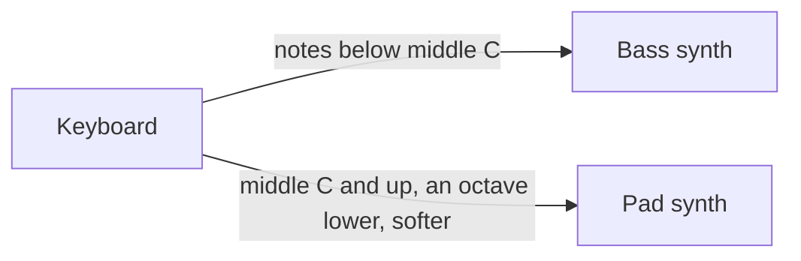

Windows MIDI Patchbay ("Patchbay") is the Windows MIDI Services app that connects MIDI devices to each other. You put devices on a canvas and draw connections from one device's **Out** to another device's **In**. Each connection can let only some messages through, and can change them on the way, such as moving them to another channel or transposing them. A design is called a **patch**, and each patch is one `.midipatch` file.

This article is written for AI agents and online AI chats that plan patches for people. It's also for anyone who wants to write or check a patch file by hand. If you're asking an AI to build a patch for you, give it the link to this article and ask it to read the whole page before it starts.

> **MIDI Patchbay is a preview app.** The patch file described here is version 1. Later versions can add settings.

> **For AI agents:** Read this article from start to finish before you write anything. Follow [Building a patch for someone](#building-a-patch-for-someone) as your process, and use [The patch file](#the-patch-file) as your reference. You usually can't see Patchbay yourself, so the notes marked **For agents** point out mistakes that load without an error and give the customer the wrong patch.

The rules that matter most:

1. **Ask before you build.** Get the device names, what plays what, and on which channels.
2. **Hand the file over to be imported,** and write `"activateAtStartup": false`. The customer turns routing on in Patchbay after they've looked at it.
3. **Count channels and groups from 0 in the file.** People, manuals, and Patchbay's own screens count them from 1.
4. **Name each device the way Windows shows it, and match it by name.** You can't know a device's ID.
5. **Set `"active": true`** on every filter and every transform, and `"valueScale": "percent"` on every transform. Without them, they do nothing.
6. **Write strict JSON.** No comments, no comma after the last item, and no hexadecimal numbers.
7. **Say what Patchbay can't do,** and show the plan in plain words before you hand it over.

On this page:

- [What a patch is](#what-a-patch-is)
- [Building a patch for someone](#building-a-patch-for-someone)
- [Where patch files go, and how to bring one in](#where-patch-files-go-and-how-to-bring-one-in)
- [What Patchbay can't do](#what-patchbay-cant-do)
- [The patch file](#the-patch-file)
- [Mistakes that are easy to miss](#mistakes-that-are-easy-to-miss)

## What a patch is

- A patch has **endpoints**: the devices on its canvas. A keyboard, a synth, a drum machine, or a loopback that leads to an app.
- A patch has **connections**. Each one takes what arrives from one endpoint's **Out** and sends it to another endpoint's **In**.
- Each connection can have a **filter**, which decides what gets through, and a **transform**, which changes what gets through. The filter runs first, then the transform, on the copy going to that one destination. Nothing on one connection affects another.
- Each connection can also have a **sending speed**, which slows it down for a device that loses data when a lot arrives at once. It's the last step, after the filter and the transform.
- A patch can **wait for send complete**. Then each message waits until the device's driver has taken the one before it. It covers every connection in the patch.
- **Routing only happens while Patchbay is running.** Patchbay receives the messages and sends them on itself.
- Several patches can route at the same time, and a patch can route without being the one on screen.

**Groups.** Every MIDI 1.0 device uses group 1. A MIDI 2.0 device can have up to sixteen groups, each with sixteen channels. A connection can start from one group or all of them, and end at one group or all of them:

- From all groups to all groups passes everything through with its group untouched. That's the usual choice.
- From one group passes only that group.
- To one group moves everything onto that group. That's how four groups of one device fold onto one group of another.

## Building a patch for someone

### 1. Ask first

Ask these before you write anything. Put them in one message, in plain words, and offer a sensible answer for each so the customer can just say yes.

If the customer pasted a prompt from **Ask an AI assistant…** in Patchbay, it already lists the MIDI devices on their PC. Use those names exactly. You still need to ask what each device does.

| Ask | Why it matters |
| --- | --- |
| Which devices are involved? Get each one's name exactly as Windows shows it, for example in MIDI Settings, or in Patchbay's **Add endpoint** list. | The file finds devices by name. A name that's only close doesn't match. |
| What should play what? For example, the keyboard plays both synths. | Each pair is a connection. |
| Are any of them apps on the same PC, such as a DAW? | Patchbay reaches an app through a loopback. See [What Patchbay can't do](#what-patchbay-cant-do). |
| Which channels does each device send and listen on? | Most synths listen on one channel. A channel move fixes a mismatch. |
| Should the keyboard be split? At which note? | A split is a note range on each connection. Ask for the note by name, such as middle C. |
| Should anything be transposed, by how much, and on which side of the split? | |
| How should playing feel? Too hard to play loudly, too easy, or every note the same? | That's a velocity change. |
| Does a pedal or a wheel work backwards, or not reach its ends? | That's a controller value change. |
| Should anything be kept out, such as clock, active sensing, or program changes? | That's a filter. |
| Does any device lose messages when a lot arrives at once, such as during a SysEx dump? | That's a sending speed on each connection into it. Keeping out what it doesn't use, with a filter, helps too. |
| Should the patch start by itself whenever Patchbay starts? | The customer turns that on in Patchbay. Tell them where. |

### 2. Plan the connections

Write the plan down as a list before you write the file, and check it for loops: a device's output that finds its way back to its own input, directly or the long way around, floods everything within a second.

| The customer wants | What to write |
| --- | --- |
| One device plays another | One connection from the first to the second. |
| One device plays two | Two connections from the same source. |
| Two devices play one | Two connections into the same destination. |
| A keyboard split at middle C | Two connections from the keyboard, one with a note range of 0 to 59 and the other 60 to 127. |
| A layer: both synths play every note | Two connections from the keyboard with no note range. |
| Move channel 1 to channel 2 | A transform with `"channelMap": [ { "from": 0, "to": 1 } ]`. |
| Transpose down an octave | A transform with `"transposeSemitones": -12`. |
| Only notes get through | A filter with `"messageTypes": 20, "channelVoiceStatuses": 768`. |
| Keep out clock and active sensing | A filter with `"systemMessages": 751`. |
| Only channel 10 | A filter with `"channels": 512`. |
| A sustain pedal that works backwards | A transform with `"controlValueShapes": [ { "controller": 64, "invert": true } ]`. |
| The mod wheel moves expression instead | A transform with `"controlMap": [ { "from": 1, "to": 11 } ]`. |
| Harder to play loud | A transform with `"velocityCurve": 1`. |
| Every note at velocity 100 | A transform with `"velocityCurve": 3, "fixedVelocityPercent": 78.74`. |
| Program 1 on the keyboard picks program 41 on the synth | A transform with `"programMap": [ { "from": 0, "to": 40 } ]`. |
| A device loses messages when a lot arrives at once | `"sendSpeedLimit": 1` on each connection into it. That's MIDI 1.0 wire speed. |
| Each message reaches the device's driver before the next one goes | `"waitForSendComplete": true` at the top level. It covers every connection in the patch. |

The numbers are explained in [Filters](#filters) and [Transforms](#transforms).

### 3. Write the file

- **JSON, saved as UTF-8.** A byte order mark is allowed, but not needed.
- **Strict JSON.** No comments, no comma after the last item in a list or an object, and no hexadecimal numbers. JSON has no `0x`.
- **Names for choices,** spelled exactly as this article shows them, capital letters included.
- **Ids are text,** unique within the patch. Patchbay writes GUIDs, but any unique text works, such as `keyboard` or `keys-to-bass`.
- **Leave out what you don't need.** Anything you leave out takes the default in [The patch file](#the-patch-file).

Don't save the file into Patchbay's own folder. Save it somewhere else, such as Downloads, and have the customer import it, as [Where patch files go](#where-patch-files-go-and-how-to-bring-one-in) explains. Importing is what makes sure a patch from somewhere else doesn't start routing on its own.

If you can run commands on the customer's PC, write the file with PowerShell 7:

```powershell
$path = Join-Path ([Environment]::GetFolderPath('UserProfile')) 'Downloads\Keyboard split.midipatch'
[IO.File]::WriteAllText($path, $json, [Text.UTF8Encoding]::new($false))
```

Then `midipatchbay "<patch file>"` imports it, exactly as a double-click does.

If you're an online chat, give the customer the file as a download named after the patch, ending in `.midipatch`. If you can only show text, put the whole file in one code block and tell them how to save it: paste it into Notepad, select **File** > **Save as**, set **Save as type** to **All files**, type a name that ends in `.midipatch`, and leave **Encoding** at **UTF-8**.

### 4. Check it

Go through [Mistakes that are easy to miss](#mistakes-that-are-easy-to-miss) for every file. If you can run PowerShell 7, save this as `Test-MidiPatch.ps1` and run `pwsh -File Test-MidiPatch.ps1 -Path "<patch file>"`. It reads the file as strictly as Patchbay does, and lists the mistakes that load without an error.

```powershell
param([Parameter(Mandatory)][string]$Path)

$text = [IO.File]::ReadAllText($Path)
$null = [Text.Json.JsonDocument]::Parse($text)   # throws on a comment, a trailing comma, or a hexadecimal number
$patch = $text | ConvertFrom-Json
$problems = [Collections.Generic.List[string]]::new()

function Test-Range($Value, [int]$Lowest, [int]$Highest) { $null -eq $Value -or ($Value -ge $Lowest -and $Value -le $Highest) }

if ($patch.activateAtStartup -ne $false) { $problems.Add('activateAtStartup isn''t false. If this file is put in the patches folder without being imported, it can start routing when Patchbay starts.') }
if ($null -ne $patch.waitForSendComplete -and $patch.waitForSendComplete -isnot [bool]) { $problems.Add('waitForSendComplete isn''t true or false, so Patchbay ignores it.') }

$ids = @($patch.endpoints | ForEach-Object { $_.id })
foreach ($id in ($ids | Group-Object -CaseSensitive | Where-Object Count -gt 1).Name) { $problems.Add("Two endpoints have the id '$id'. Patchbay keeps only the first.") }
foreach ($e in $patch.endpoints) {
    $mode = $e.matchMode ?? 'endpointDeviceId'
    if (-not $e.id) { $problems.Add("The endpoint '$($e.displayName)' has no id, so Patchbay leaves it out.") }
    if (-not $e.displayName) { $problems.Add("The endpoint '$($e.id)' has no displayName.") }
    if ($mode -cnotin @('endpointDeviceId', 'usbVendorAndProduct', 'endpointName')) { $problems.Add("The endpoint '$($e.displayName)' has the matchMode '$mode'.") }
    elseif ($mode -ceq 'endpointDeviceId' -and -not $e.match.endpointDeviceId) { $problems.Add("The endpoint '$($e.displayName)' matches by device ID but has none, so the customer has to pick the device. Use endpointName.") }
}

$pairs = [Collections.Generic.HashSet[string]]::new([StringComparer]::Ordinal)
foreach ($c in $patch.connections) {
    $where = "The connection from '$($c.sourceEndpointId)' to '$($c.destinationEndpointId)'"
    if ($c.sourceEndpointId -cnotin $ids -or $c.destinationEndpointId -cnotin $ids) { $problems.Add("$where names an endpoint that isn't in endpoints, so Patchbay leaves it out.") }
    if (-not (Test-Range $c.sourceGroup -1 15) -or -not (Test-Range $c.destinationGroup -1 15)) { $problems.Add("$where has a group outside -1 to 15. The file counts groups from 0, and -1 is all groups.") }
    if (-not $pairs.Add("$($c.sourceEndpointId)|$($c.sourceGroup ?? -1)|$($c.destinationEndpointId)|$($c.destinationGroup ?? -1)")) { $problems.Add("$where repeats another connection between the same points, so Patchbay keeps only the first.") }
    if ($c.muted -eq $true) { $problems.Add("$where is muted, so it passes nothing.") }
    $speed = $c.sendSpeedLimit
    if ($null -ne $speed -and -not (($speed -is [long] -or $speed -is [int]) -and $speed -in 0, 1, 2, 4, 8, 16, 32)) { $problems.Add("$where has a sendSpeedLimit that isn't 0, 1, 2, 4, 8, 16, or 32.") }
    $from = $c.sourceGroup ?? -1; $to = $c.destinationGroup ?? -1
    if ($c.sourceEndpointId -ceq $c.destinationEndpointId -and ($from -eq $to -or $from -eq -1 -or $to -eq -1)) { $problems.Add("$where sends the endpoint's output straight back into its own input.") }

    $f = $c.filter
    if ($f) {
        if ($f.active -ne $true) { $problems.Add("$where has a filter without `"active`": true, so the filter does nothing.") }
        foreach ($key in 'messageTypes', 'channels', 'channelVoiceStatuses') { if (-not (Test-Range $f.$key 0 65535)) { $problems.Add("$where has $key outside 0 to 65535.") } }
        if (-not (Test-Range $f.systemMessages 0 1023)) { $problems.Add("$where has systemMessages outside 0 to 1023.") }
        if ($f.limitNoteRange -and ($null -eq $f.lowestNote -or $null -eq $f.highestNote -or -not (Test-Range $f.lowestNote 0 127) -or -not (Test-Range $f.highestNote 0 127))) { $problems.Add("$where limits notes but needs lowestNote and highestNote from 0 to 127.") }
        if ($null -ne $f.lowestNote -and -not $f.limitNoteRange) { $problems.Add("$where has a note range but limitNoteRange isn't true, so every note gets through.") }
    }

    $t = $c.transform
    if ($t) {
        if ($t.active -ne $true) { $problems.Add("$where has a transform without `"active`": true, so the transform does nothing.") }
        if ($t.valueScale -cnotin @('percent', 'sevenBit')) { $problems.Add("$where has a transform without `"valueScale`": `"percent`", so its velocity percentages are ignored.") }
        if (-not (Test-Range $t.transposeSemitones -48 48)) { $problems.Add("$where transposes outside -48 to 48.") }
        if (-not (Test-Range $t.velocityCurve 0 3)) { $problems.Add("$where has a velocityCurve outside 0 to 3.") }
        foreach ($key in 'fixedVelocityPercent', 'minimumVelocityPercent', 'maximumVelocityPercent') { if (-not (Test-Range $t.$key 0 100)) { $problems.Add("$where has $key outside 0 to 100.") } }
        foreach ($map in 'channelMap', 'noteMap', 'controlMap', 'programMap', 'bankMsbMap', 'bankLsbMap') {
            $highest = if ($map -ceq 'channelMap') { 15 } else { 127 }
            foreach ($entry in $t.$map) { if ($null -eq $entry.from -or $null -eq $entry.to -or -not (Test-Range $entry.from 0 $highest) -or -not (Test-Range $entry.to 0 $highest)) { $problems.Add("$where has a $map entry outside 0 to $highest. The file counts from 0.") } }
        }
        foreach ($shape in @($t.controlValueShapes) + @($t.aftertouchShape)) {
            if ($null -eq $shape) { continue }
            if ($shape -ne $t.aftertouchShape -and -not (Test-Range $shape.controller 0 127)) { $problems.Add("$where shapes a controller outside 0 to 127.") }
            if (($shape.curve ?? 'linear') -cnotin @('linear', 'slowRise', 'fastRise')) { $problems.Add("$where has the curve '$($shape.curve)'.") }
            foreach ($key in 'inputMinimumPercent', 'inputMaximumPercent', 'outputMinimumPercent', 'outputMaximumPercent') { if (-not (Test-Range $shape.$key 0 100)) { $problems.Add("$where has $key outside 0 to 100.") } }
        }
    }
}

if ($problems.Count -gt 0) { $problems; exit 1 }
'No problems found.'
```

A file that passes can still route the wrong thing. Only the customer can tell you that.

### 5. Show the customer the plan

Show the customer what the patch does before you hand it over, and ask them to confirm it.

- **In plain words.** One line for each connection, such as "Keyboard to Bass synth: notes below middle C only" and "Keyboard to Pad synth: middle C and up, one octave lower, played softer".
- **As a picture,** if you can draw one. Boxes for the devices on the left and the right, and arrows between them, labeled with what each arrow lets through and changes. If you can show Mermaid diagrams, this is enough:



The best picture is Patchbay itself. An imported patch doesn't route until the customer turns it on, so they can import it, look at the canvas, and select each connection to see a summary of what it lets through and changes, before anything is connected.

### 6. Hand it over

Tell the customer how to get the file into Patchbay, using [Where patch files go, and how to bring one in](#where-patch-files-go-and-how-to-bring-one-in). Then tell them:

- How to start it: select the patch, then select **Start routing** on the bar across the top. To have it start every time Patchbay starts, turn on **Start automatically** next to the **Routing** switch.
- That routing only runs while Patchbay is running, and that Patchbay's settings include **Start with Windows** and **Run in notification area**, which keep it going.
- Which device each endpoint stands for. If one shows as missing, the name didn't match. When a connected device looks like a match, Patchbay offers it: select the endpoint, then select **Use this device**. Otherwise, remove the endpoint, add the right device with **Add endpoint**, and draw its connections again.
- What the patch can't do that they asked for, and what you did instead.

## Where patch files go, and how to bring one in

Patchbay keeps its patches in **Documents › MIDI Patchbay**, one `.midipatch` file per patch.

- **To bring a patch in,** select **Import patch…** in Patchbay and pick the file, or double-click the file in File Explorer. The first time you double-click one, Windows asks which app to open it with: pick MIDI Patchbay. From a command line, `midipatchbay "<patch file>"` does the same.
- **Importing copies the file into the patches folder** under a name of its own, so the original can stay where it is. The imported patch doesn't route, and doesn't start automatically, until the customer turns those on.
- **The Documents folder isn't always `C:\Users\<name>\Documents`.** On many PCs it has been moved into OneDrive. In File Explorer, select **Documents** and look for **MIDI Patchbay** there.
- **A file put straight into the folder** shows up the next time Patchbay starts, and skips the import. If it says `"activateAtStartup": true`, or doesn't say, it can start routing as soon as Patchbay starts. That's why you should hand files over to be imported.
- Older versions of Patchbay named patch files `.midipatch.json`. Patchbay renames them to `.midipatch` when it starts.

## What Patchbay can't do

Tell the customer about these before they find out on their own.

- **Routing only runs while Patchbay is running.** Close it, and every route stops. The **Start with Windows** and **Run in notification area** settings keep it going in the background.
- **Patchbay can't reach inside another app.** To send to or receive from an app on the same PC, such as a DAW, the app and Patchbay both use a loopback. A patch file can name a loopback that already exists, but it can't make one. Make it first, with **Create loopback** in Patchbay or with MIDI Loopback Setup, then use its name in the patch.
- **It can't turn one kind of message into another.** No notes into controllers, no controller into an NRPN, and no aftertouch into a controller. Transforms move messages to another channel, note, controller, program, or bank, and reshape velocity, controller values, and aftertouch.
- **It can't pick out one controller.** A filter lets all control changes through or none of them. A transform can move a controller to another number, but can't remove it.
- **It can't route by velocity.** There are no velocity splits or velocity layers.
- **No timing.** No delays, echoes, arpeggios, chords, or clock of its own.
- **It doesn't look inside system exclusive.** A filter lets it through or keeps it out.
- **A sending speed belongs to one connection.** Two connections into the same device can together send it more than either one's speed.
- **A filter's channels and note range only apply to messages that carry them.** Clock, for example, passes a channel filter.
- **It only sees its own connections.** A cable between two devices, or another routing app, can close a loop Patchbay can't see.

## The patch file

### A complete example

This patch splits a keyboard at middle C. Notes below middle C go to the bass synth, with clock and active sensing kept out. Middle C and up go to the pad synth, an octave lower and played softer. Change the three names to the ones Windows shows for the customer's devices.

```json
{
  "fileVersion": 1,
  "name": "Keyboard split",
  "description": "Bass below middle C, pad from middle C up.",
  "activateAtStartup": false,
  "endpoints": [
    { "id": "keyboard", "displayName": "Keyboard", "match": { "transportSuppliedEndpointName": "Keyboard" }, "matchMode": "endpointName", "x": 60, "y": 60 },
    { "id": "bass", "displayName": "Bass synth", "match": { "transportSuppliedEndpointName": "Bass synth" }, "matchMode": "endpointName", "x": 600, "y": 60 },
    { "id": "pad", "displayName": "Pad synth", "match": { "transportSuppliedEndpointName": "Pad synth" }, "matchMode": "endpointName", "x": 600, "y": 260 }
  ],
  "connections": [
    {
      "id": "keyboard-to-bass",
      "sourceEndpointId": "keyboard", "sourceGroup": -1,
      "destinationEndpointId": "bass", "destinationGroup": -1,
      "filter": { "active": true, "systemMessages": 751, "limitNoteRange": true, "lowestNote": 0, "highestNote": 59 }
    },
    {
      "id": "keyboard-to-pad",
      "sourceEndpointId": "keyboard", "sourceGroup": -1,
      "destinationEndpointId": "pad", "destinationGroup": -1,
      "filter": { "active": true, "systemMessages": 751, "limitNoteRange": true, "lowestNote": 60, "highestNote": 127 },
      "transform": { "active": true, "valueScale": "percent", "transposeSemitones": -12, "velocityCurve": 1 }
    }
  ]
}
```

The tables below list every setting. **If left out** is what Patchbay uses when a file doesn't have the key. Patchbay doesn't keep keys it doesn't know: they're gone the next time it saves the patch.

### The top level

| Key | Values | If left out | What it does |
| --- | --- | --- | --- |
| `fileVersion` | 1 | | The file format version. Write 1. |
| `name` | text | the file name | The patch's name in Patchbay. |
| `description` | text | empty | One line about what the patch is for. |
| `activateAtStartup` | `true`, `false` | `true` | Starts routing whenever Patchbay starts. Write `false`. Importing sets it to `false` anyway, and the customer turns it on in Patchbay. |
| `waitForSendComplete` | `true`, `false` | `false` | Each message waits until the device's driver has taken the one before it, the way older apps that use WinMM always send. It covers every connection in the patch. Write `true` only for a device that loses data when a lot arrives at once. |
| `created`, `modified` | numbers | 0 | Kept by the app. Write 0 or leave them out. |
| `endpoints` | list, up to 64 | none | The devices on the canvas. |
| `connections` | list, up to 512 | none | The routes. |

`_comment` is ignored.

### Endpoints

| Key | Values | If left out | What it does |
| --- | --- | --- | --- |
| `id` | text | required | Unique in the patch. Connections name endpoints by id. An endpoint with no id is left out. |
| `displayName` | text | empty | The name on the canvas. Write the device's name as Windows shows it. |
| `match` | object | empty | How Patchbay finds the real device. |
| `matchMode` | `endpointDeviceId`, `usbVendorAndProduct`, `endpointName` | `endpointDeviceId` | Which part of `match` it uses. Write `endpointName`. |
| `x`, `y` | numbers | 0 | Where the endpoint sits on the canvas. An endpoint is at least 252 pixels wide, with about 48 pixels for its name and 32 for each row of groups. Put sources on the left, at `x` 60, and destinations on the right, at `x` 600, about 200 pixels apart from top to bottom. |
| `showAllGroups` | `true`, `false` | `false` | Shows all sixteen groups on a device that doesn't say which it uses. |
| `transportCode` | text | empty | Kept by the app. Leave it out. |

**Matching a device by name.** You can't know a device's ID, so match by name:

```json
{ "id": "keyboard", "displayName": "KeyLab 61 MkII", "match": { "transportSuppliedEndpointName": "KeyLab 61 MkII" }, "matchMode": "endpointName", "x": 60, "y": 60 }
```

Patchbay compares the name in `match` with each device's own name and with the name Windows shows for it, which the customer may have changed in MIDI Settings. Capital letters don't matter, but everything else must be the same. If `match` has no name, it compares `displayName` instead. Two identical devices have the same name, so name matching can't tell them apart. When Patchbay saves a device the customer added, `match` also holds the device's ID and USB details.

### Connections

| Key | Values | If left out | What it does |
| --- | --- | --- | --- |
| `id` | text | made up when the file loads | Unique in the patch. |
| `sourceEndpointId` | an endpoint `id` | required | Where messages come from: that endpoint's **Out**. |
| `sourceGroup` | -1 to 15 | -1 | The group they come from, counted from 0. -1 is all groups. |
| `destinationEndpointId` | an endpoint `id` | required | Where messages go: that endpoint's **In**. |
| `destinationGroup` | -1 to 15 | -1 | The group they go to, counted from 0. -1 keeps each message's own group. |
| `muted` | `true`, `false` | `false` | A muted connection passes nothing. Write `false`. |
| `filter` | object | lets everything through | See [Filters](#filters). |
| `transform` | object | changes nothing | See [Transforms](#transforms). |
| `sendSpeedLimit` | 0, 1, 2, 4, 8, 16, 32 | 0 | How fast this connection sends, as a multiple of MIDI 1.0 wire speed, which is the speed of a 5-pin DIN cable. 0 is no limit. A single message is never held back: after a quiet moment, 64 bytes for each multiple go out at once, and only what comes after that is spaced out. Applies after the filter and the transform. |

A connection that names an endpoint the patch doesn't have is left out, and so is a second connection between the same two points with the same groups.

### Filters

A filter lists what's **allowed** through. Everything starts allowed, and a message has to pass every part of the filter. Leave out a part to allow everything it covers.

| Key | Values | If left out | What it does |
| --- | --- | --- | --- |
| `active` | `true`, `false` | `false` | Turns the filter on. Without it, the filter does nothing. |
| `messageTypes` | 0 to 65535 | 65535 | Which kinds of Universal MIDI Packet get through. |
| `channels` | 0 to 65535 | 65535 | Which channels get through. Applies to channel messages only. |
| `channelVoiceStatuses` | 0 to 65535 | 65535 | Which channel messages get through, such as notes or program changes, for both MIDI 1.0 and MIDI 2.0. |
| `systemMessages` | 0 to 1023 | 1023 | Which system messages get through, such as clock. |
| `limitNoteRange` | `true`, `false` | `false` | Turns the note range on. |
| `lowestNote`, `highestNote` | 0 to 127 | 0 and 127 | The notes that get through, both ends included. Middle C is 60, which Patchbay shows as C3. Other apps and manuals may call it C4, so go by the number. Applies to note on, note off, poly pressure, and MIDI 2.0 per-note messages. |

The four numbers are sets of switches, one bit each. Add up the values of the ones to allow:

| `messageTypes` | Value |
| --- | --- |
| Utility | 1 |
| System, such as clock | 2 |
| MIDI 1.0 channel messages | 4 |
| System exclusive (7-bit) | 8 |
| MIDI 2.0 channel messages | 16 |
| 8-bit data | 32 |
| Flex data | 8192 |
| UMP stream | 32768 |

| `channels` | Value |
| --- | --- |
| Channel *n*, from 1 to 16 | 2 to the power of *n* − 1: channel 1 is 1, channel 2 is 2, channel 3 is 4, and channel 10 is 512 |

| `channelVoiceStatuses` | Value |
| --- | --- |
| MIDI 2.0 registered per-note controller | 1 |
| MIDI 2.0 assignable per-note controller | 2 |
| MIDI 2.0 registered controller (RPN) | 4 |
| MIDI 2.0 assignable controller (NRPN) | 8 |
| MIDI 2.0 relative registered controller | 16 |
| MIDI 2.0 relative assignable controller | 32 |
| MIDI 2.0 per-note pitch bend | 64 |
| Note off | 256 |
| Note on | 512 |
| Poly pressure | 1024 |
| Control change | 2048 |
| Program change | 4096 |
| Channel pressure | 8192 |
| Pitch bend | 16384 |
| MIDI 2.0 per-note management | 32768 |

| `systemMessages` | Value |
| --- | --- |
| Time code | 1 |
| Song position | 2 |
| Song select | 4 |
| Tune request | 8 |
| Timing clock | 16 |
| Start | 32 |
| Continue | 64 |
| Stop | 128 |
| Active sensing | 256 |
| Reset | 512 |

For example:

- **Only notes:** `"messageTypes": 20, "channelVoiceStatuses": 768`. That's MIDI 1.0 and MIDI 2.0 channel messages (4 + 16), and note off and note on (256 + 512).
- **Everything but clock and active sensing:** `"systemMessages": 751`. That's 1023 − 16 − 256.
- **Only channels 1 and 10:** `"channels": 513`. That's 1 + 512.

> **For agents:** A MIDI 1.0 device sends RPNs and NRPNs as control changes 101, 100, 99, 98, 6, and 38, so the RPN and NRPN switches only apply to MIDI 2.0 devices. Keeping control changes out keeps a MIDI 1.0 device's RPNs and NRPNs out too.

### Transforms

A transform changes what gets through, on the way to its one destination.

| Key | Values | If left out | What it does |
| --- | --- | --- | --- |
| `active` | `true`, `false` | `false` | Turns the transform on. Without it, the transform does nothing. |
| `valueScale` | `percent`, `sevenBit` | | Write `percent`. Without it, the velocity percentages below are ignored. It only changes how Patchbay shows numbers; the file always holds percentages. |
| `channelMap` | list of `{ "from": 0, "to": 1 }` | none | Moves a channel to another, counted from 0. Done first, before anything else. |
| `transposeSemitones` | -48 to 48 | 0 | Moves every note up or down, including poly pressure and MIDI 2.0 per-note messages. A note pushed past either end stops at the end. |
| `noteMap` | list of `{ "from": 36, "to": 38 }` | none | Sends one note as another, 0 to 127. A note listed here isn't transposed. |
| `ignoreExactPitchNotes` | `true`, `false` | `false` | Leaves alone MIDI 2.0 notes that carry an exact pitch, for when the note number means a drum pad rather than a pitch. |
| `velocityCurve` | 0 to 3 | 0 | Note on velocity. 0 leaves it alone. 1 is **Linear to curved**, which makes it harder to play loud. 2 is **Curved to linear**, which makes it easier. 3 sends every note at `fixedVelocityPercent`. |
| `fixedVelocityPercent` | 0 to 100 | 78.74 | The velocity for `velocityCurve` 3. 78.74 is 100 out of 127. |
| `rescaleVelocity` | `true`, `false` | `false` | Fits every velocity into a range. |
| `minimumVelocityPercent`, `maximumVelocityPercent` | 0 to 100 | 0 and 100 | That range. |
| `controlMap` | list of `{ "from": 1, "to": 11 }` | none | Sends one controller as another, 0 to 127. |
| `controlValueShapes` | list | none | Changes controller values. See below. |
| `aftertouchShape` | object | none | Changes channel and poly pressure the same way, without `invert`. A pressure of 0 always stays 0. |
| `programMap` | list of `{ "from": 0, "to": 40 }` | none | Picks a different program, 0 to 127, the number sent on the wire. That's one less than most manuals print. |
| `bankMsbMap`, `bankLsbMap` | lists of `{ "from": 0, "to": 1 }` | none | Picks a different bank, as controller 0 and controller 32, or the bank in a MIDI 2.0 program change. |

The `minimumVelocity` and `maximumVelocity` keys Patchbay writes are for older versions. Leave them out.

Each entry in `controlValueShapes` changes one controller's value:

| Key | Values | If left out | What it does |
| --- | --- | --- | --- |
| `controller` | 0 to 127 | required | The controller, after `controlMap` has moved it. |
| `invert` | `true`, `false` | `false` | Turns the value upside down, for a pedal that works backwards. Done before the curve. |
| `curve` | `linear`, `slowRise`, `fastRise` | `linear` | `slowRise` gives finer control near the bottom, and `fastRise` near the top. |
| `inputMinimumPercent`, `inputMaximumPercent` | 0 to 100 | 0 and 100 | The part of the incoming range that counts. A pedal that only reaches 10 to 117 out of 127 is 7.87 to 92.13. |
| `outputMinimumPercent`, `outputMaximumPercent` | 0 to 100 | 0 and 100 | Where that lands. An output maximum of 50 makes the top of the wheel send half. |

For example, a sustain pedal that works backwards, and an expression pedal that never reaches its ends:

```json
"transform": {
  "active": true,
  "valueScale": "percent",
  "controlValueShapes": [
    { "controller": 64, "invert": true },
    { "controller": 11, "inputMinimumPercent": 7.87, "inputMaximumPercent": 92.13 }
  ]
}
```

### Limits

Patchbay reads a patch up to 4 megabytes, with up to 64 endpoints and 512 connections, and up to 128 entries in each list in a transform. It shows up to 256 patches. Text is cut off at 1,024 characters. Anything past a limit is dropped.

## Mistakes that are easy to miss

> **For agents:** Each of these loads without an error and gives the customer the wrong patch.
>
> - A filter or a transform has no `"active": true`, so it does nothing.
> - A transform has no `"valueScale": "percent"`, so its velocity percentages are ignored.
> - A channel or a group is counted from 1. Channel 2 is `1` in the file, and group 1 is `0`.
> - A program is counted from 1. Program 1 is `0` in the file.
> - A note range is set without `"limitNoteRange": true`, so every note gets through.
> - A split leaves a gap or an overlap: 0 to 59 on one side and 60 to 127 on the other has neither.
> - A device in `match` is a name that's only close to the real one, so it shows as missing.
> - `activateAtStartup` is left out and the file is put straight into the patches folder, so it can start routing as soon as Patchbay starts.
> - A connection sends a device's output back to its own input, directly or through other devices, which floods them.
> - A filter keeps out control changes, which also keeps out a MIDI 1.0 device's sustain pedal, mod wheel, RPNs, and NRPNs.
> - `sendSpeedLimit` is put on the connection out of the device that loses data, instead of on the connections into it.
> - A connection is supposed to reach an app, but the patch names a loopback that doesn't exist yet.
> - The patch depends on something in [What Patchbay can't do](#what-patchbay-cant-do).
