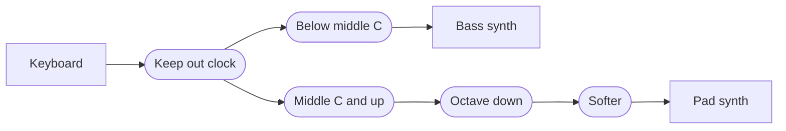

Windows MIDI Patchbay ("Patchbay") is the Windows MIDI Services app that connects MIDI devices to each other. You put devices on a canvas and draw connections from one device's **Out** to another device's **In**. In between, you can add **steps**. A step lets only some messages through, or changes them on the way, such as moving them to another channel or transposing them. A design is called a **patch**, and each patch is one `.midipatch` file.

This article is written for AI agents and online AI chats that plan patches for people. It's also for anyone who wants to write or check a patch file by hand. If you're asking an AI to build a patch for you, give it the link to this article and ask it to read the whole page before it starts.

> **MIDI Patchbay is a preview app.** The patch file described here is version 2, which Patchbay writes from Windows MIDI Services Preview 11 on. Patchbay still opens version 1 files and converts them. Later versions can add settings.

> **For AI agents:** Read this article from start to finish before you write anything. Follow [Building a patch for someone](#building-a-patch-for-someone) as your process, and use [The patch file](#the-patch-file) as your reference. You usually can't see Patchbay yourself, so the notes marked **For agents** point out mistakes that load without an error and give the customer the wrong patch.

The rules that matter most:

1. **Ask before you build.** Get the device names, what plays what, and on which channels.
2. **Write `"fileVersion": 2`.** Without it, Patchbay reads the file as the older format and leaves out every step and connection.
3. **Hand the file over to be imported,** and write `"activateAtStartup": false`. The customer turns routing on in Patchbay after they've looked at it.
4. **Count channels and groups from 0 in the file.** People, manuals, and Patchbay's own screens count them from 1.
5. **Name each device the way Windows shows it, and match it by name.** You can't know a device's ID.
6. **Use only the keys and values in this article.** Patchbay ignores a key it doesn't know without an error, so a made-up key looks fine and does nothing.
7. **Write strict JSON.** No comments, no comma after the last item, and no hexadecimal numbers.
8. **Say what Patchbay can't do,** and show the plan in plain words before you hand it over.

On this page:

- [What a patch is](#what-a-patch-is)
- [Building a patch for someone](#building-a-patch-for-someone)
- [Where patch files go, and how to bring one in](#where-patch-files-go-and-how-to-bring-one-in)
- [What Patchbay can't do](#what-patchbay-cant-do)
- [The patch file](#the-patch-file)
- [Step settings](#step-settings)
- [Mistakes that are easy to miss](#mistakes-that-are-easy-to-miss)

## What a patch is

- A patch has **endpoints**: the devices on its canvas. A keyboard, a synth, a drum machine, or a loopback that leads to an app.
- A patch has **steps**. Each step does one job, such as keeping out clock, letting only some notes through, or transposing. A step has one **In** and one **Out**. MIDI clock and MIDI Time Code have only an **Out**, and an LFO's **In** takes the clock it follows.
- A patch has **connections**. Each one takes what comes out of an endpoint's or a step's **Out** and sends it to another endpoint's or step's **In**.
- Messages go through the steps in the order the connections lead them. A chain of steps between a keyboard and a synth works like a cable with each step plugged in along the way.
- When an **Out** has more than one connection, each connection gets its own copy of every message. What a step does to one copy doesn't change the others. When more than one connection goes into the same **In**, their messages are merged.
- There are four kinds of steps. **Filters** keep messages out. **Transforms** change messages. The **message throttler** slows messages down for a device that loses data when a lot arrives at once. **Generators** make messages of their own, such as MIDI clock, for as long as the patch is routing.
- A patch can **wait for send complete**. Then each message waits until the device's driver has taken the one before it. It covers every connection in the patch.
- **Routing only happens while Patchbay is running.** Patchbay receives the messages and sends them on itself.
- Several patches can route at the same time. Each patch opens in a window of its own, and it keeps routing after its window is closed.

**Groups.** Every MIDI 1.0 device uses group 1. A MIDI 2.0 device can have up to sixteen groups, each with sixteen channels. An endpoint has a connection point for all of its groups, and one for each group:

- From all groups to any group passes everything through with its group untouched. That's the usual choice.
- From one group passes only that group.
- To one group moves everything onto that group. That's how four groups of one device fold onto one group of another.
- A step's **In** and **Out** carry every group. The group filter and group mapper steps pick out and move groups along the way.

## Building a patch for someone

### 1. Ask first

Ask these before you write anything. Put them in one message, in plain words, and offer a sensible answer for each so the customer can just say yes.

If the customer pasted a prompt from **Ask an AI assistant…** in Patchbay, it already lists the MIDI devices on their PC and the groups each one uses. Use those names exactly. You still need to ask what each device does.

| Ask | Why it matters |
| --- | --- |
| Which devices are involved? Get each one's name exactly as Windows shows it, for example in MIDI Settings, or on the **Endpoints** tab of a patch in Patchbay. | The file finds devices by name. A name that's only close doesn't match. |
| What should play what? For example, the keyboard plays both synths. | Each pair is a path of connections, with any steps along the way. |
| Are any of them apps on the same PC, such as a DAW? | Patchbay reaches an app through a loopback. See [What Patchbay can't do](#what-patchbay-cant-do). |
| Which channels does each device send and listen on? | Most synths listen on one channel. A channel mapper step fixes a mismatch. |
| Should the keyboard be split? At which note? | A split is a note filter step on each side. Ask for the note by name, such as middle C. |
| Should anything be transposed, by how much, and on which side of the split? | That's a transpose step. |
| How should playing feel? Too hard to play loudly, too easy, or every note the same? | That's a velocity rescaler step. |
| Should soft and hard playing go to different sounds? Where's the line between them? | That's a velocity filter step on each side. |
| Does a pedal or a wheel work backwards, or not reach its ends? | That's a control change values step. |
| Should anything be kept out, such as clock, active sensing, program changes, or one controller? | That's a filter step. |
| Does any device lose messages when a lot arrives at once, such as during a SysEx dump? | That's a message throttler step in front of it. Keeping out what it doesn't use, with a filter step, helps too. |
| Should Patchbay send MIDI clock to some of the devices? At what tempo? Should it send Start and Stop? | That's a `clockGenerator` step, connected to each device that follows it. A device that should run at half speed gets the clock through a `clockDivider` step. |
| Does a device need MIDI Time Code? At what frame rate, and from what time? | That's a `timeCodeGenerator` step. |
| Should something move up and down by itself, such as a filter sweep or a wobble? Which controller, how fast, and over how much of its range? Should it keep in step with a clock? | That's an `lfoGenerator` step. To keep it in step, connect the clock to its **In**. |
| Should the patch start by itself whenever Patchbay starts? | The customer turns that on in Patchbay. Tell them where. |

### 2. Plan the steps and connections

Write the plan down as a list of paths before you write the file, such as "Keyboard, then Keep out clock, then Below middle C, then Bass synth". Then check it:

- **Loops.** A device's output that finds its way back to its own input, directly or the long way around, floods everything within a second.
- **Steps in a circle.** Steps can't be connected in a circle. A patch with steps in a circle doesn't route at all.
- **Order.** A step only sees what the steps before it let through, and a filter after a transform sees the changed message. Put filters first. To split a keyboard and transpose one side, put the note filter before the transpose, so the split is at the keys the player actually presses.
- **Dead ends.** A step with nothing connected to its **Out** sends what it gets nowhere.

| The customer wants | What to write |
| --- | --- |
| One device plays another | A connection from the first device to the second. No steps. |
| One device plays two | Two connections from the same **Out**. |
| Two devices play one | Two connections into the same **In**. |
| A keyboard split at middle C | Two `noteFilter` steps, both fed by the keyboard. One has `"lowest": 0, "highest": 59` and leads to the first synth. The other has `"lowest": 60, "highest": 127` and leads to the second. |
| A layer: both synths play every note | Two connections from the keyboard, with no note filter. |
| Move channel 1 to channel 2 | A `channelMap` step with `"channelMap": [ { "from": 0, "to": 1 } ]`. |
| Transpose down an octave | A `transpose` step with `"transposeSemitones": -12`. |
| Only notes get through | A `messageTypeFilter` step with `"messageTypes": 20, "channelVoiceStatuses": 768`. |
| Keep out clock and active sensing | A `messageTypeFilter` step with `"systemMessages": 751`. |
| Only channel 10 | A `channelFilter` step with `"channels": 512`. |
| Keep out one controller, such as volume | A `controlChangeFilter` step with `"mode": "one", "controller": 7, "action": "keepOut"`. |
| Of all the controllers, only the mod wheel and the sustain pedal | A `controlChangeFilter` step with `"mode": "list", "controllers": [1, 64], "action": "letThrough"`. Messages that aren't control changes still get through. |
| Soft notes to one synth and hard notes to another, split at velocity 64 | Two `velocityFilter` steps. One has `"lowestPercent": 0, "highestPercent": 49.99`, and the other has `"lowestPercent": 50, "highestPercent": 100`. |
| A sustain pedal that works backwards | A `controlChangeValue` step with `"valueScale": "percent", "controlValueShapes": [ { "controller": 64, "invert": true } ]`. |
| The mod wheel moves expression instead | A `controlChangeMap` step with `"controlMap": [ { "from": 1, "to": 11 } ]`. |
| Harder to play loud | A `velocity` step with `"valueScale": "percent", "velocityCurve": 1`. |
| Every note at velocity 100 | A `velocity` step with `"valueScale": "percent", "velocityCurve": 3, "fixedVelocityPercent": 78.74`. |
| Program 1 on the keyboard picks program 41 on the synth | A `programMap` step with `"programMap": [ { "from": 0, "to": 40 } ]`. |
| Only group 2 of a MIDI 2.0 device | A connection from that device with `"sourceGroup": 1`. |
| Everything onto group 3 of a MIDI 2.0 device | A connection into that device with `"destinationGroup": 2`. |
| Group 1 moves to group 3, and the other groups stay where they are | A `groupMap` step with `"groupMap": [ { "from": 0, "to": 2 } ]`. |
| A device loses messages when a lot arrives at once | A `throttle` step with `"speed": 1`, which is MIDI 1.0 wire speed. Connect everything that goes to that device through it. |
| Each message reaches the device's driver before the next one goes | `"waitForSendComplete": true` at the top level. It covers every connection in the patch. |
| One clock for several devices, at 96 BPM | A `clockGenerator` step with `"beatsPerMinute": 96`, connected to each device. |
| One device at half the tempo of the others | A `clockDivider` step with `"divideBy": 2`, between the clock and that device. |
| Time code at 25 frames per second, from one hour in | A `timeCodeGenerator` step with `"frameRate": 25, "startTime": "01:00:00:00"`. |
| A slow filter sweep on controller 74, two bars long | An `lfoGenerator` step with `"wave": "triangle", "beatsPerCycle": 8, "message": "controlChange", "number": 74`. |
| An LFO in step with a clock | A connection from the clock into the `lfoGenerator` step. The clock can be a `clockGenerator`, a `clockDivider`, or a device that sends MIDI clock. |

The numbers are explained in [Step settings](#step-settings).

### 3. Write the file

- **JSON, saved as UTF-8.** A byte order mark is allowed, but not needed.
- **Strict JSON.** No comments, no comma after the last item in a list or an object, and no hexadecimal numbers. JSON has no `0x`.
- **`"fileVersion": 2`,** every time.
- **Names for choices,** spelled exactly as this article shows them, capital letters included.
- **Ids are text,** unique within the patch across endpoints and steps together. Patchbay writes GUIDs, but any unique text works, such as `keyboard` or `below-middle-c`.
- **Lay it out from left to right,** as [Where things go on the canvas](#where-things-go-on-the-canvas) shows. Patchbay puts everything exactly where the file says.
- **Leave out what you don't need.** Anything you leave out takes the default in [The patch file](#the-patch-file) and [Step settings](#step-settings).

Don't save the file into Patchbay's own folder. Save it somewhere else, such as Downloads, and have the customer import it, as [Where patch files go](#where-patch-files-go-and-how-to-bring-one-in) explains. Importing is what makes sure a patch from somewhere else doesn't start routing on its own.

If you can run commands on the customer's PC, write the file with PowerShell 7:

```powershell
$path = Join-Path ([Environment]::GetFolderPath('UserProfile')) 'Downloads\Keyboard split.midipatch'
[IO.File]::WriteAllText($path, $json, [Text.UTF8Encoding]::new($false))
```

Then `midipatchbay "<patch file>"` imports it, exactly as a double-click does.

If you're an online chat, give the customer the file as a download named after the patch, ending in `.midipatch`. If you can only show text, put the whole file in one code block and tell them how to save it: paste it into Notepad, select **File** > **Save as**, set **Save as type** to **All files**, type a name that ends in `.midipatch`, and leave **Encoding** at **UTF-8**.

### 4. Check it

Go through [Mistakes that are easy to miss](#mistakes-that-are-easy-to-miss) for every file. If you can run PowerShell 7, save this as `Test-MidiPatch.ps1` and run `pwsh -File Test-MidiPatch.ps1 -Path "<patch file>"`. It reads the file as strictly as Patchbay does, and lists the mistakes that load without an error.

```powershell
param([Parameter(Mandatory)][string]$Path)
$ErrorActionPreference = 'Stop'

$text = [IO.File]::ReadAllText($Path)
$null = [Text.Json.JsonDocument]::Parse($text)   # throws on a comment, a trailing comma, or a hexadecimal number
$patch = $text | ConvertFrom-Json
$problems = [Collections.Generic.List[string]]::new()

function Test-Number($Value) { $Value -is [long] -or $Value -is [int] -or $Value -is [double] -or $Value -is [decimal] }
function Test-Range($Value, [double]$Lowest, [double]$Highest) { $null -eq $Value -or ((Test-Number $Value) -and $Value -ge $Lowest -and $Value -le $Highest) }
function Get-List($Value) { if ($null -eq $Value) { @() } else { @($Value) } }
function Test-Keys($Object, [string[]]$Known, [string]$Where) {
    if ($Object -isnot [Management.Automation.PSCustomObject]) { return }
    $in = $Where.Substring(0, 1).ToLowerInvariant() + $Where.Substring(1)
    foreach ($name in $Object.PSObject.Properties.Name) { if ($name -cnotin $Known) { $problems.Add("Patchbay doesn't know the key '$name' in $in, so it's ignored.") } }
}
function Test-Choice($Value, [string[]]$Choices, [string]$Where, [string]$Key) {
    if ($null -ne $Value -and $Value -cnotin $Choices) { $problems.Add("$Where has the $Key '$Value'. Use one of: $($Choices -join ', ').") }
}
function Test-Map($Settings, [string]$Key, [int]$Highest, [string]$Where) {
    $list = Get-List $Settings.$Key
    if ($list.Count -gt 128) { $problems.Add("$Where has more than 128 entries in $Key. Patchbay keeps the first 128.") }
    foreach ($entry in $list) {
        if (-not (Test-Number $entry.from) -or -not (Test-Number $entry.to) -or -not (Test-Range $entry.from 0 $Highest) -or -not (Test-Range $entry.to 0 $Highest)) { $problems.Add("$Where has a $Key entry without a from and a to from 0 to $Highest. The file counts from 0.") }
    }
}
function Test-Shape($Shape, [bool]$ForController, [string]$Where) {
    $known = @('curve', 'inputMinimumPercent', 'inputMaximumPercent', 'outputMinimumPercent', 'outputMaximumPercent') + $(if ($ForController) { 'controller', 'invert' } else { @() })
    Test-Keys $Shape $known $Where
    if ($ForController -and (-not (Test-Number $Shape.controller) -or -not (Test-Range $Shape.controller 0 127))) { $problems.Add("$Where shapes a controller that isn't 0 to 127, so that entry is left out.") }
    Test-Choice $Shape.curve @('linear', 'slowRise', 'fastRise') $Where 'curve'
    foreach ($key in 'inputMinimumPercent', 'inputMaximumPercent', 'outputMinimumPercent', 'outputMaximumPercent') { if (-not (Test-Range $Shape.$key 0 100)) { $problems.Add("$Where has $key outside 0 to 100.") } }
}
function Test-ValueSet($Settings, [string]$One, [string]$Many, [string]$Where) {
    Test-Choice $Settings.mode @('range', 'one', 'list') $Where 'mode'
    Test-Choice $Settings.action @('letThrough', 'keepOut') $Where 'action'
    foreach ($key in 'lowest', 'highest', $One) { if (-not (Test-Range $Settings.$key 0 127)) { $problems.Add("$Where has $key outside 0 to 127.") } }
    foreach ($value in (Get-List $Settings.$Many)) { if (-not (Test-Number $value) -or -not (Test-Range $value 0 127)) { $problems.Add("$Where has '$value' in $Many, which isn't a number from 0 to 127.") } }
    $mode = $Settings.mode ?? 'range'
    if ($mode -ceq 'range' -and ($null -ne $Settings.$One -or (Get-List $Settings.$Many).Count -gt 0) -and $null -eq $Settings.lowest -and $null -eq $Settings.highest) { $problems.Add("$Where sets $One or $Many, but mode isn't one or list, so it uses the range and picks out everything.") }
    if ($mode -ceq 'list' -and (Get-List $Settings.$Many).Count -eq 0) { $problems.Add("$Where has an empty $Many list. With letThrough nothing it looks at gets through, and with keepOut it does nothing.") }
}

$stepKeys = @{
    messageTypeFilter   = @('messageTypes', 'channelVoiceStatuses', 'systemMessages')
    groupFilter         = @('groups')
    channelFilter       = @('channels')
    noteFilter          = @('mode', 'action', 'lowest', 'highest', 'note', 'notes')
    controlChangeFilter = @('mode', 'action', 'lowest', 'highest', 'controller', 'controllers')
    velocityFilter      = @('action', 'valueScale', 'lowestPercent', 'highestPercent')
    messageMaskFilter   = @('words', 'action', 'hex', 'conditions')
    channelMap          = @('channelMap')
    groupMap            = @('groupMap')
    noteMap             = @('noteMap', 'ignoreExactPitchNotes')
    transpose           = @('transposeSemitones', 'ignoreExactPitchNotes')
    velocity            = @('valueScale', 'velocityCurve', 'fixedVelocityPercent', 'rescaleVelocity', 'minimumVelocityPercent', 'maximumVelocityPercent')
    aftertouch          = @('valueScale', 'aftertouchShape')
    controlChangeMap    = @('controlMap')
    controlChangeValue  = @('valueScale', 'controlValueShapes')
    programMap          = @('programMap', 'bankMsbMap', 'bankLsbMap')
    throttle            = @('speed')
    clockDivider        = @('divideBy')
    clockGenerator      = @('beatsPerMinute', 'sendStartStop', 'swingPercent', 'swingSubdivision', 'group')
    timeCodeGenerator   = @('frameRate', 'startTime', 'sendFullFrame', 'group')
    lfoGenerator        = @('wave', 'beatsPerCycle', 'beatsPerMinute', 'lowestPercent', 'highestPercent', 'intervalMilliseconds', 'message', 'channel', 'number', 'group', 'midi1', 'returnToMiddle')
}
$generators = @('clockGenerator', 'timeCodeGenerator', 'lfoGenerator')
$noInput = @('clockGenerator', 'timeCodeGenerator')

Test-Keys $patch @('_comment', 'fileVersion', 'name', 'description', 'activateAtStartup', 'waitForSendComplete', 'created', 'modified', 'endpoints', 'blocks', 'connections') 'The patch'
if ($patch.fileVersion -ne 2) { $problems.Add('fileVersion isn''t 2, so Patchbay reads this as an older patch and leaves out every step and connection.') }
if ($patch.activateAtStartup -ne $false) { $problems.Add('activateAtStartup isn''t false. If this file is put in the patches folder without being imported, it can start routing when Patchbay starts.') }
if ($null -ne $patch.waitForSendComplete -and $patch.waitForSendComplete -isnot [bool]) { $problems.Add('waitForSendComplete isn''t true or false, so Patchbay ignores it.') }

$kinds = [Collections.Generic.Dictionary[string, string]]::new([StringComparer]::Ordinal)   # id -> endpoint or step type
foreach ($e in (Get-List $patch.endpoints)) {
    $where = "The endpoint '$($e.displayName ?? $e.id)'"
    Test-Keys $e @('id', 'displayName', 'transportCode', 'match', 'matchMode', 'x', 'y', 'showAllGroups') $where
    $mode = $e.matchMode ?? 'endpointDeviceId'
    if (-not $e.id) { $problems.Add("$where has no id, so Patchbay leaves it out."); continue }
    if (-not $kinds.TryAdd($e.id, 'endpoint')) { $problems.Add("Two endpoints have the id '$($e.id)'. Patchbay keeps only the first.") }
    if (-not $e.displayName) { $problems.Add("The endpoint '$($e.id)' has no displayName.") }
    if ($mode -cnotin @('endpointDeviceId', 'usbVendorAndProduct', 'endpointName')) { $problems.Add("$where has the matchMode '$mode'.") }
    elseif ($mode -ceq 'endpointDeviceId' -and -not $e.match.endpointDeviceId) { $problems.Add("$where matches by device ID but has none, so the customer has to pick the device. Use endpointName.") }
}

foreach ($b in (Get-List $patch.blocks)) {
    $where = "The step '$($b.name ?? $b.id)'"
    Test-Keys $b @('id', 'type', 'name', 'x', 'y', 'bypassed', 'settings') $where
    if (-not $b.id) { $problems.Add("$where has no id, so Patchbay leaves it out."); continue }
    if ($b.type -cnotin $stepKeys.Keys) { $problems.Add("$where has the type '$($b.type)', which Patchbay doesn't know, so it leaves the step out with its connections."); continue }
    if (-not $kinds.TryAdd($b.id, $b.type)) { $problems.Add("The step '$($b.id)' has an id that another endpoint or step already has, so Patchbay leaves it out."); continue }
    if ($b.bypassed -eq $true) { $problems.Add($(if ($b.type -cin $generators) { "$where is bypassed, so it sends nothing." } else { "$where is bypassed, so it lets everything through unchanged." })) }
    $s = $b.settings
    if ($null -eq $s) { $problems.Add("$where has no settings, so it uses the defaults for its type."); continue }
    Test-Keys $s $stepKeys[$b.type] "The settings of the step '$($b.name ?? $b.id)'"

    switch -CaseSensitive ($b.type) {
        'messageTypeFilter' {
            foreach ($key in 'messageTypes', 'channelVoiceStatuses') { if (-not (Test-Range $s.$key 0 65535)) { $problems.Add("$where has $key outside 0 to 65535.") } }
            if (-not (Test-Range $s.systemMessages 0 1023)) { $problems.Add("$where has systemMessages outside 0 to 1023.") }
        }
        'channelFilter' { if (-not (Test-Range $s.channels 0 65535)) { $problems.Add("$where has channels outside 0 to 65535.") } }
        'groupFilter' { if (-not (Test-Range $s.groups 0 65535)) { $problems.Add("$where has groups outside 0 to 65535.") } }
        'noteFilter' { Test-ValueSet $s 'note' 'notes' $where }
        'controlChangeFilter' { Test-ValueSet $s 'controller' 'controllers' $where }
        'velocityFilter' {
            Test-Choice $s.action @('letThrough', 'keepOut') $where 'action'
            Test-Choice $s.valueScale @('percent', 'sevenBit') $where 'valueScale'
            foreach ($key in 'lowestPercent', 'highestPercent') { if (-not (Test-Range $s.$key 0 100)) { $problems.Add("$where has $key outside 0 to 100.") } }
        }
        'messageMaskFilter' {
            $words = $s.words ?? 2
            if (-not (Test-Number $words) -or $words -notin 1, 2, 3, 4) { $problems.Add("$where has words that isn't 1, 2, 3, or 4."); $words = 2 }
            Test-Choice $s.action @('letThrough', 'keepOut') $where 'action'
            $conditions = Get-List $s.conditions
            if ($conditions.Count -eq 0) { $problems.Add("$where has no conditions, so it does nothing.") }
            if ($conditions.Count -gt 4) { $problems.Add("$where has more than 4 conditions. Patchbay keeps the first 4.") }
            foreach ($c in $conditions) {
                Test-Keys $c @('word', 'highBit', 'lowBit', 'match', 'value', 'values', 'lowest', 'highest') "A condition in the step '$($b.name ?? $b.id)'"
                if (-not (Test-Number $c.word) -or -not (Test-Number $c.highBit) -or -not (Test-Number $c.lowBit) -or $c.word -lt 0 -or $c.word -ge $words -or -not (Test-Range $c.highBit 0 31) -or -not (Test-Range $c.lowBit 0 $c.highBit)) {
                    $problems.Add("$where has a condition whose word, highBit or lowBit is missing or doesn't fit a message of $words words, so it's left out."); continue
                }
                $largest = [Math]::Pow(2, $c.highBit - $c.lowBit + 1) - 1
                Test-Choice $c.match @('exactly', 'anyOf', 'between') $where 'match'
                foreach ($key in 'value', 'lowest', 'highest') { if (-not (Test-Range $c.$key 0 $largest)) { $problems.Add("$where has a condition $key that doesn't fit in bits $($c.highBit) to $($c.lowBit), which hold 0 to $largest.") } }
                foreach ($value in (Get-List $c.values)) { if (-not (Test-Number $value) -or -not (Test-Range $value 0 $largest)) { $problems.Add("$where has a condition value '$value' that doesn't fit in bits $($c.highBit) to $($c.lowBit).") } }
            }
        }
        'channelMap' { Test-Map $s 'channelMap' 15 $where }
        'groupMap' { Test-Map $s 'groupMap' 15 $where }
        'noteMap' { Test-Map $s 'noteMap' 127 $where }
        'transpose' { if (-not (Test-Range $s.transposeSemitones -48 48)) { $problems.Add("$where transposes outside -48 to 48.") } }
        'velocity' {
            if ($s.valueScale -cnotin @('percent', 'sevenBit')) { $problems.Add("$where has no `"valueScale`": `"percent`", so its velocity percentages are ignored.") }
            if (-not (Test-Range $s.velocityCurve 0 3)) { $problems.Add("$where has a velocityCurve outside 0 to 3.") }
            foreach ($key in 'fixedVelocityPercent', 'minimumVelocityPercent', 'maximumVelocityPercent') { if (-not (Test-Range $s.$key 0 100)) { $problems.Add("$where has $key outside 0 to 100.") } }
        }
        'aftertouch' {
            Test-Choice $s.valueScale @('percent', 'sevenBit') $where 'valueScale'
            if ($null -ne $s.aftertouchShape) { Test-Shape $s.aftertouchShape $false "The aftertouchShape in the step '$($b.name ?? $b.id)'" }
        }
        'controlChangeMap' { Test-Map $s 'controlMap' 127 $where }
        'controlChangeValue' {
            Test-Choice $s.valueScale @('percent', 'sevenBit') $where 'valueScale'
            foreach ($shape in (Get-List $s.controlValueShapes)) { Test-Shape $shape $true "A controlValueShapes entry in the step '$($b.name ?? $b.id)'" }
        }
        'programMap' { foreach ($key in 'programMap', 'bankMsbMap', 'bankLsbMap') { Test-Map $s $key 127 $where } }
        'throttle' { if ($null -ne $s.speed -and -not ((Test-Number $s.speed) -and $s.speed -in 0, 1, 2, 4, 8, 16, 32)) { $problems.Add("$where has a speed that isn't 0, 1, 2, 4, 8, 16, or 32.") } }
        'clockDivider' { if (-not (Test-Range $s.divideBy 1 96)) { $problems.Add("$where has divideBy outside 1 to 96.") } }
        'clockGenerator' {
            if (-not (Test-Range $s.beatsPerMinute 20 300)) { $problems.Add("$where has beatsPerMinute outside 20 to 300.") }
            if (-not (Test-Range $s.swingPercent 50 75)) { $problems.Add("$where has swingPercent outside 50 to 75.") }
            if ($null -ne $s.swingSubdivision -and $s.swingSubdivision -notin 2, 4) { $problems.Add("$where has a swingSubdivision that isn't 2 or 4.") }
        }
        'timeCodeGenerator' {
            $rate = $s.frameRate ?? 30
            if (-not (Test-Number $rate) -or $rate -notin 24, 25, 29.97, 30) { $problems.Add("$where has a frameRate that isn't 24, 25, 29.97, or 30."); $rate = 30 }
            if ($null -ne $s.startTime) {
                $parts = @("$($s.startTime)" -split '[:;.]')
                $fit = $s.startTime -is [string] -and $parts.Count -le 4 -and -not ($parts | Where-Object { $_ -notmatch '^\d{1,3}$' })
                if ($fit) {
                    $parts = @(@('0') * (4 - $parts.Count)) + $parts
                    $fit = [int]$parts[0] -le 23 -and [int]$parts[1] -le 59 -and [int]$parts[2] -le 59 -and [int]$parts[3] -lt [Math]::Round($rate)
                }
                if (-not $fit) { $problems.Add("$where has a startTime that isn't hours:minutes:seconds:frames at its frame rate, so it starts from 00:00:00:00.") }
            }
        }
        'lfoGenerator' {
            Test-Choice $s.wave @('sine', 'triangle', 'square', 'rampUp', 'rampDown', 'whiteNoise', 'pinkNoise', 'brownNoise', 'blueNoise') $where 'wave'
            if (-not (Test-Range $s.beatsPerCycle 0.0625 64)) { $problems.Add("$where has beatsPerCycle outside 0.0625 to 64.") }
            if (-not (Test-Range $s.beatsPerMinute 20 300)) { $problems.Add("$where has beatsPerMinute outside 20 to 300.") }
            foreach ($key in 'lowestPercent', 'highestPercent') { if (-not (Test-Range $s.$key 0 100)) { $problems.Add("$where has $key outside 0 to 100.") } }
            if (-not (Test-Range $s.intervalMilliseconds 5 1000)) { $problems.Add("$where has intervalMilliseconds outside 5 to 1000.") }
            Test-Choice $s.message @('controlChange', 'pitchBend', 'channelPressure', 'polyPressure', 'rpn', 'nrpn') $where 'message'
            if (-not (Test-Range $s.channel 0 15)) { $problems.Add("$where has a channel outside 0 to 15. The file counts channels from 0.") }
            $message = $s.message ?? 'controlChange'
            if ($message -cin 'pitchBend', 'channelPressure') { if ($null -ne $s.number) { $problems.Add("$where has a number, but $message doesn't use one, so it's ignored.") } }
            else {
                $largest = if ($message -cin 'rpn', 'nrpn') { 16383 } else { 127 }
                if (-not (Test-Range $s.number 0 $largest)) { $problems.Add("$where has a number outside 0 to $largest for $message.") }
            }
        }
    }
    if ($b.type -cin $generators -and -not (Test-Range $s.group 0 15)) { $problems.Add("$where has a group outside 0 to 15. The file counts groups from 0.") }
}

$next = [Collections.Generic.Dictionary[string, Collections.Generic.List[string]]]::new([StringComparer]::Ordinal)
$hasIn = [Collections.Generic.HashSet[string]]::new([StringComparer]::Ordinal)
$hasOut = [Collections.Generic.HashSet[string]]::new([StringComparer]::Ordinal)
$pairs = [Collections.Generic.HashSet[string]]::new([StringComparer]::Ordinal)
foreach ($c in (Get-List $patch.connections)) {
    $where = if ($c.source -and $c.destination) { "The connection from '$($c.source)' to '$($c.destination)'" } else { "The connection '$($c.id)'" }
    Test-Keys $c @('id', 'source', 'sourceGroup', 'destination', 'destinationGroup', 'muted') $where
    if (-not $c.source -or -not $c.destination -or -not $kinds.ContainsKey($c.source) -or -not $kinds.ContainsKey($c.destination)) { $problems.Add("$where names an endpoint or step that isn't in the patch, so Patchbay leaves it out."); continue }
    if ($c.source -ceq $c.destination) { $problems.Add("$where goes from something to itself, so Patchbay leaves it out."); continue }
    if ($kinds[$c.destination] -cin $noInput) { $problems.Add("$where goes into a $($kinds[$c.destination]) step, which has no In, so Patchbay leaves it out."); continue }
    if ($kinds[$c.source] -cne 'endpoint' -and $null -ne $c.sourceGroup) { $problems.Add("$where has a sourceGroup, but a step has one Out, so it's ignored.") }
    if ($kinds[$c.destination] -cne 'endpoint' -and $null -ne $c.destinationGroup) { $problems.Add("$where has a destinationGroup, but a step has one In, so it's ignored.") }
    if (-not (Test-Range $c.sourceGroup -1 15) -or -not (Test-Range $c.destinationGroup -1 15)) { $problems.Add("$where has a group outside -1 to 15. The file counts groups from 0, and -1 is all groups.") }
    $from = if ($kinds[$c.source] -ceq 'endpoint') { $c.sourceGroup ?? -1 } else { -1 }
    $to = if ($kinds[$c.destination] -ceq 'endpoint') { $c.destinationGroup ?? -1 } else { -1 }
    if (-not $pairs.Add("$($c.source)|$from|$($c.destination)|$to")) { $problems.Add("$where repeats another connection between the same points, so Patchbay keeps only the first."); continue }
    if ($c.muted -eq $true) { $problems.Add("$where is muted, so it passes nothing."); continue }
    if (-not $next.ContainsKey($c.source)) { $next[$c.source] = [Collections.Generic.List[string]]::new() }
    $next[$c.source].Add($c.destination)
    $null = $hasOut.Add($c.source); $null = $hasIn.Add($c.destination)
}

foreach ($id in $kinds.Keys) {
    if ($kinds[$id] -ceq 'endpoint') { continue }
    if ($kinds[$id] -cin $generators) {
        if (-not $hasOut.Contains($id)) { $problems.Add("Nothing is connected to the Out of the generator '$id', so it doesn't run.") }
        continue
    }
    if (-not $hasIn.Contains($id)) { $problems.Add("Nothing is connected to the In of the step '$id', so it does nothing.") }
    if (-not $hasOut.Contains($id)) { $problems.Add("Nothing is connected to the Out of the step '$id', so what goes into it goes nowhere.") }
}

# Steps connected in a circle stop the whole patch from routing.
$state = [Collections.Generic.Dictionary[string, int]]::new([StringComparer]::Ordinal)
function Find-StepCircle([string]$Id) {
    $state[$Id] = 1
    if ($next.ContainsKey($Id)) {
        foreach ($to in $next[$Id]) {
            if ($kinds[$to] -ceq 'endpoint' -or $kinds[$to] -cin $generators) { continue }   # what goes into an LFO goes no further
            if ($state.ContainsKey($to) -and $state[$to] -eq 1) { return $true }
            if (-not $state.ContainsKey($to) -and (Find-StepCircle $to)) { return $true }
        }
    }
    $state[$Id] = 2
    return $false
}
foreach ($id in @($kinds.Keys)) { if ($kinds[$id] -cne 'endpoint' -and -not $state.ContainsKey($id) -and (Find-StepCircle $id)) { $problems.Add('Some steps are connected in a circle, so the whole patch doesn''t route.'); break } }

# An endpoint whose Out leads back to its own In, straight or through steps, floods it.
foreach ($id in @($kinds.Keys)) {
    if ($kinds[$id] -cne 'endpoint') { continue }
    $seen = [Collections.Generic.HashSet[string]]::new([StringComparer]::Ordinal)
    $pending = [Collections.Generic.Stack[string]]::new(); $pending.Push($id)
    while ($pending.Count -gt 0) {
        $current = $pending.Pop()
        if (-not $next.ContainsKey($current)) { continue }
        foreach ($to in $next[$current]) {
            if ($to -ceq $id) { $problems.Add("The endpoint '$id' sends its output back into its own input. Unless that only moves messages to another group, it floods the device."); $pending.Clear(); break }
            if ($kinds[$to] -cne 'endpoint' -and $kinds[$to] -cnotin $generators -and $seen.Add($to)) { $pending.Push($to) }
        }
    }
}

if ($problems.Count -gt 0) { $problems | Select-Object -Unique; exit 1 }
'No problems found.'
```

A file that passes can still route the wrong thing. Only the customer can tell you that.

### 5. Show the customer the plan

Show the customer what the patch does before you hand it over, and ask them to confirm it.

- **In plain words.** One line for each path, such as "Keyboard to Bass synth: notes below middle C only" and "Keyboard to Pad synth: middle C and up, one octave lower, played softer". Say what each step does, not just its name.
- **As a picture,** if you can draw one. Boxes for the devices on the left and the right, rounded boxes for the steps between them, and arrows for the connections. If you can show Mermaid diagrams, this is enough:



The best picture is Patchbay itself. An imported patch doesn't route until the customer turns it on, so they can import it, open it, and select each step to see what it does, before anything is connected.

### 6. Hand it over

Tell the customer how to get the file into Patchbay, using [Where patch files go, and how to bring one in](#where-patch-files-go-and-how-to-bring-one-in). Then tell them:

- How to start it: in the main MIDI Patchbay window, turn on the switch on the patch's tile. Or open the patch and select **Start routing** on the bar across the top. To have it start every time Patchbay starts, open the patch and turn on **Start automatically** next to the **Routing** switch.
- That routing only runs while Patchbay is running, and that Patchbay's settings include **Start with Windows** and **Run in notification area**, which keep it going.
- Which device each endpoint stands for. If one shows as missing, the name didn't match. When a connected device looks like a match, Patchbay offers it: select the endpoint, then select **Use this device**. Otherwise, remove the endpoint, drag the right device onto the canvas from the **Endpoints** tab on the left, and draw its connections again.
- That **Auto arrange**, on the toolbar of the patch window, lays the patch out again if it looks crowded.
- What the patch can't do that they asked for, and what you did instead.

## Where patch files go, and how to bring one in

Patchbay keeps its patches in **Documents › MIDI Patchbay**, one `.midipatch` file per patch.

- **To bring a patch in,** select **Import patch…** in the main MIDI Patchbay window and pick the file, or double-click the file in File Explorer. The first time you double-click one, Windows asks which app to open it with: pick MIDI Patchbay. From a command line, `midipatchbay "<patch file>"` does the same.
- **Importing copies the file into the patches folder** under a name of its own, so the original can stay where it is. The imported patch doesn't route, and doesn't start automatically, until the customer turns those on.
- **The Documents folder isn't always `C:\Users\<name>\Documents`.** On many PCs it has been moved into OneDrive. In File Explorer, select **Documents** and look for **MIDI Patchbay** there.
- **A file put straight into the folder** shows up the next time Patchbay starts, and skips the import. If it says `"activateAtStartup": true`, or doesn't say, it can start routing as soon as Patchbay starts. That's why you should hand files over to be imported.
- **A version 1 patch is converted when Patchbay opens it.** Its filters, transforms, and sending speeds become steps, and it routes the same way it did. Patchbay keeps the original file in **Documents › MIDI Patchbay › Earlier versions**.
- **Patchbay in Windows MIDI Services Preview 10 or earlier can't read version 2.** It opens the file with no connections, and saving it there loses the steps and connections. If a patch window in the customer's Patchbay has no **Steps** tab on the left, ask them to update Windows MIDI Services first.
- Older versions of Patchbay named patch files `.midipatch.json`. Patchbay renames them to `.midipatch` when it starts.

## What Patchbay can't do

Tell the customer about these before they find out on their own.

- **Routing only runs while Patchbay is running.** Close it, and every route stops. The **Start with Windows** and **Run in notification area** settings keep it going in the background.
- **Patchbay can't reach inside another app.** To send to or receive from an app on the same PC, such as a DAW, the app and Patchbay both use a loopback. A patch file can name a loopback that already exists, but it can't make one. Make it first, with **Create loopback** in Patchbay or with MIDI Loopback Setup, then use its name in the patch.
- **It can't turn one kind of message into another.** No notes into controllers, no controller into an NRPN, and no aftertouch into a controller. Steps move messages to another channel, group, note, controller, program, or bank, and reshape velocity, controller values, and aftertouch.
- **No delays, echoes, arpeggios, or chords.** Only the generator steps make messages of their own: MIDI clock, MIDI Time Code, and an LFO.
- **MIDI clock and MIDI Time Code don't follow anything.** They can't lock to a clock that comes in from a device, and messages don't start or stop them. They run whenever their patch is routing. Only an LFO follows a clock, and only one connected to its **In**.
- **It doesn't look inside system exclusive.** A message type filter lets it all through or keeps it all out. A message mask can't do better: a long system exclusive message is split into many packets, and a mask sees each packet on its own.
- **Steps can't be connected in a circle.** A patch with steps in a circle doesn't route until the circle is broken.
- **A filter's channels and notes only apply to messages that carry them.** Clock, for example, gets through a channel filter and a note filter.
- **A velocity filter only looks at note on messages.** Note off always gets through, so no note is left sounding.
- **Messages without a group aren't routed.** Those are the MIDI 2.0 stream messages that devices use to describe themselves, and utility messages such as jitter reduction timestamps.
- **It only sees its own connections.** A cable between two devices, or another routing app, can close a loop Patchbay can't see.

## The patch file

### A complete example

This patch splits a keyboard at middle C. Clock and active sensing are kept out of both sides. Notes below middle C go to the bass synth. Middle C and up go to the pad synth, an octave lower and played softer. Change the three device names to the ones Windows shows for the customer's devices.

```json
{
  "fileVersion": 2,
  "name": "Keyboard split",
  "description": "Bass below middle C, pad from middle C up.",
  "activateAtStartup": false,
  "endpoints": [
    { "id": "keyboard", "displayName": "Keyboard", "match": { "transportSuppliedEndpointName": "Keyboard" }, "matchMode": "endpointName", "x": 60, "y": 100 },
    { "id": "bass", "displayName": "Bass synth", "match": { "transportSuppliedEndpointName": "Bass synth" }, "matchMode": "endpointName", "x": 1520, "y": 20 },
    { "id": "pad", "displayName": "Pad synth", "match": { "transportSuppliedEndpointName": "Pad synth" }, "matchMode": "endpointName", "x": 1520, "y": 220 }
  ],
  "blocks": [
    { "id": "no-clock", "type": "messageTypeFilter", "name": "Keep out clock", "x": 400, "y": 130, "settings": { "systemMessages": 751 } },
    { "id": "low-notes", "type": "noteFilter", "name": "Below middle C", "x": 680, "y": 40, "settings": { "mode": "range", "action": "letThrough", "lowest": 0, "highest": 59 } },
    { "id": "high-notes", "type": "noteFilter", "name": "Middle C and up", "x": 680, "y": 220, "settings": { "mode": "range", "action": "letThrough", "lowest": 60, "highest": 127 } },
    { "id": "octave-down", "type": "transpose", "name": "Octave down", "x": 960, "y": 220, "settings": { "transposeSemitones": -12 } },
    { "id": "softer", "type": "velocity", "name": "Softer", "x": 1240, "y": 220, "settings": { "valueScale": "percent", "velocityCurve": 1 } }
  ],
  "connections": [
    { "id": "keyboard-in", "source": "keyboard", "sourceGroup": -1, "destination": "no-clock" },
    { "id": "to-low", "source": "no-clock", "destination": "low-notes" },
    { "id": "to-high", "source": "no-clock", "destination": "high-notes" },
    { "id": "low-to-bass", "source": "low-notes", "destination": "bass", "destinationGroup": -1 },
    { "id": "high-down", "source": "high-notes", "destination": "octave-down" },
    { "id": "down-softer", "source": "octave-down", "destination": "softer" },
    { "id": "softer-to-pad", "source": "softer", "destination": "pad", "destinationGroup": -1 }
  ]
}
```

The tables below list every setting. **If left out** is what Patchbay uses when a file doesn't have the key. Patchbay doesn't keep keys it doesn't know: they're gone the next time it saves the patch.

### The top level

| Key | Values | If left out | What it does |
| --- | --- | --- | --- |
| `fileVersion` | 2 | 1 | The file format version. Write 2. Patchbay reads a file without it, or with 1, as the older format, which has no steps. |
| `name` | text | the file name | The patch's name in Patchbay. |
| `description` | text | empty | One line about what the patch is for. |
| `activateAtStartup` | `true`, `false` | `true` | Starts routing whenever Patchbay starts. Write `false`. Importing sets it to `false` anyway, and the customer turns it on in Patchbay. |
| `waitForSendComplete` | `true`, `false` | `false` | Each message waits until the device's driver has taken the one before it, the way older apps that use WinMM always send. It covers every connection in the patch. Write `true` only for a device that loses data when a lot arrives at once. |
| `created`, `modified` | numbers | 0 | Kept by the app. Write 0 or leave them out. |
| `endpoints` | list, up to 64 | none | The devices on the canvas. |
| `blocks` | list, up to 1,024 | none | The steps on the canvas. The file calls them blocks. |
| `connections` | list, up to 2,048 | none | What's connected to what. |

`_comment` is ignored.

### Endpoints

| Key | Values | If left out | What it does |
| --- | --- | --- | --- |
| `id` | text | required | Unique in the patch, among endpoints and steps together. Connections name endpoints by id. An endpoint with no id, or with an id that's already used, is left out. |
| `displayName` | text | empty | The name on the canvas. Write the device's name as Windows shows it. |
| `match` | object | empty | How Patchbay finds the real device. |
| `matchMode` | `endpointDeviceId`, `usbVendorAndProduct`, `endpointName` | `endpointDeviceId` | Which part of `match` it uses. Write `endpointName`. |
| `x`, `y` | numbers | 0 | Where the endpoint's top left corner sits on the canvas. See [Where things go on the canvas](#where-things-go-on-the-canvas). |
| `showAllGroups` | `true`, `false` | `false` | Shows all sixteen groups on a device that doesn't say which it uses. |
| `transportCode` | text | empty | Kept by the app. Leave it out. |

**Matching a device by name.** You can't know a device's ID, so match by name:

```json
{ "id": "keyboard", "displayName": "KeyLab 61 MkII", "match": { "transportSuppliedEndpointName": "KeyLab 61 MkII" }, "matchMode": "endpointName", "x": 60, "y": 60 }
```

Patchbay compares the name in `match` with each device's own name and with the name Windows shows for it, which the customer may have changed in MIDI Settings. Capital letters don't matter, but everything else must be the same. If `match` has no name, it compares `displayName` instead. Two identical devices have the same name, so name matching can't tell them apart. When Patchbay saves a device the customer added, `match` also holds the device's ID and USB details.

### Steps

The steps are in the `blocks` list.

| Key | Values | If left out | What it does |
| --- | --- | --- | --- |
| `id` | text | required | Unique in the patch, among endpoints and steps together. Connections name steps by id. A step with no id, or with an id that's already used, is left out. |
| `type` | a type from the next table | required | What the step does. Capital letters matter. A step with a type Patchbay doesn't know is left out, along with its connections. |
| `name` | text | the type's name | The name on the canvas, such as "Below middle C". Leave it out to show the type's name, such as **Note filter**, in the customer's language. |
| `x`, `y` | numbers | 0 | Where the step's top left corner sits on the canvas. See [Where things go on the canvas](#where-things-go-on-the-canvas). |
| `bypassed` | `true`, `false` | `false` | A bypassed step lets everything through unchanged, and a bypassed generator sends nothing. Write `false`. |
| `settings` | object | the type's defaults | What the step does. See [Step settings](#step-settings). |

| `type` | Patchbay calls it | What it does |
| --- | --- | --- |
| `messageTypeFilter` | Message type filter | Lets through only the kinds of message you pick, such as notes, or everything but clock. |
| `groupFilter` | Group filter | Lets through only the groups you pick. |
| `channelFilter` | Channel filter | Lets through only the channels you pick. |
| `noteFilter` | Note filter | Lets a range of notes, one note, or a list of notes through, or keeps them out. |
| `controlChangeFilter` | Control change filter | Lets a range of controllers, one controller, or a list of controllers through, or keeps them out. |
| `velocityFilter` | Velocity filter | Lets through only notes played within a range of velocities, or keeps them out. |
| `messageMaskFilter` | Message mask filter | Picks out messages by the bits in them, for anything the other filters don't cover. |
| `channelMap` | Channel mapper | Moves messages from one channel to another. |
| `groupMap` | Group mapper | Moves messages from one group to another. |
| `noteMap` | Note mapper | Sends one note as another. |
| `transpose` | Transpose | Moves every note up or down. |
| `velocity` | Velocity rescaler | Changes how hard notes are played. |
| `aftertouch` | Aftertouch rescaler | Reshapes channel pressure and poly pressure. |
| `controlChangeMap` | Control change mapper | Sends one controller as another. |
| `controlChangeValue` | Control change values | Turns a controller's values upside down, bends them, or squeezes them into a range. |
| `programMap` | Program and bank mapper | Picks a different program or bank. |
| `clockDivider` | Clock divider | Lets one MIDI clock pulse in every so many through, for a device that should run at half the tempo, a third, and so on. |
| `throttle` | Message throttler | Slows messages down for a device that loses data when a lot arrives at once. |
| `clockGenerator` | MIDI clock | A generator. Sends MIDI clock at a tempo, for as long as the patch is routing. |
| `timeCodeGenerator` | MIDI Time Code | A generator. Sends MIDI Time Code from a start time, for as long as the patch is routing. |
| `lfoGenerator` | LFO | A generator. Sweeps a controller, pitch bend, aftertouch, or an RPN or NRPN up and down, for as long as the patch is routing. |

### Connections

| Key | Values | If left out | What it does |
| --- | --- | --- | --- |
| `id` | text | made up when the file loads | Unique among the connections. |
| `source` | an endpoint or step `id` | required | Where messages come from: its **Out**. |
| `sourceGroup` | -1 to 15 | -1 | Only when `source` is an endpoint. The group messages come from, counted from 0. -1 is all groups. |
| `destination` | an endpoint or step `id` | required | Where messages go: its **In**. |
| `destinationGroup` | -1 to 15 | -1 | Only when `destination` is an endpoint. The group messages go to, counted from 0. -1 keeps each message's own group. |
| `muted` | `true`, `false` | `false` | A muted connection passes nothing. Write `false`. |

A connection is left out when it names an endpoint or step the patch doesn't have, when it goes from something to itself, when it goes into a MIDI clock or MIDI Time Code step, which has no **In**, or when it repeats another connection between the same two points with the same groups. A step has no groups, so `sourceGroup` and `destinationGroup` are ignored at a step's end of a connection.

### Where things go on the canvas

`x` and `y` are in pixels, from the top left corner of the canvas, with `y` going down. Patchbay puts everything exactly where the file says, so lay the patch out like a picture of the plan, from left to right:

- An endpoint is 280 pixels wide. With one group it's about 130 pixels high, and each extra group it shows adds 32.
- A step is 208 pixels wide and 76 high.
- Put sources at `x` 60, one under another. A generator is a source too.
- Put each step one column to the right of the step before it. Columns 280 pixels apart, starting at `x` 400, work well. Steps that come after the same step can share a column, at least 110 pixels apart from top to bottom.
- Put destinations in a column after the last steps, 280 pixels further right.

Things that overlap still work, but the customer can't see them. **Auto arrange** in Patchbay lays a patch out again.

### Limits

Patchbay reads a patch up to 4 megabytes, with up to 64 endpoints, 1,024 steps, and 2,048 connections. A step can have up to 128 entries in each list, and a message mask up to 4 conditions. Patchbay shows up to 256 patches. Text is cut off at 1,024 characters. Anything past a limit is dropped.

## Step settings

Each step's `settings` holds only the keys for its own type. A key that belongs to another type is ignored. Leave out a key to use its default. A number that's out of range is ignored too, so the default is used, or the entry is left out of its list.

### Message type filter

`"type": "messageTypeFilter"`. Lets through only the kinds of message whose switches are on. Everything starts switched on.

| Key | Values | If left out | What it does |
| --- | --- | --- | --- |
| `messageTypes` | 0 to 65535 | 65535 | Which kinds of Universal MIDI Packet get through. |
| `channelVoiceStatuses` | 0 to 65535 | 65535 | Which channel messages get through, such as notes or program changes, for both MIDI 1.0 and MIDI 2.0. |
| `systemMessages` | 0 to 1023 | 1023 | Which system messages get through, such as clock. |

Each number is a set of switches, one bit each. Add up the values of the ones to allow:

| `messageTypes` | Value |
| --- | --- |
| Utility | 1 |
| System, such as clock | 2 |
| MIDI 1.0 channel messages | 4 |
| System exclusive (7-bit) | 8 |
| MIDI 2.0 channel messages | 16 |
| 8-bit data | 32 |
| Flex data | 8192 |
| UMP stream | 32768 |

| `channelVoiceStatuses` | Value |
| --- | --- |
| MIDI 2.0 registered per-note controller | 1 |
| MIDI 2.0 assignable per-note controller | 2 |
| MIDI 2.0 registered controller (RPN) | 4 |
| MIDI 2.0 assignable controller (NRPN) | 8 |
| MIDI 2.0 relative registered controller | 16 |
| MIDI 2.0 relative assignable controller | 32 |
| MIDI 2.0 per-note pitch bend | 64 |
| Note off | 256 |
| Note on | 512 |
| Poly pressure | 1024 |
| Control change | 2048 |
| Program change | 4096 |
| Channel pressure | 8192 |
| Pitch bend | 16384 |
| MIDI 2.0 per-note management | 32768 |

| `systemMessages` | Value |
| --- | --- |
| Time code | 1 |
| Song position | 2 |
| Song select | 4 |
| Tune request | 8 |
| Timing clock | 16 |
| Start | 32 |
| Continue | 64 |
| Stop | 128 |
| Active sensing | 256 |
| Reset | 512 |

For example:

- **Only notes:** `"messageTypes": 20, "channelVoiceStatuses": 768`. That's MIDI 1.0 and MIDI 2.0 channel messages (4 + 16), and note off and note on (256 + 512).
- **Everything but clock and active sensing:** `"systemMessages": 751`. That's 1023 − 16 − 256.

> **For agents:** A MIDI 1.0 device sends RPNs and NRPNs as control changes 101, 100, 99, 98, 6, and 38, so the RPN and NRPN switches only apply to MIDI 2.0 devices. Keeping control changes out keeps a MIDI 1.0 device's RPNs and NRPNs out too.

### Channel filter

`"type": "channelFilter"`. Lets through only messages on the channels whose switches are on. Messages without a channel, such as clock, always get through.

| Key | Values | If left out | What it does |
| --- | --- | --- | --- |
| `channels` | 0 to 65535 | 65535 | Which channels get through. Channel *n*, counted from 1, is 2 to the power of *n* − 1: channel 1 is 1, channel 2 is 2, channel 3 is 4, and channel 10 is 512. Add them up for more than one: channels 1 and 10 are 513. |

### Group filter

`"type": "groupFilter"`. Lets through only messages in the groups whose switches are on. Messages without a group always get through.

| Key | Values | If left out | What it does |
| --- | --- | --- | --- |
| `groups` | 0 to 65535 | 65535 | Which groups get through, counted the same way as channels: group 1 is 1, group 2 is 2, group 3 is 4, and group 16 is 32768. |

### Note filter

`"type": "noteFilter"`. Picks out notes by number. It looks at note on, note off, poly pressure, and the MIDI 2.0 per-note messages. Everything else gets through.

| Key | Values | If left out | What it does |
| --- | --- | --- | --- |
| `mode` | `range`, `one`, `list` | `range` | Which notes it picks out: from `lowest` to `highest`, the one `note`, or the `notes` listed. |
| `action` | `letThrough`, `keepOut` | `letThrough` | `letThrough` lets only the notes it picks out through. `keepOut` keeps them out and lets the rest through. |
| `lowest`, `highest` | 0 to 127 | 0 and 127 | The range, both ends included. |
| `note` | 0 to 127 | 60 | The one note. |
| `notes` | a list of numbers from 0 to 127 | empty | The list, such as `[36, 38, 42]`. |

Middle C is 60, which Patchbay shows as C3. Other apps and manuals may call it C4, so go by the number. Only the keys for the `mode` count. Patchbay saves all of them, so a file it wrote can hold a range, a note, and a list at once.

### Control change filter

`"type": "controlChangeFilter"`. Picks out control change messages by controller number, from MIDI 1.0 and MIDI 2.0 devices. Everything else gets through.

| Key | Values | If left out | What it does |
| --- | --- | --- | --- |
| `mode` | `range`, `one`, `list` | `range` | Which controllers it picks out: from `lowest` to `highest`, the one `controller`, or the `controllers` listed. |
| `action` | `letThrough`, `keepOut` | `letThrough` | `letThrough` lets only the controllers it picks out through. `keepOut` keeps them out and lets the rest through. |
| `lowest`, `highest` | 0 to 127 | 0 and 127 | The range, both ends included. |
| `controller` | 0 to 127 | 1 | The one controller. 1 is the mod wheel, 7 is volume, 11 is expression, and 64 is the sustain pedal. |
| `controllers` | a list of numbers from 0 to 127 | empty | The list, such as `[1, 64]`. |

> **For agents:** A MIDI 1.0 device sends RPNs and NRPNs as controllers 101, 100, 99, 98, 6, and 38, and bank select as 0 and 32. A range of controllers can catch them by accident. Pick controllers out one at a time, or as a list.

### Velocity filter

`"type": "velocityFilter"`. Picks out notes by how hard they're played. It only looks at note on. Note off always gets through, and so does a MIDI 1.0 note on with velocity 0, which means note off.

| Key | Values | If left out | What it does |
| --- | --- | --- | --- |
| `action` | `letThrough`, `keepOut` | `letThrough` | `letThrough` lets only the notes it picks out through. `keepOut` keeps them out and lets the rest through. |
| `lowestPercent`, `highestPercent` | 0 to 100 | 0 and 100 | The velocities it picks out, both ends included, as a percentage of the hardest a note can be played. For a MIDI 1.0 velocity, divide by 127 and multiply by 100: 64 is 50.39. |
| `valueScale` | `percent`, `sevenBit` | `percent` | How Patchbay shows the numbers: as percentages, or from 0 to 127. The file always holds percentages. |

Both ends are included, so two velocity filters that meet at the same number both let a note at exactly that velocity through. Leave a tiny gap, such as 49.99 on one and 50 on the other.

### Message mask filter

`"type": "messageMaskFilter"`. Picks out messages by the bits in them. Use it only when no other filter does the job. It only looks at messages of one size. Messages of other sizes always get through, and so does everything while it has no conditions.

| Key | Values | If left out | What it does |
| --- | --- | --- | --- |
| `words` | 1 to 4 | 2 | The size of message it looks at, in 32-bit words. 1 is utility, system, and MIDI 1.0 channel messages. 2 is MIDI 2.0 channel messages and 7-bit system exclusive. 4 is 8-bit data, flex data, and stream messages. |
| `action` | `letThrough`, `keepOut` | `keepOut` | `keepOut` keeps out the messages that match. `letThrough` lets only those through, and keeps out every other message of the same size. |
| `hex` | `true`, `false` | `false` | Shows the numbers in hexadecimal in Patchbay. The file always holds ordinary numbers. |
| `conditions` | a list, up to 4 | none | What a message has to match. It has to match all of them. |

Each condition:

| Key | Values | If left out | What it does |
| --- | --- | --- | --- |
| `word` | 0 to `words` − 1 | required | Which word of the message, counted from 0. |
| `highBit`, `lowBit` | 0 to 31 | required | The bits to look at, both ends included. Bit 31 is the top bit of the word. `highBit` has to be the same as `lowBit` or higher. |
| `match` | `exactly`, `anyOf`, `between` | `exactly` | How the bits are compared. |
| `value` | a number that fits in the bits | 0 | For `exactly`. |
| `values` | a list, up to 128 | empty | For `anyOf`. |
| `lowest`, `highest` | numbers that fit in the bits | 0 and the most that fits | For `between`, both ends included. |

A condition without a `word`, a `highBit`, and a `lowBit`, or with a `word` past the end of the message, is left out. Bits hold a number from 0 up to 2 to the power of how many bits there are, minus 1: four bits hold 0 to 15.

The first word of a channel message:

| Bits | What they hold |
| --- | --- |
| 31 to 28 | Message type: 2 for MIDI 1.0 channel messages, 4 for MIDI 2.0 |
| 27 to 24 | Group, counted from 0 |
| 23 to 20 | Status: 8 note off, 9 note on, 10 poly pressure, 11 control change, 12 program change, 13 channel pressure, 14 pitch bend |
| 19 to 16 | Channel, counted from 0 |
| 14 to 8 | Note or controller number |
| 6 to 0 | MIDI 1.0 velocity or value |

For example, this step keeps out volume, which is controller 7, on channel 1 from a MIDI 1.0 device, and lets everything else through:

```json
{
  "id": "no-volume", "type": "messageMaskFilter", "name": "No volume on channel 1", "x": 400, "y": 90,
  "settings": {
    "words": 1,
    "action": "keepOut",
    "conditions": [
      { "word": 0, "highBit": 31, "lowBit": 28, "match": "exactly", "value": 2 },
      { "word": 0, "highBit": 23, "lowBit": 20, "match": "exactly", "value": 11 },
      { "word": 0, "highBit": 19, "lowBit": 16, "match": "exactly", "value": 0 },
      { "word": 0, "highBit": 14, "lowBit": 8, "match": "exactly", "value": 7 }
    ]
  }
}
```

### Channel mapper

`"type": "channelMap"`.

| Key | Values | If left out | What it does |
| --- | --- | --- | --- |
| `channelMap` | a list of `{ "from": 0, "to": 1 }` | none | Moves a channel to another, counted from 0: from 0 to 1 moves channel 1 to channel 2. A channel that isn't listed stays where it is. |

### Group mapper

`"type": "groupMap"`.

| Key | Values | If left out | What it does |
| --- | --- | --- | --- |
| `groupMap` | a list of `{ "from": 0, "to": 2 }` | none | Moves a group to another, counted from 0: from 0 to 2 moves group 1 to group 3. A group that isn't listed stays where it is. |

### Note mapper

`"type": "noteMap"`.

| Key | Values | If left out | What it does |
| --- | --- | --- | --- |
| `noteMap` | a list of `{ "from": 36, "to": 38 }` | none | Sends one note as another, from 0 to 127. A note that isn't listed goes through unchanged. |
| `ignoreExactPitchNotes` | `true`, `false` | `false` | Leaves alone MIDI 2.0 notes that carry an exact pitch, for when the note number means a drum pad rather than a pitch. |

### Transpose

`"type": "transpose"`.

| Key | Values | If left out | What it does |
| --- | --- | --- | --- |
| `transposeSemitones` | -48 to 48 | 0 | Moves every note up or down, including poly pressure and MIDI 2.0 per-note messages. A note pushed past either end stops at the end. |
| `ignoreExactPitchNotes` | `true`, `false` | `false` | Leaves alone MIDI 2.0 notes that carry an exact pitch, for when the note number means a drum pad rather than a pitch. |

### Velocity rescaler

`"type": "velocity"`. Changes the velocity of note on messages.

| Key | Values | If left out | What it does |
| --- | --- | --- | --- |
| `valueScale` | `percent`, `sevenBit` | | Write `percent`. Without it, the percentages below are ignored. It only changes how Patchbay shows the numbers: the file always holds percentages. |
| `velocityCurve` | 0 to 3 | 0 | 0 leaves it alone. 1 is **Linear to curved**, which makes it harder to play loud. 2 is **Curved to linear**, which makes it easier. 3 sends every note at `fixedVelocityPercent`. |
| `fixedVelocityPercent` | 0 to 100 | 78.74 | The velocity for `velocityCurve` 3. 78.74 is 100 out of 127. |
| `rescaleVelocity` | `true`, `false` | `false` | Fits every velocity into a range. |
| `minimumVelocityPercent`, `maximumVelocityPercent` | 0 to 100 | 0 and 100 | That range. |

### Aftertouch rescaler

`"type": "aftertouch"`. Reshapes channel pressure and poly pressure. A pressure of 0 always stays 0.

| Key | Values | If left out | What it does |
| --- | --- | --- | --- |
| `valueScale` | `percent`, `sevenBit` | `percent` | How Patchbay shows the numbers. The file always holds percentages. |
| `aftertouchShape` | object | changes nothing | The shape: `curve` and the four percentages from the table under [Control change values](#control-change-values). |

### Control change mapper

`"type": "controlChangeMap"`.

| Key | Values | If left out | What it does |
| --- | --- | --- | --- |
| `controlMap` | a list of `{ "from": 1, "to": 11 }` | none | Sends one controller as another, from 0 to 127. |

### Control change values

`"type": "controlChangeValue"`.

| Key | Values | If left out | What it does |
| --- | --- | --- | --- |
| `valueScale` | `percent`, `sevenBit` | `percent` | How Patchbay shows the numbers. The file always holds percentages. |
| `controlValueShapes` | a list | none | One entry for each controller to change. |

Each entry changes one controller's value:

| Key | Values | If left out | What it does |
| --- | --- | --- | --- |
| `controller` | 0 to 127 | required | The controller, as it arrives at this step. |
| `invert` | `true`, `false` | `false` | Turns the value upside down, for a pedal that works backwards. Done before the curve. |
| `curve` | `linear`, `slowRise`, `fastRise` | `linear` | `slowRise` gives finer control near the bottom, and `fastRise` near the top. |
| `inputMinimumPercent`, `inputMaximumPercent` | 0 to 100 | 0 and 100 | The part of the incoming range that counts. A pedal that only reaches 10 to 117 out of 127 is 7.87 to 92.13. |
| `outputMinimumPercent`, `outputMaximumPercent` | 0 to 100 | 0 and 100 | Where that lands. An output maximum of 50 makes the top of the wheel send half. |

For example, a sustain pedal that works backwards, and an expression pedal that never reaches its ends:

```json
{
  "id": "pedals", "type": "controlChangeValue", "name": "Fix the pedals", "x": 400, "y": 90,
  "settings": {
    "valueScale": "percent",
    "controlValueShapes": [
      { "controller": 64, "invert": true },
      { "controller": 11, "inputMinimumPercent": 7.87, "inputMaximumPercent": 92.13 }
    ]
  }
}
```

### Program and bank mapper

`"type": "programMap"`.

| Key | Values | If left out | What it does |
| --- | --- | --- | --- |
| `programMap` | a list of `{ "from": 0, "to": 40 }` | none | Picks a different program, from 0 to 127, the number sent on the wire. That's one less than most manuals print. |
| `bankMsbMap`, `bankLsbMap` | lists of `{ "from": 0, "to": 1 }` | none | Picks a different bank, as controller 0 and controller 32, or the bank in a MIDI 2.0 program change. |

### Clock divider

`"type": "clockDivider"`. Lets one timing clock pulse in every so many through. Start sets the count back, so the first pulse after it always goes through, and a song position is divided to match. Everything else goes through untouched.

| Key | Values | If left out | What it does |
| --- | --- | --- | --- |
| `divideBy` | 1 to 96 | 2 | How many pulses go in for each one that comes out. 2 is half the tempo, and 3 is a third. 1 lets every pulse through. |

### Message throttler

`"type": "throttle"`.

| Key | Values | If left out | What it does |
| --- | --- | --- | --- |
| `speed` | 0, 1, 2, 4, 8, 16, 32 | 1 | How fast it sends, as a multiple of MIDI 1.0 wire speed, which is the speed of a 5-pin DIN cable. 0 is no limit. |

A single message is never held back: after a quiet moment, 64 bytes for each multiple go out at once, and only what comes after that is spaced out. Everything connected into one throttler shares its speed, so put one throttler in front of the device and connect everything for that device through it.

### MIDI clock

`"type": "clockGenerator"`. A generator: it has no **In**. Sends MIDI clock, 24 pulses for every beat, for as long as the patch is routing. Connect its **Out** to every device that should follow it.

| Key | Values | If left out | What it does |
| --- | --- | --- | --- |
| `beatsPerMinute` | 20 to 300 | 120 | The tempo. It can have decimals, such as 97.5. |
| `sendStartStop` | `true`, `false` | `true` | Sends Start when the patch starts routing, and Stop when it stops. |
| `swingPercent` | 50 to 75 | 50 | How much swing. 50 is straight. |
| `swingSubdivision` | 2, 4 | 2 | What swings: 2 is eighth notes, and 4 is sixteenth notes. |
| `group` | 0 to 15 | 0 | The group it sends on, counted from 0. A connection into one group of an endpoint sends it there instead. |

For example, this patch sends one clock at 96 BPM to a drum machine and a sequencer, and the same clock at half speed to an arpeggiator. Change the three device names to the ones Windows shows for the customer's devices.

```json
{
  "fileVersion": 2,
  "name": "Studio clock",
  "description": "One clock at 96 BPM, and half time for the arpeggiator.",
  "activateAtStartup": false,
  "endpoints": [
    { "id": "drums", "displayName": "Drum machine", "match": { "transportSuppliedEndpointName": "Drum machine" }, "matchMode": "endpointName", "x": 680, "y": 20 },
    { "id": "sequencer", "displayName": "Sequencer", "match": { "transportSuppliedEndpointName": "Sequencer" }, "matchMode": "endpointName", "x": 680, "y": 180 },
    { "id": "arp", "displayName": "Arpeggiator", "match": { "transportSuppliedEndpointName": "Arpeggiator" }, "matchMode": "endpointName", "x": 680, "y": 340 }
  ],
  "blocks": [
    { "id": "clock", "type": "clockGenerator", "name": "Studio clock", "x": 60, "y": 180, "settings": { "beatsPerMinute": 96, "sendStartStop": true } },
    { "id": "half-time", "type": "clockDivider", "name": "Half time", "x": 400, "y": 370, "settings": { "divideBy": 2 } }
  ],
  "connections": [
    { "id": "to-drums", "source": "clock", "destination": "drums", "destinationGroup": -1 },
    { "id": "to-sequencer", "source": "clock", "destination": "sequencer", "destinationGroup": -1 },
    { "id": "to-half-time", "source": "clock", "destination": "half-time" },
    { "id": "to-arp", "source": "half-time", "destination": "arp", "destinationGroup": -1 }
  ]
}
```

A customer who wants a different tempo for each project can keep one patch like this for each, and start the one they need.

### MIDI Time Code

`"type": "timeCodeGenerator"`. A generator: it has no **In**. Sends MIDI Time Code quarter frames for as long as the patch is routing, counting from `startTime` each time it starts.

| Key | Values | If left out | What it does |
| --- | --- | --- | --- |
| `frameRate` | 24, 25, 29.97, 30 | 30 | Frames per second. 29.97 is always drop frame. |
| `startTime` | text, such as `"01:00:00:00"` | `"00:00:00:00"` | Where it starts counting: hours, minutes, seconds, and frames. A shorter time fills from the right, so `"12"` is twelve frames. Patchbay writes drop frame with a semicolon before the frames, such as `"01:00:00;02"`, and reads either. A time that doesn't fit the frame rate is ignored. |
| `sendFullFrame` | `true`, `false` | `true` | Sends a full timecode when it starts and when it stops, so a device finds its place at once. |
| `group` | 0 to 15 | 0 | The group it sends on, counted from 0. |

### LFO

`"type": "lfoGenerator"`. A generator. Sweeps a value up and down for as long as the patch is routing, in the same shapes as an LFO control in MIDI Glass.

| Key | Values | If left out | What it does |
| --- | --- | --- | --- |
| `wave` | `sine`, `triangle`, `square`, `rampUp`, `rampDown`, `whiteNoise`, `pinkNoise`, `brownNoise`, `blueNoise` | `sine` | The shape. |
| `beatsPerCycle` | 0.0625 to 64 | 4 | How long one pass takes, in beats. 4 is one bar of 4/4. Patchbay's settings offer 0.25, 0.5, 1, 1.5, 2, 3, 4, 8, 16, and 32. |
| `beatsPerMinute` | 20 to 300 | 120 | The tempo the beats are counted at, when no clock is connected to the LFO's **In**. |
| `lowestPercent`, `highestPercent` | 0 to 100 | 0 and 100 | The two ends of the sweep, as a percentage of the message's whole range. A lowest above the highest turns the wave upside down. |
| `intervalMilliseconds` | 5 to 1000 | 25 | How often it sends a new value. A value that hasn't changed isn't sent again. |
| `message` | `controlChange`, `pitchBend`, `channelPressure`, `polyPressure`, `rpn`, `nrpn` | `controlChange` | What it sends. |
| `number` | depends on `message` | 1 for `controlChange`, 60 for `polyPressure`, and 0 for `rpn` and `nrpn` | The controller for `controlChange` and the note for `polyPressure`, from 0 to 127. For `rpn` and `nrpn`, the bank times 128 plus the index, from 0 to 16383. `pitchBend` and `channelPressure` don't use it. |
| `channel` | 0 to 15 | 0 | The channel, counted from 0. |
| `group` | 0 to 15 | 0 | The group, counted from 0. |
| `midi1` | `true`, `false` | `false` | Sends MIDI 1.0 messages instead of MIDI 2.0. Windows converts MIDI 2.0 messages for a MIDI 1.0 device, so leave it out unless the customer asks for MIDI 1.0 messages. `rpn` and `nrpn` always go as MIDI 2.0. |
| `returnToMiddle` | `true`, `false` | `true` | When the patch stops routing, sends the value halfway between `lowestPercent` and `highestPercent`. Over the whole range, that puts a pitch bend back in the middle. |

For example, a slow triangle sweep of controller 74 on channel 1, which many synths use for filter cutoff, two bars long at 120 BPM, between 20% and 80%:

```json
{ "id": "filter-sweep", "type": "lfoGenerator", "name": "Filter sweep", "x": 60, "y": 300, "settings": { "wave": "triangle", "beatsPerCycle": 8, "beatsPerMinute": 120, "lowestPercent": 20, "highestPercent": 80, "message": "controlChange", "channel": 0, "number": 74 } }
```

**An LFO that follows a clock.** An LFO has an **In**. Connect a clock to it, and the LFO follows that clock instead of `beatsPerMinute`. The clock can come from a `clockGenerator`, a `clockDivider`, or a device that sends MIDI clock. One pass takes `beatsPerCycle` beats of the clock, a Start from the clock puts the LFO back at the beginning of a pass, and when the clock stops, the LFO stops moving. Only timing clock, Start and Song Position reach the LFO, and nothing goes on from its **In**. A muted connection into the LFO still counts, so the LFO waits for the clock rather than running at its own tempo. For example, with the clock from the MIDI clock example above:

```json
{ "id": "clock-to-sweep", "source": "clock", "destination": "filter-sweep" }
```

## Mistakes that are easy to miss

> **For agents:** Each of these loads without an error and gives the customer the wrong patch.
>
> - `fileVersion` isn't 2, so every step and connection is left out.
> - A key from version 1 of the file is used, such as `filter`, `transform`, `sourceEndpointId`, `sendSpeedLimit`, or `active`. Patchbay ignores it.
> - A key or a choice is spelled differently from this article, such as `NoteFilter` or `keep_out`. Capital letters matter.
> - A velocity rescaler has no `"valueScale": "percent"`, so its percentages are ignored.
> - A channel or a group is counted from 1. Channel 2 is `1` in the file, and group 1 is `0`.
> - A program is counted from 1. Program 1 is `0` in the file.
> - A note or control change filter sets `note`, `notes`, `controller`, or `controllers` without the `mode` that uses it, so it works on the whole range.
> - A message mask leaves out `action`, so it keeps out what matches. That's the opposite of the note and control change filters, which let through what they pick out unless told otherwise.
> - A split leaves a gap or an overlap: 0 to 59 on one side and 60 to 127 on the other has neither.
> - Two velocity filters meet at the same number, so a note at exactly that velocity plays on both.
> - A step has nothing connected to its **Out**, so what goes into it goes nowhere.
> - Steps are connected in a circle, so the patch doesn't route at all.
> - A filter comes after a transform and sees the changed message, such as a note filter after a transpose.
> - A device in `match` is a name that's only close to the real one, so it shows as missing.
> - `activateAtStartup` is left out and the file is put straight into the patches folder, so it can start routing as soon as Patchbay starts.
> - A device's output leads back to its own input, directly or through steps or other devices, which floods them.
> - A message type filter keeps out control changes, which also keeps out a MIDI 1.0 device's sustain pedal, mod wheel, RPNs, and NRPNs.
> - A throttler is put on the way out of the device that loses data, instead of in front of it.
> - A connection is supposed to reach an app, but the patch names a loopback that doesn't exist yet.
> - A connection goes into a `clockGenerator` or `timeCodeGenerator` step. They have no **In**, so the connection is left out.
> - Something other than a clock is connected to an LFO's **In**, such as a keyboard that doesn't send clock. The LFO then waits for a clock that never comes, and doesn't move.
> - A generator's `channel` or `group` is counted from 1. Channel 1 is `0` in the file.
> - An LFO's `number` doesn't match its `message`. For `rpn` and `nrpn` it's the bank times 128 plus the index, so RPN 0, 0 is `0` and NRPN 1, 5 is `133`.
> - A clock and an LFO that should play together aren't connected. Each keeps its own `beatsPerMinute` until the clock is connected to the LFO's **In**.
> - The patch depends on something in [What Patchbay can't do](#what-patchbay-cant-do).
