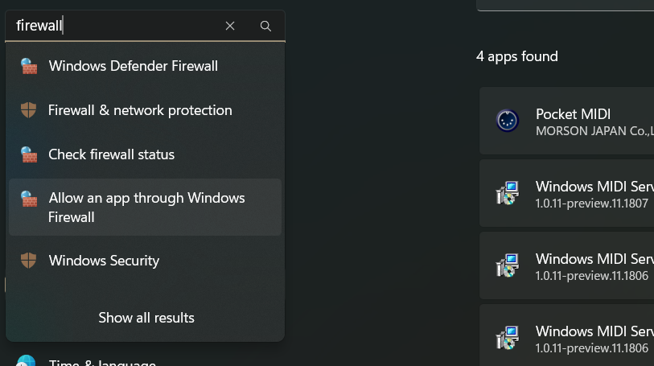
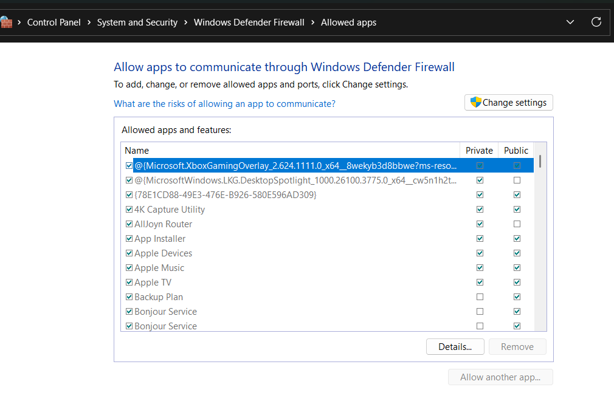
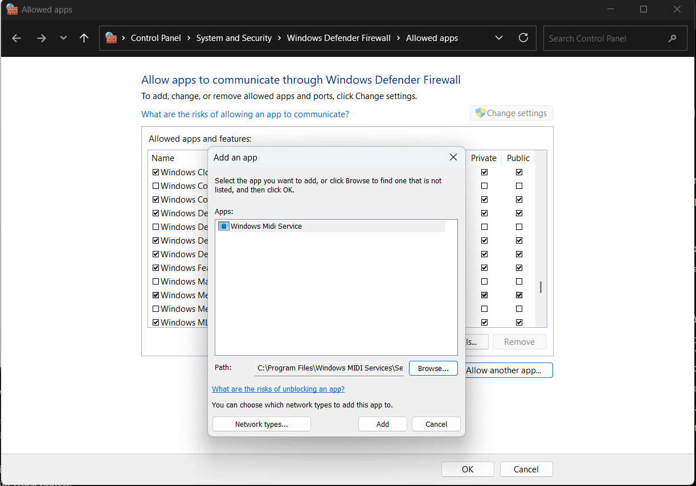
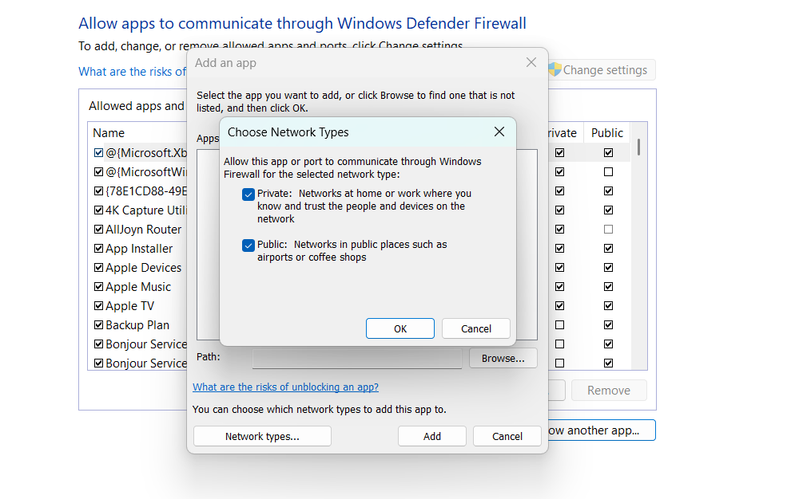
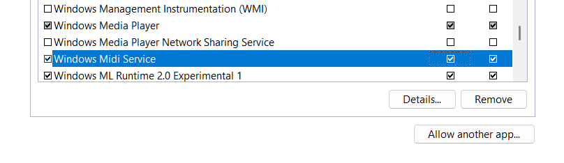

Can other Network MIDI 2.0-enabled PCs or devices see your PC, but cannot connect to it?

By default, the Windows MIDI Service is not allowed to listen to incoming connections through the firewall. That means that external Network MIDI 2.0 devices will see the service advertised, but their connection requests will be ignored, because they are blocked before the service sees them.

# How to fix it

1. Go into Windows settings and search for "Firewall". You'll receive several hits. You want the "Allow an app through Windows Firewall"

2. That will bring up an older-style control panel page for allowing an app through the firewall.

3. Click "Change settings" (this will require that you have Administrator permissions)

4. Click "Allow another app..."

5. In the window that comes up, click "Browse"

6. If you are using the preview MIDI service from GitHub, it is installed in `%programfiles%\Windows MIDI Services\Service`. On most PCs, this will be `C:\Program Files\Windows MIDI Services\Service`. Browse to that folder and choose `midisrv.exe`. If you are using the in-box install of the service, the version of the service running will be in `%windir%\System32`, typically `C:\Windows\System32`. The executable name is the same.

7. Select the correct network type for your setup. If you are using Network MIDI 2 on a trusted network, like a home or work installation, that will typically be "private". Otherwise, it will be "public". You can choose both if you aren't sure and/or you will be using Network MIDI 2.0 on untrusted or public networks.

8. When complete, you should see the Windows MIDI Service listed in the firewall for the network types you have selected.

