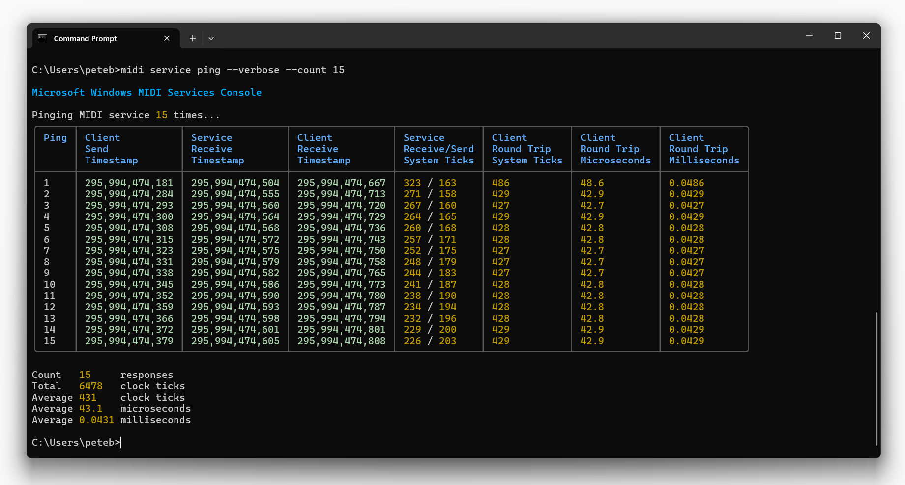

The MidiDiagnostics class contains a number of static functions which enable working with the service outside of a specific session. These are not normally used by applications.

## Static Methods

| Static Property | Description |
| --------------- | ----------- |
| `DiagnosticsLoopbackAEndpointDeviceId` | Returns the endpoint device Id for the diagnostic loopback used for development and support purposes. |
| `DiagnosticsLoopbackBEndpointDeviceId` | Returns the endpoint device Id for the diagnostic loopback used for development and support purposes. |

### Service Health

| `PingService (UInt8)` | Send the specified count of ping messages to the ping endpoint and report on the status and time. Return if the responses are not received in an internally calculated timeout period. |
| `PingService (UInt8, UInt32)` | Send the specified count of ping messages to the ping endpoint and report on the status and time. Return if responses are not received in the specified timeout period (milliseconds). |

Pinging the Windows service uses the same mechanism as sending any UMP message. The actual message sent is a prioprietary message. (At the time this was created, there was no standard MIDI 2.0 UMP ping message). The message itself is sent to the diagnostics endpoint in the service, which is implemented like any other transport. Therefore, the speed of the pings here and the success of the ping process is a reasonable indicator of service, cross-process queue, and client API health.

The diagnostic ping endpoint does not understand any other type of message, and should not be used by applications other than through the ping functions here.

The ping does not tell you if a specific transport or device is in a bad state. For example, if a specific USB MIDI device has crashed, this ping message will still work because it is not sent out over USB.

Here's an example of ping responses through the MIDI console app

