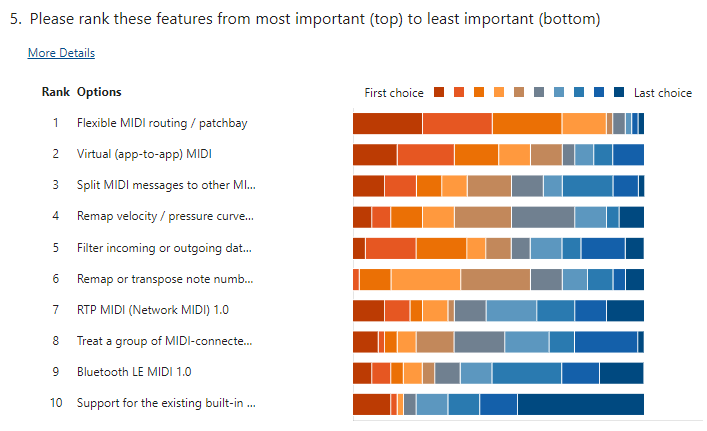
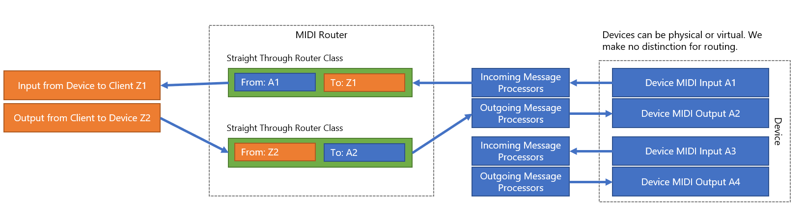
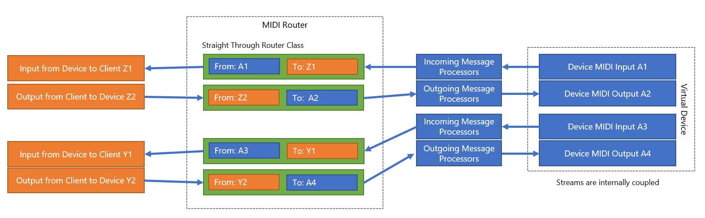
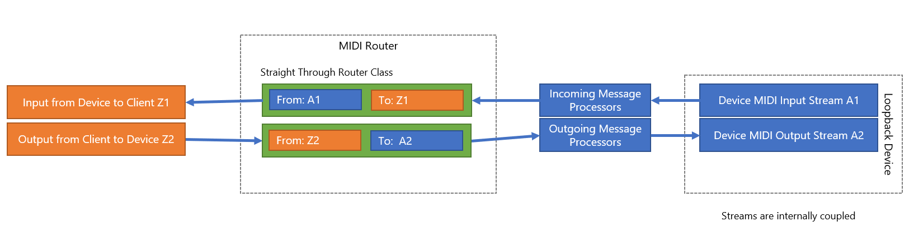
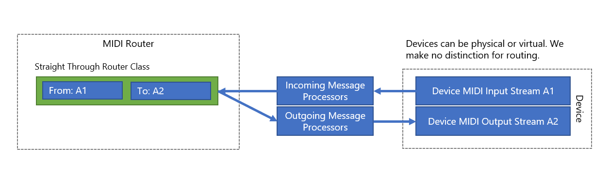
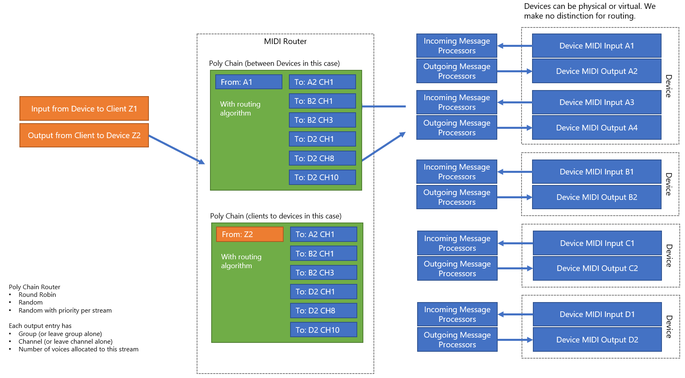
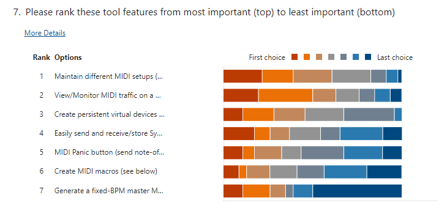

# High-level API Features and Principles

These are not final designs, but rather are brainstorming design ideas and setting forth some important principles and features we intend to pursue.

## Definitions as used in this readme

**Device:** A unique piece of hardware (or virtual hardware) that the Windows MIDI Services exchanges MIDI information with directly over a specific type of transport. In the case of USB, this would be the USB MIDI device directly connected to the PC. In the case of Virtual, it would be the virtual hardware created by the user or by an app. This is contrary to the MIDI specification which thinks of devices somewhat differently in order to account to scenarios like two synthesizers talking with each other. We look at these things from an OS-centric POV. Hardware devices are typically enumerated through a driver or other PnP-related code.

**Endpoint:** This definition is especially volatile due to changes in function blocks. But currently, an endpoint is the new API equivalent of what we used to call ports. In MIDI 2.0, these can be bi-directional, so to avoid confusion, we're no longer using the term "Port" in the API. Endpoints are enumerated, at least in parth, through MIDI discovery protocols.

**Transport:** The mechanism by which the device is communicated with. This could be, among others in the future, USB, BLE, RTP, Virtual, Serial, etc.

## Fundamentals

Beyond the usual security and stability and other internal requirements, here are some of the tenets for this API and its related tools.

### Development happens in the open (as much as possible)

As much as we can, we develop in the open. The repo started off as private due to our NDA with the MIDI Association and the pre-release standards we were working on implementing. Beyond that, anything which can be open is open and permissively licensed. We're open to other developers using the code for their own OS implementations, as well as having a view into the API and drivers which enables them to better understand what is happening in the OS, submit bug reports, enhancements, etc.

### The user is in control and has visibility

Anything which the user can control, they should be able to control. That includes changing the state of endpoints, adding metadata, renaming things, routing devices/endpoints, filtering etc.

A big part of this is the concept of a "setup". This is a snapshot of the state of the MIDI system that can be modified by the user and recalled whenever they need. A user may have setups for home studio and then for specific performances where they use different synths etc.

Another important part of this is to require all apps to open Sessions and provide their current app/document/project title (we also capture the process ID and name) so the user can see all open sessions, terminate sessions manually to free up endpoints, and more. We don't want to require the user to reboot to deal with any potential issues created by a hung or crashed application.

### Developers can easily prototype new features/protocols/more

Historically, Windows has not been used for quick prototyping of new MIDI and musician features because it requires a driver to be written to extend MIDI. Through a variety of new MIDI features, like virtual devices, plugins for transports, user-supplied metadata, and more, we want to make sure Windows is the best prototyping and experimenting platform.

## MIDI Messages

The core of MIDI is the MIDI Message. MIDI 2.0 uses discrete packets of 32, 64, 96, or 128 bits.

### Developers have direct access to UMP data

Although we provide strongly-typed classes for specific messages, we also provide direct access to the UMP words, and neither require that they be created through the strongly-typed messages, nor do we require that any given UMP must be able to be translated into a strongly typed message. Finally, we do not discard anything that fits basic UMP rules, even if we do not recognize the contents. Going back to the previous point, this enables developers to prototype new UMP-based messages without requiring direct API support already in place.

```cpp
// preliminary code for one of the four UMP packet sizes
struct WINDOWSMIDISERVICES_API Ump64 : virtual public Ump
{
  union
  {
    MidiWord32    Word[2] = {};   // an alias for uint32_t
    MidiShort16   Short[4];       // an alias for uint16_t
    MidiByte8     Byte[8];        // an alias for uint8_t
  };

  virtual const MidiMessageType getMessageType();

  // Fills the structure with the data in the buffer. Optionally validates 
  // that the specified message type is correct for the packet type
  virtual bool setFromWords(MidiWord32* wordBuffer, bool validateFirst);
};
```

### Optional strongly-typed classes for messages

Unlike MIDI 1.0, MIDI 2.0 is a discrete packet-based protocol, not a byte stream protocol. We know that with MIDI 1.0, which was also much simpler, developers often preferred to work with the byte streams directly. In MIDI 2.0, this is far less relevant.

The rules for translating MIDI 1.0 messages to UMP, and upgrading MIDI 1.0 messages to MIDI 2.0 messages need to be implemented the same way across applications. Additionally, some developers prefer to work with strongly-typed messages rather than raw data.

So we provide optional strongly-typed message classes which handle building and translating messages.

One of the strongly-typed classes may look like this:

```cpp
// Preliminary code
// Base MIDI 2 channel voice type
struct WINDOWSMIDISERVICES_API Midi2ChannelVoiceMessage : public Ump64
{
  const MidiMessageType MessageType = MidiMessageTypeMidi2ChannelVoice;

  const MidiNibble4 getOpcode();

  const MidiGroup getGroup();
  void setGroup(const MidiGroup value);

  const MidiChannel getChannel();
  void setChannel(const MidiChannel value);
};

// Preliminary code
// An example of one of the strongly-typed MIDI message types
struct WINDOWSMIDISERVICES_API Midi2NoteOffMessage final : public Midi2ChannelVoiceMessage
{
  const Midi2ChannelVoiceOpcode Opcode = Midi2ChannelVoiceOpcodeNoteOff;

  const MidiByte7 getNoteNumber();
  void setNoteNumber(const MidiByte7 value);

  // we have an enum for attribute type, but other attribute types may 
  // be set in the MIDI CI profile, so we don't restrict
  // See protocol spec 4.2.13 and 4.2.14 for attributes and pitch
  const MidiByte8 getAttributeType();
  void setAttributeType(const MidiByte8 value);

  const MidiShort16 getVelocity();
  void setVelocity(const MidiShort16 value);

  const MidiShort16 getAttributeData();
  void setAttributeData(const MidiShort16 value);

  //Conversion method. Uses MIDI 1.0 rules and data
  static Midi2NoteOffMessage FromMidi1Bytes(
    const MidiGroup group,
    const MidiByte8 statusByte,
    const MidiByte7 noteNumberByte,
    const MidiByte7 velocityByte);

  // Factory method. Includes data cleanup. To avoid that, use the direct 
  // data members (Byte[], Short[], Word[]).
  static Midi2NoteOffMessage FromValues(
    const MidiGroup group,
    const MidiChannel channel,
    const MidiByte7 noteNumber,
    const Midi2NoteOnOffAttributeType attributeType,
    const MidiShort16 velocity,
    const MidiShort16 attributeData);
};
```

You'll also notice that there are many type aliases which help convey the intent. Although MidiByte7 is stored in an 8 bit byte, it signals to developers that only the lower 7 bits are being used here. Others, like the MIDI Channel enum help avoid confusion between the protocol's 0-15 vs user-facing 1-16, but are easily cast to regular integers.

```cpp
// this is here to enforce 0-15 numbering for folks who
// may be unfamiliar with it, and to avoid ambiguity
// those who are familiar can just cast the value to this type
enum WINDOWSMIDISERVICES_API MidiChannel : MidiNibble4
{
  MidiChannel01 = 0,
  MidiChannel02 = 1,
  MidiChannel03 = 2,
  MidiChannel04 = 3,
  MidiChannel05 = 4,
  MidiChannel06 = 5,
  MidiChannel07 = 6,
  MidiChannel08 = 7,
  MidiChannel09 = 8,
  MidiChannel10 = 9,
  MidiChannel11 = 10,
  MidiChannel12 = 11,
  MidiChannel13 = 12,
  MidiChannel14 = 13,
  MidiChannel15 = 14,
  MidiChannel16 = 15
};
```

In these simple ways, we help keep the API simple to use for those who haven't read the full MIDI spec, while not removing any of the power or direct access used by apps like complex DAWs.

## MIDI-CI

MIDI-CI originally started as a stop-gap between MIDI 1.0 and MIDI 2.0. Some of the MIDI-CI features have been deprecated (like protocol negotiation), but others are even more useful now.

### Internal MIDI CI handling

Many MIDI CI, and new MIDI 2.0 replacements for MIDI CI, require some level of request/response to be able to enumerate endpoints, get data, negotiate parameters, etc. As much as possible, those conversations are behind proper API methods. Not only will this keep from having every app in a multi-client system make the same requests, but it also makes the data more usable than parsing JSON or other values from a SysEx stream. Finally, it also makes it possible for Windows to provide some missing data to help up-level the capabilities of the huge ecosystem of non-MIDI 2.0 and non-MIDI-CI aware devices out there.

### User-supplied metadata

Many DAWs keep internal databases of user devices and endpoints and metadata around them. Any time a user has to set up a new DAW, or wants to experiment with using a different DAW, they have to go through and re-create all of that metadata

Metadata for devices and endpoints often includes things like:

* Should this be sent MIDI clock start/stop messages?
* Custom names
* A user-supplied description
* A custom icon

MIDI 2.0 includes discovery for some of this information, but not all of it. Additionally, some of these are based on user decisions, not capabilities for the device/endpoint itself.

### User-supplied MIDI-CI data

For the forseeable future, the vast majority of devices in the studio are going to be MIDI 1.0 devices which do not support MIDI 2.0 or MIDI-CI. To help provide additional utility for these devices, we can allow the user to provide MIDI-CI data for the devices as part of their setup files. 

We can also allow users to override some MIDI-CI and MIDI 2.0 properties. For example, they may decide that there are way too many jitter timestamps going on in their system, and so want to disable that capability for a specific device. We should allow that. They may also decide that they want to provide a different name than MIDI 2.0 has provided through endpoint discovery. Again, we should allow that through the MIDI setup.

These will also come into play when users need to be able to, within a setup, pair a MIDI 1.0 input and MIDI 1.0 output together, as a MIDI-CI-capable single bi-directional endpoint.

Finally, the user may know that a device is MIDI 1.0, but can use a data rate much higher than 31250. Again, we should allow them to have that level of control through their setup, and we should also provide that information to the DAW or other API-consuming app.

## Devices and routing

The top two user requests (after multi-client and reduced jitter) are for a "MIDI patchbay" and Virtual Devices



### Programmatic and user-created virtual devices

Both users and app developers need to be able to create virtual sdevices. Users may want to set up custom routes or filters which only apply when connecting to a specific virtual device. App developers want to support app-to-app MIDI scenarios where virtual devices are created when an app loads up, and are tied to that app's lifetime.

We will support both persistent (stored in the setup file) virtual devices, created by users in the settings app, as well as devices created through the API.

### Flexible "MIDI Patchbay" style routing

With the combination of virtual devices and MIDI routing, there are lots of possibilities for how to have devices, apps, and endpoints talk to each other.

**Straight-through routing**

Straight-through routing will be what's used most often, and so will be highly optimized.



**App-to-app MIDI**

When combining virtual internally-connected ports with routing, you can easily do app-to-app MIDI while continuing to support message processors, and using the same client API one would use to speak to any other device or endpoint.



**Client loopback for testing**

Next are a couple types of routing which are really for testing. Users often want to test the performance of their own MIDI devices and client connections. I've done it myself with a little JUCE app and by connecting a DIN cable from MIDI out to MIDI in on one of my devices. App developers want to verify that what they are sending is what they think they are sending. Finally, anyone testing out a message processor will want to be able to see exactly what it does to messages. A client loopback helps make that happen.



Additionally, driver and device developers will want to be able to test their own code, and so have requested a loopback that is on the driver side, but uses the same send/receive code that will be used in production.



**Fan-out / Polychain routing**

One that I'm personally interested in is the idea of poly-chaining of synthesizers (or other tone generators). Right now, this requires either support in the synthesizer, a plugin, or an external polychain box. This is relatively simple to do once you have different types of routing processors in the services.



I would use this all the time to treat a bunch of monosynths as a single polysynth. It's more of a niche feature, though, so although the intent is to ensure the architecture will support it, the feature itself may not be in the first releases.

There may be other types of routing in the future, but these are the tops for user and developers right now.

## Filters and Message Processors

Users have asked for the ability to filter and otherwise manipulate messages, at the system level -- across all consuming apps, for specific devices and endpoints. They're looking for features like what we had in the old MIDI Mapper (patch maps, velocity curves, note remapping, etc.). We're to provide that through pluggable filters and message processors which can be attached to an endpoint through part of the setup.

We're investigating the right approach for this to help maintain system security but also provide the features that users have requested. As such, it may be that the filters and processors are built into the stack (and user selectable) rather than plugins. That said, there's opportunity here for third-parties to create a lot of useful system-wide functionality here. All TBD.

Going back to the feature ranking above, after the MIDI patchbay and Virtual MIDI, the next ranked feature requests are:

* Virtual split points (take an incoming message and send it to different MIDI endpoints/groups/channels based on the note number or frequency)
* Remap velocity or pressure curves
* Filter incoming or outgoing data to eliminate certain message types, etc.
* Remap or transpose note numbers (for mapping drum kits, transposing, etc.)

## Smart System Exclusive handling

MIDI 1.0 ports in Windows are not multi-client without the use of a third-party driver. That means that only one app can use a MIDI port at any given time. The new API and drivers are all multi-client.

This has been worked around through third-party drivers and devices. However, those devices neglect to handle one very important multi-client data concern: MIDI 1.0 SysEx data will be corrupted if one app is sending SysEx, and another app sends anything other than a MIDI realtime (clock, for example) message. This can ruin a MIDI-delivered OS upload, potentially bricking a device, or foul up a patch dump turning existing patches into garbage, especially on older devices. It can cause problems when setting advanced parameters during a performance, and it can also cause a number of issues with MIDI CI requests and responses, which are based on SysEx.

In the MIDI 2.0 packet format, this is less of a concern. However, we still need to ensure MIDI 1.0 devices work properly. So the API needs to enable apps to lock an endpoint at some level for SysEx transmission, deny other sessions access to the endpoint, and have smart timeout to unlock the endpoint if the sending app hangs or crashes. Additionally, going back to putting the user in control, the tools will allow users to unlock a previously locked endpoint.

## A set of robust tools

Today, MIDI users need to rely on third-party tools like MIDI-OX, or my own MIDI SysEx Transfer Utility to be able to send and receive SysEx, monitor ports, view connected devices, and more. There's no single musician-friendly download or in-box component which provides all of these, plus features like device/endpoint renaming, configuration, etc.



We will provide tools for managing MIDI, sending and receiving SysEx, entering custom metadata, creating persistent virtual devices, configuring message processors, routing, and transports, and more through a settings app in Windows. The end result will be a file or set of files (current prototype is JSON) which can be easily picked up and moved to a new system, or backed up and restored.

## Positioned to grow in the future

We know MIDI 2.0 continues to evolve and we'll never really be able to put a single stake in the ground and say "this is where MIDI 2.0 is complete". New message types are added, new transports are being worked on, and users will find new and innovative ways to work with MIDI. This API and toolset will continue to grow, and will be positioned to be updatable over time with first and third-party contributions in this repo.
