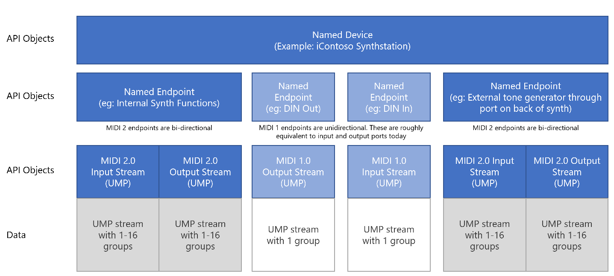

# API Specifications

=======================================================
TODO: This needs to be updated after the SDK changes
=======================================================

These are not final designs, but rather are brainstorming design ideas. All code is pseudo-c code with just enough syntax to get the point across. You will notice a real lack of semicolons, for example. :)

## General Approach

* We provide first-class access to raw data as much as is possible
  * The fundamental types are the base Midi Word (32 bit word), Ump32, Ump64, Ump96, and Ump128, as per the specifications.
  * We always provide classes to process that data into friendly formats, but do not require their use. For example, classes to build/parse channel voice messages.
  * Core API is meant to stay lean and fast, with additional features added as helper classes, as long as performance is not negatively impacted
* One exception to raw data is the required Discovery and Protocol Negotiation for MIDI-CI. We provide the final results, but the transaction itself is handled by the MIDI Services.
* Entry point into API functionality is always the session
  * An app may have as many sessions open as it needs
* Everything is multi-client and all devices in the session are available all the time
  * Only endpoints need to be opened, and that's really only to wire up handling for incoming messages
  * Device enumeration is detailed, flexible, and supports our device/transport plugin approach
* The user is in control
  * The user can override certain settings for endpoints, like disabling protocol negotiation, for example, and also setting the name to whatever they want, so that they are in control of the setup
  * We will implement and require features which give the user more visibility into the state of MIDI on the machine, even if those features aren't of obvious use to the applications themselves.
  * The user must explicitly enable any plugins that aren't shipped with the services
  * The configuration (setup) files are human-readable JSON, and easily accessible for viewing, editing, copying, or backup
* Unless otherwise stated, all API-level Ids are GUIDs
* All end-user accessible device, endpoint, etc. names support full unicode, except where the MIDI specification requires UTF-8 or similar
* All API-consumed or delivered messages will be packaged in UMP, including MIDI 1.0
  * Helper classes will be provided to parse out strongly typed MIDI 1.0/2.0 messages
  * Helper classes will be provided to build a UMP from MIDI 1.0 or MIDI 2.0 strongly-typed messages

To level-set, here are some of the main objects/classes we're dealing with with messages. It's especially important to understand the relationship between devices, streams, and endpoints as this is different from the MIDI 1.0 APIs.

* Device: A MIDI device connected to the PC through a transport like USB, RTP, BLE, Virtual, etc.
* Endpoint: An addressible MIDI "port" on the device. In the case of MIDI 2.0. In the case of MIDI 1.0, these are uni-directional.
* Stream: An input or output buffer or stream of data coming from or going out of the endpoint. In MIDI 1.0, these were just bytes. But in MIDI 2.0, and all UMP-wrapped MIDI 1.0 messages, these are chunks of words as defined in the MIDI 2.0 specs. A stream has further subdivisions in it for channels and group/function blocks. However, the API does not do any processing at that level and instead leaves it up to applications to address different groups and channels.

## Other Related Specifications

* [Programming Languages and Models](api-spec-programming-models.md)
* [Session Management](api-spec-session.md)
* [MIDI Setups](api-spec-setups.md)

