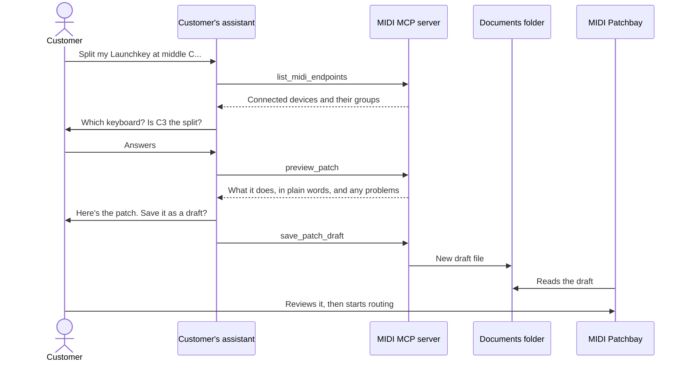
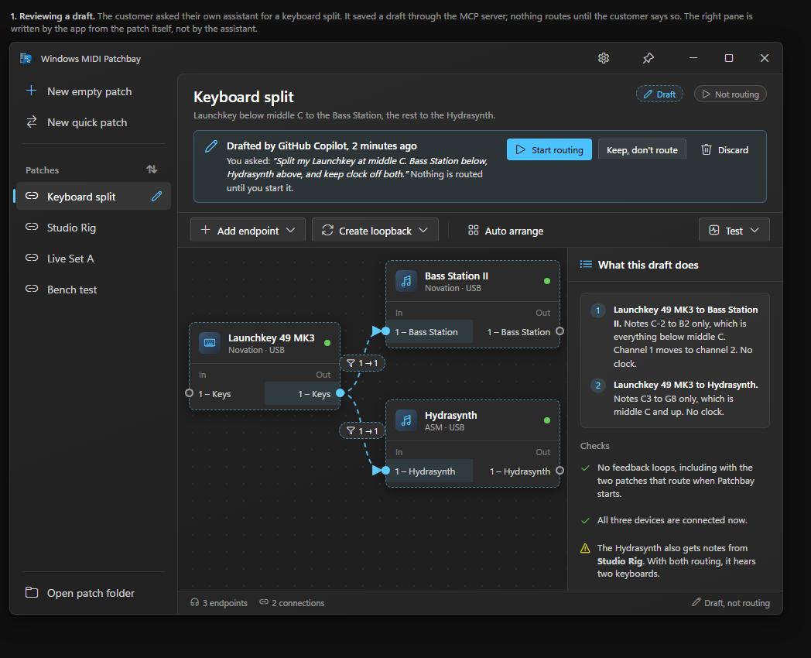
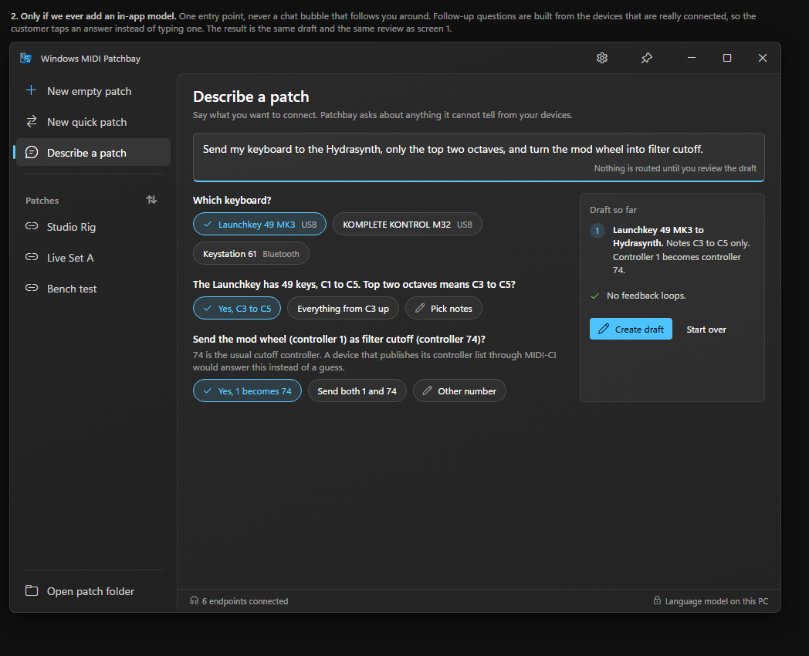
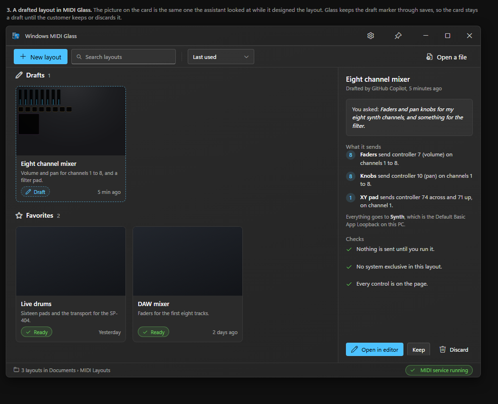
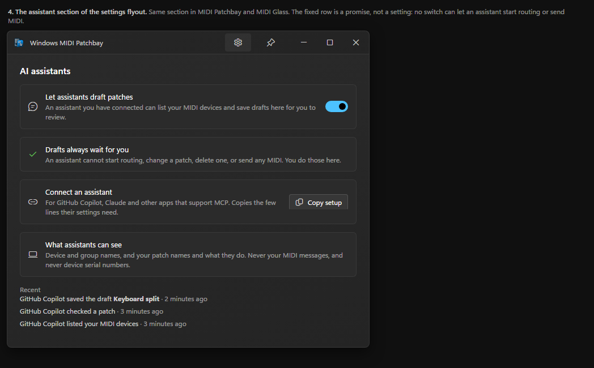

# AI help in MIDI Patchbay and MIDI Glass: investigation

**Status:** prototype and investigation, September 27, 2026. No app or API code was changed. Nothing here ships.

## The goal

A customer says what they want, in their own words: "Split my Launchkey at middle C. Bass Station below, Hydrasynth above." They get asked about anything that isn't clear, and they end up with a patch (MIDI Patchbay) or a control surface layout (MIDI Glass) that they review before it does anything.

## What was decided

These are Pete's answers from September 27, 2026.

- **The AI is the customer's own assistant, connected through MCP.** That means GitHub Copilot in VS Code, the Copilot CLI, Claude and other apps that support the Model Context Protocol. We don't ship a model or a chat window, and there's no sign-in in our apps.
- **No third-party MCP framework.** The spike writes the protocol code by hand in C++ so the size is known before choosing. The numbers are below.
- **Assistants make drafts. The customer applies them.** Nothing routes and no MIDI is sent until the customer says so in the app.
- **Plan for package identity**, even though the apps aren't MSIX packages today.

## Options we looked at

| Option | What it needs | Result |
|---|---|---|
| Customer's own assistant through MCP | A small MCP server for each app | **Chosen.** Works with any assistant that supports MCP. We ship no model and pay for no service. The customer adds our server to their assistant once, unless Windows lists it for them (see package identity below). |
| Chat inside the app with an on-device model (Windows AI APIs) | Package identity, the `systemAIModels` capability, and a Copilot+ PC | Not now. It only works on some PCs, access is limited today, and the docs say the current model (Phi Silica) is being replaced by Aion Instruct late in 2026. It's also hard to do without annoying people. Comp 2 shows the one entry point we'd accept if we ever do it. |
| GitHub Copilot SDK | Node, Python, Go, .NET, Rust or Java (no C++), Copilot CLI running as a local server, and a Copilot plan or the customer's own model key | Not chosen. It would put a Copilot sign-in inside our apps. |
| App Actions on Windows | Package identity | Poor fit. An action is one step another app can start. It can't ask follow-up questions. |
| MCP through the official C# SDK in a helper exe | .NET, and a second copy of each app's file code in C#, or a bridge to the C++ code | Not chosen. .NET would be new to these apps. Today only the PowerShell extensions use it. |

## How it works in the prototype

The server is [`mcp/`](../mcp). The tools are listed in the [README](../README.md#tools).

### How the customer gets asked for details

The customer needs to be asked about anything that isn't clear. The spike does that in four ways, and all of them work with any assistant today.

- **The server tells the assistant the order of work:** look at the devices, ask about anything unclear, preview, and save only after the customer agrees. MCP sends these instructions to the assistant when it connects.
- **Tools answer with a question instead of a guess.** If "Launchkey" matches two devices, the tool returns both and says "Ask the customer which one, then pass its id." If a device doesn't have the group that was asked for, the tool lists the groups it does have.
- **The preview is written for the customer.** The assistant reads back "Notes C-2 to B2 only, which is everything below middle C. Channel 1 moves to channel 2." The customer confirms what will happen, not a block of JSON.
- **Tool descriptions carry the MIDI facts models get wrong:** channels are 1 to 16, groups are 1 to 16, note 60 is named C3 in these apps, and a loopback echoes what it gets.

Not built: questions asked by the server itself (elicitation in the older MCP spec, `input_required` results in the 2026-07-28 spec). The host shows those as a form. Support across hosts is uneven, and the assistant's own chat already works.

### Drafts

- **MIDI Patchbay:** a draft is a normal patch file with `activateAtStartup` turned off, plus a `_draft` block that records who made it, what the customer asked for, and when. Patchbay already loads a file like that without routing it, so drafts work today with no app change. Two limits: Patchbay reads its folder only when it starts, and it drops the `_draft` block the next time the customer saves the patch.
- **MIDI Glass:** a draft is a normal layout file with a `_draft` block. Glass keeps fields it doesn't know when it saves, so the draft stays marked until the app clears it. Glass rereads its folder when devices change and after its own actions, but not when a new file appears.
- **A draft never replaces a file.** If the name is taken, the server adds " (2)" and so on.
- **"Drafted by" is a label, not proof.** The name comes from the assistant's app, and any program can send any name.
- **The checks use the apps' own code.** MIDI Glass's document code is compiled into the server unchanged, so a layout draft is built and checked by the same code the app uses. Patch drafts are written to match Patchbay's file format key for key, and the test runs them through a copy of Patchbay's own filter and transform code to prove they do what the preview says.

## Size: hand-written C++ compared to an MCP SDK

Pete asked to see the size first. These are lines of code, not counting blank lines or comments.

| Part | Lines | Would an MCP SDK replace it? |
|---|---:|---|
| Protocol: JSON-RPC over stdin and stdout, both spec versions, errors (`McpServer`) | 527 | Yes |
| Text and JSON helpers (`ToolText`) | 431 | About 100 lines |
| Startup and options (`main.cpp`, `pch.h`) | 165 | Some |
| Endpoint tools (`EndpointTools`) | 271 | No |
| Patchbay tools (`PatchbayTools`) | 1,492 | No |
| Glass tools (`GlassTools`) | 1,041 | No |
| **Total** | **3,927** | **About 700, or one sixth** |

Tests add 315 lines of PowerShell and 124 lines for the Patchbay checker. The exe is 1.8 MB for x64 and 2.1 MB for ARM64. Most of that is the C++/WinRT projection and the Glass document code, not the protocol.

What this shows:

- **The protocol is the small part.** About five of every six lines are tools and their helpers, and the tools need the apps' C++ code. A C# server would need a second copy of the Patchbay and Glass file code, which will drift from the apps, or a bridge into the C++ code. It would also bring .NET into two apps that are C++ today.
- **The real cost of writing it ourselves is keeping up with the spec.** The 2026-07-28 release removed the old connection handshake: every request now carries its protocol version, servers answer a new `server/discover` request, and every result says what kind of result it is. Hosts will move to it at different speeds, so the spike answers both the new and the old forms. Each spec release means reading the changelog and updating about 500 lines. An SDK would do that for us, on its own schedule.
- **What the hand-written code doesn't do,** because the first version doesn't need it: questions from the server, progress and cancel messages, resources and prompts, and HTTP. It speaks stdin and stdout only, which is what local assistants use.

## Safety and privacy

- **The only thing a tool can write is a new draft file** in the app's own folder. No tool sends MIDI, starts routing, changes or deletes an existing file, or reads the Windows MIDI Services configuration file. Everything about devices comes from the MIDI SDK.
- **Everything a tool is sent is treated as untrusted.** An assistant can be steered by text it read somewhere else, like a web page. So every value is checked for size, range and allowed names. File names are built by the server and cleaned the same way the app cleans them. The folder is fixed. Messages over 8 MB are dropped.
- **Text sent back to the assistant is untrusted too.** Device names, patch names and layout names come from devices and files, and one could hold instructions aimed at the assistant. That's one more reason tools can only make drafts, and why the review screens describe a draft from the app's own reading of the file, never from the assistant's words.
- **What an assistant can see:** endpoint names, ids and transports, groups, loopback pairs, and saved patch and layout names and what they do. Patchbay already stores endpoint ids in every patch file. Not serial numbers, not MIDI traffic, and not full paths. Paths are shown under Documents, like `Documents\MIDI Patchbay\Keyboard split.midipatch.json`.
- **Hosts can tell reading tools from writing tools.** Each tool is marked with MCP annotations (`readOnlyHint` and related hints), so a host can ask before a save and not before a list.

## Package identity and Windows agent connectors

Windows can list the MCP servers of installed apps for assistants to use, so the customer doesn't have to add them by hand. The docs call these agent connectors, and they need package identity. Our apps are installed by WiX installers, not MSIX.

- **How we'd get identity:** packaging with external location. The installer registers a small signed package that points at the app's install folder, and the exe carries a manifest that names that package. The installer removes it on uninstall. The app itself stays where it is.
- **What the package declares:** a `com.microsoft.windows.ai.mcpServer` app extension and an MCP bundle `manifest.json`. The manifest holds fixed copies of the server's answers to the old `initialize` and `tools/list` requests, and they must match what the server returns. That's another reason the server keeps answering the old handshake. A build step should produce those copies by running the server, so they can't drift.
- **Servers registered this way always run contained.** They run as a separate agent user in a separate session. They can't see the customer's running apps, their registry settings (HKCU) or their files, except through capabilities the package declares, like the Documents library, which the customer grants to each assistant.
- **What containment means for this design:**
  - Drafts as files in Documents is the only design that works both contained and not. That fits the drafts decision.
  - A setting stored in HKCU, like "Let assistants draft patches", can't be read by a contained server. It would have to live in a file in the app's Documents folder, or the app would enforce it by ignoring drafts when it's off.
  - **Unknown:** whether a contained server can reach the MIDI service to list devices. If it can't, `list_midi_endpoints` comes back empty and the checks get weaker. This is the biggest open question.
  - **Probably fine, not tested:** starting `midiglass.exe` to draw a preview. The docs say a contained server can run programs in the agent session.
- **Servers without identity** aren't contained, but Windows lets assistants use them only if the customer turns on "Reduce protections for agent connectors" in Settings. We shouldn't ask customers to do that.
- **Can't test it on Pete's PC yet.** `odr.exe` is there, but it reports that the feature isn't enabled on this PC, and Settings has no way to turn agent connectors on. The docs list Windows build 26220.7262 or later and don't mention Copilot+ PCs. Pete's PC runs a Canary build (29671), which comes from a different branch, so the feature may just not be in Canary yet.
- **Without identity,** customers can still add the server by hand in their assistant's settings. The "Copy setup" button in comp 4 gives them the lines to paste.

## What the apps would need

These are in the comps. None of it is built.

- **MIDI Patchbay:** notice new files in its folder. Show a draft bar with Start routing, Keep but don't route, and Discard. Draw draft cords dashed. Describe the draft in a "What this draft does" pane written by the app from its own filter and transform summaries. Keep the `_draft` block until the customer decides.
- **MIDI Glass:** notice new files. Show a Drafts group in the library with the preview picture, a side card that says what the layout sends and what was checked, and Open in editor, Keep and Discard.
- **Both:** an "AI assistants" section in settings with an on and off switch, the fixed promise that drafts always wait for the customer, Copy setup, what assistants can see, and recent activity. Recent activity needs the server to write a small log where the app can read it, which containment affects the same way as the switch.
- **Both:** move the tool text into resource files. Hosts show tool descriptions to people, so the repository rule for user-facing strings applies.

| | |
|---|---|
|  |  |
| 1. Reviewing a draft in Patchbay. The right pane is written by the app, not the assistant. | 2. Only if we ever add an in-app model. One entry point, and questions built from the connected devices. |
|  |  |
| 3. A draft in the Glass library, with the same picture the assistant saw. | 4. The settings section, the same in both apps. |

## What was tested

Tested on Pete's PC on September 27, 2026, with the MIDI service running:

- The server builds for x64 and ARM64 (Release, warnings treated as errors).
- The test script passes all 89 checks against the x64 build. It covers both spec versions, bad requests, every tool, the files the tools write, and feedback loops, including loops that go through a patch that's already saved.
- Patch drafts were run through Patchbay's own filter and transform code: 12 checks, such as "a low note goes up an octave at 80% velocity", "a note above the split is dropped" and "clock is dropped".
- Layout drafts were read back and drawn by `midiglass.exe` itself.
- Two drafts made through the server's own tools, with Pete's real devices, were opened in the real apps. Patchbay listed the patch draft and showed it as "Not routing", with a "Route this patch" button. Glass showed the layout draft in its library with its picture and "1 device ready".
- Pete tried it with GitHub Copilot in VS Code. Asked to route "my keyboard to my synth", the assistant asked which ones, listing five keyboards and three synths, then previewed the patch and saved the draft after he agreed.
- That run found a defect. When a tool result has `structuredContent`, VS Code gives the model that JSON and not the result's text, so the plain-words summary never arrived. Pictures still arrive. The spec says the text should be a copy of the JSON, and ours wasn't. The server now returns only text and pictures.

Not tested:

- A layout request with a real assistant, including whether it uses the preview picture to fix the layout.
- The server since that fix, with a real assistant.
- The ARM64 build hasn't been run.
- Agent connectors and containment, because the feature isn't on for this PC.
- How well assistants ask questions and use the tools. That needs a list of real requests, tried with a few assistants.

## Gaps in the spike

- It covers the common Patchbay filters and transforms: channels, message kinds, note ranges, transpose, channel, note, controller and program maps, and velocity. Not all of them.
- Glass controls can send control changes, notes, pitch bend and channel pressure. No SysEx, sequences or MIDI 2.0 messages.
- There's no way to change an existing patch or layout. That needs a "get" tool and a way to save a changed copy as a draft.
- Glass previews don't draw labels, so the preview text lists them.
- Tool text is in the code, not in resource files.

## Risks

- **The MCP spec changes quickly.** The 2026-07-28 release was a breaking change, and both forms have to be supported for a while.
- **Agent connectors are in preview.** The rules for fixed answers and containment may change.
- **Assistants make mistakes.** They can pick the wrong device or misread "middle C". Drafts and app-written review screens limit the harm. Note names are a known trap: these apps call note 60 C3, and some other software calls it C4. The tools say which convention they use every time, and they accept note numbers.
- **A draft showing up in an app can surprise people.** The draft bar says who made it and what was asked.

## Decisions

Decided on September 27, 2026:

- **The protocol code stays hand-written C++.** No .NET in these apps.
- **Try it for real.** The server is set up for GitHub Copilot in VS Code on Pete's PC, and test drafts were opened in both apps.

Still open:

1. **One server for all the MIDI tools, or one per app?** Pete leans toward one for all, so one request can use several apps and APIs. For example, "route my keyboard to the Moog One and give me a touch surface for it" needs Patchbay and Glass together. A combined server should offer only the tools of the apps that are installed, since Glass has its own installer. Tools that change the MIDI service right away, like making a loopback, aren't drafts, so they'd need their own review step.
2. **Where the server lives:** an `--mcp` switch on an app's exe, like Glass's `--thumbnail`, or a small console exe built from the apps' own file code?
   - A switch means one binary that can't drift from the app. But the apps are windowed WinUI apps, and the `--mcp` path would have to run before single-instance handling. Today a second launch hands off to the running copy and its arguments are lost.
   - A console exe starts faster and loads no UI, but Patchbay's patch code would have to move into a library both can build, and it's one more file to sign and install.
   - With one server for all the tools, no single app owns it, which points toward the console exe.
3. **Identity:** which installer registers the package? And agent connectors still need a PC where they can be turned on.

## Sources

All read on September 27, 2026.

- [MCP specification 2026-07-28: changelog](https://modelcontextprotocol.io/specification/2026-07-28/changelog), [lifecycle](https://modelcontextprotocol.io/specification/2026-07-28/basic/lifecycle), [transports](https://modelcontextprotocol.io/specification/2026-07-28/basic/transports)
- [MCP SDKs](https://modelcontextprotocol.io/docs/sdk)
- [MCP on Windows](https://learn.microsoft.com/windows/ai/mcp/overview), [MCP servers on Windows](https://learn.microsoft.com/windows/ai/mcp/servers/mcp-server-overview), [containment](https://learn.microsoft.com/windows/ai/mcp/servers/mcp-containment), [identity](https://learn.microsoft.com/windows/ai/mcp/servers/mcp-windows-identity)
- [Grant package identity by packaging with external location](https://learn.microsoft.com/windows/apps/desktop/modernize/grant-identity-to-nonpackaged-apps-overview)
- [Phi Silica](https://learn.microsoft.com/windows/ai/apis/phi-silica), [Windows AI APIs](https://learn.microsoft.com/windows/ai/apis/get-started), [App Actions on Windows](https://learn.microsoft.com/windows/ai/app-actions/)
- [GitHub Copilot SDK](https://github.com/github/copilot-sdk)
