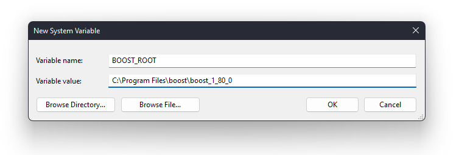

# Client SDK

C++ / WinRT client SDK.

## Building and Tools

Use latest Visual Studio 2022.

The C++ code in this solution uses boost (currently boost 1.80.0) for a number of types . My BOOST_ROOT is C:\Program Files\boost\boost_1_80_0. I set a system environment variable so I could use it in Visual Studio in the include and lib locations.

The C++ code also uses the latest accepted language spec (C++ 20) and latest standard library functions.

### Building

TODO

### Boost

TODO

### Visual Studio Add-in

If you end up editing MIDL at all, be sure to download this extension from the Visual Studio marketplace. MIDL 3.0 editing is pretty frustrating without it: [WinRT Tools for C++ by Mads Kristensen](https://marketplace.visualstudio.com/items?itemName=MadsKristensen.MIDL)

While you're at it, if you are updating any of the readme files in Visual Studio, grab the [Markdown Editor v2](https://marketplace.visualstudio.com/items?itemName=MadsKristensen.MarkdownEditor2) VSIX.
