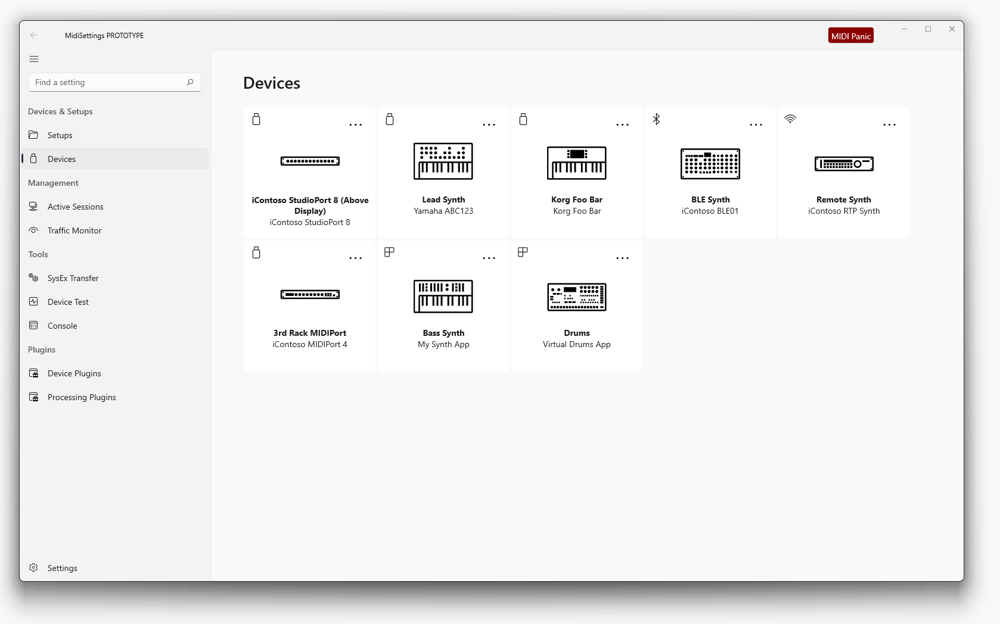

# Settings App Structure

The MIDI Settings app is a .NET, WinUI 3 app built using Visual Studio 2022 preview.

The project was initially generated using Template Studio for WinUI 3, and so follows the MVVM pattern as set up by the template.

Very early prototype with really just left menu structure in place

